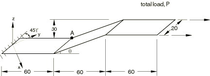
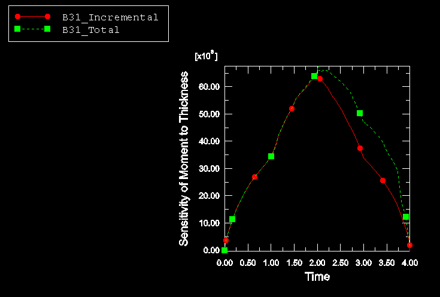
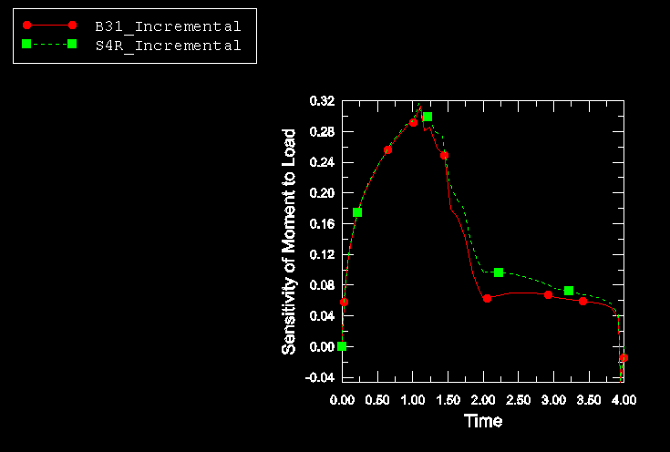
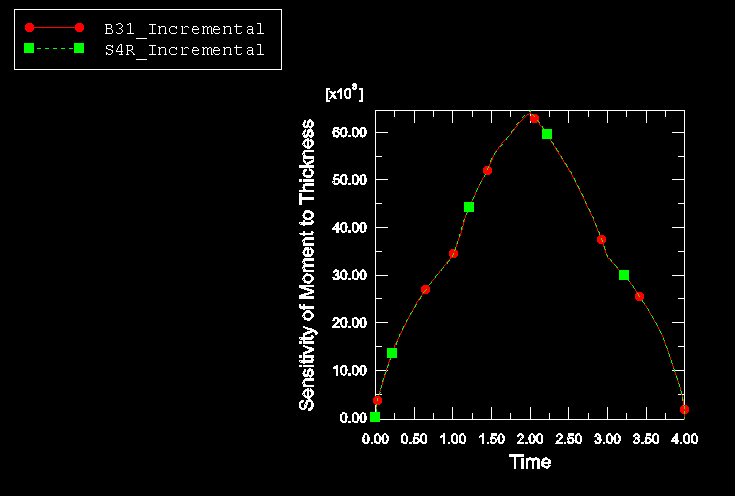
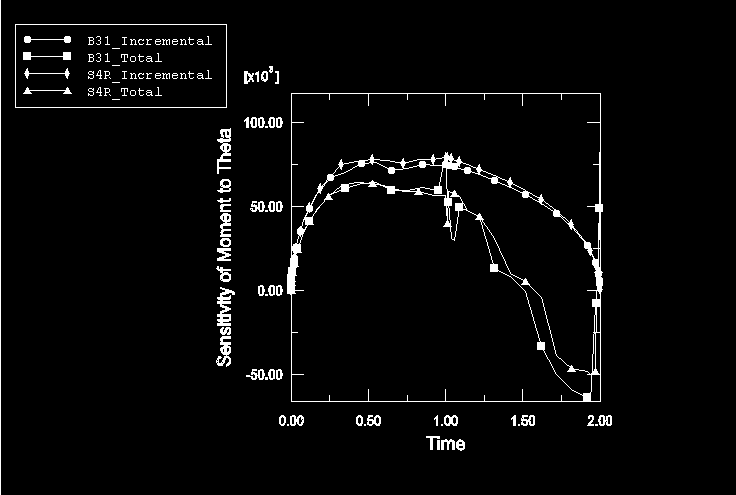
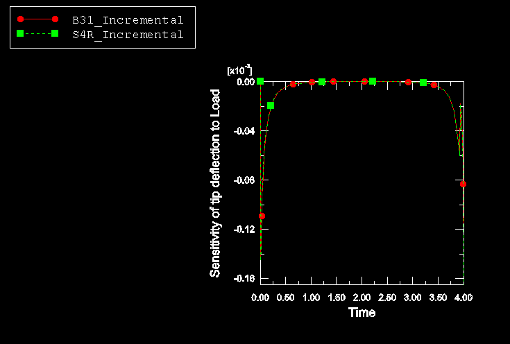
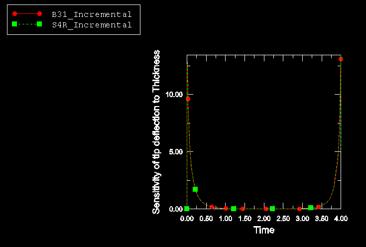
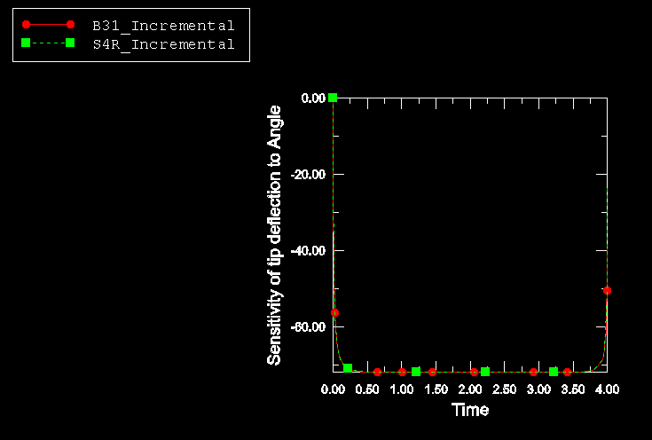

# 1.18.3 Sensitivity analysis of modified NAFEMS problem 3DNLG-1: Large deflection of Z-shaped cantilever under an end load

**Products: **Abaqus/Standard  Abaqus/Design  

This benchmark problem verifies the sensitivity results obtained using Abaqus/Design for the modified NAFEMS problem 3DNLG-1. Results for the incremental and total DSA formulations are given. The results also serve to demonstrate the limitations of the total DSA formulation for history-dependent problems.

### Problem description

The geometry of the problem is the same as that of the NAFEMS benchmark problem ["3DNLG-1: Elastic large deflection response of a Z-shaped cantilever under an end load," Section 4.10.1](ch04s10anf84.md). The problem is modified by adding plasticity to the material definition and by changing the direction of the application of the tip load to act along the axis of the beam as shown in [Figure 1.18.3--1](ch01s18ach132.md#bmkdsazcant) so as to cause extensive plastic yielding. All the problems use 72 elements to model the beam.

Initial yield occurs when the stress reaches 4000. The strain hardening increases the yield stress to 8000 at the plastic strain of 0.05 and to 9000 at the plastic strain of 0.10.

A total load of 50000 is applied in the global *x*- and *y*-directions such that the resultant load of 70710.6 acts along the axis of the beam. Of this, 25% is applied in the first step and the remainder is applied in the second step. In Step 3 75% of the load is removed, and the complete load removal is finished by the end of Step 4. The step time for each of the steps is unity.

The thickness of the beam, *T*; the applied load, *P*; and the angle, , of the inclined member of the Z-cantilever are chosen as the design parameters. The sensitivity is studied in detail for the same two output variables used in the original NAFEMS problem: the tip deflection of the cantilever, U, and the section moment, M, at point A, as shown in [Figure 1.18.3--1](ch01s18ach132.md#bmkdsazcant).

### Results and discussion

Tabulated sensitivity results are given at the end of the first, second, and third steps. The tables compare the sensitivities of the output variables with respect to the chosen design parameters obtained using the incremental and total DSA formulations in Abaqus to those obtained using the overall finite difference method (OFD). The OFD results are given for every element tested to provide a proper basis for comparison to the Abaqus sensitivity results, since every element provides slightly different sensitivity values. 

[Table 1.18.3--1](ch01s18ach132.md#table-b31) compares the sensitivity results obtained using the total and incremental formulations in Abaqus to the OFD results for element type B31. Similar results for element types B33, S4R, and S4 are shown in [Table 1.18.3--2](ch01s18ach132.md#table-b33), [Table 1.18.3--3](ch01s18ach132.md#table-s4r), and [Table 1.18.3--4](ch01s18ach132.md#table-s4), respectively. Since Abaqus outputs the sensitivity only at the integration points, the sensitivity for the moment refers to the integration point closest to the point A. The sensitivity results for shell elements have been multiplied by the width of the beam so that they can be compared with the results for beam elements. By the end of the second step (time = 2) the beam has straightened out, with the loads causing axial stretching and no further tip deflection. Consequently, at the end of Step 2 the tip deflection is insensitive to the design parameters *P* and *T*. The incremental formulation yields sensitivity results that are in close agreement with the OFD results. The total formulation shows deviations from the OFD results during the loading (up to time = 2) that are consistent with the approximations inherent in the total formulation. The deviations are large during unloading, when the problem becomes strongly history dependent (for times > 2) and the underlying assumptions of the total formulation are no longer valid. [Figure 1.18.3--2](ch01s18ach132.md#bmkinctot) shows the comparison of the sensitivity results obtained using the total and incremental formulations for moment M with respect to *T*.

To compare the elements throughout the duration of the analysis, sensitivities obtained for B31 and S4R elements using the incremental formulation are plotted. The sensitivities of moment with respect to load, thickness, and incline angle are plotted in [Figure 1.18.3--3](ch01s18ach132.md#bmkdmp), [Figure 1.18.3--4](ch01s18ach132.md#bmkdmt), and [Figure 1.18.3--5](ch01s18ach132.md#bmkdmth), respectively; while the sensitivities of the tip displacement with respect to load, thickness, and incline angle are plotted in [Figure 1.18.3--6](ch01s18ach132.md#bmkdu3p), [Figure 1.18.3--7](ch01s18ach132.md#bmkdu3t), and [Figure 1.18.3--8](ch01s18ach132.md#bmkdu3th), respectively. These plots show good agreement. 

### Input files

[dsazcantb31.inp](../eif/dsazcantb31.inp)

Cantilever modeled using B31 elements.

[dsazcantb33.inp](../eif/dsazcantb33.inp)

Cantilever modeled using B33 elements.

[dsazcants4r.inp](../eif/dsazcants4r.inp)

Cantilever modeled using S4R elements.

[dsazcants4.inp](../eif/dsazcants4.inp)

Cantilever modeled using S4 elements.

### Tables

**Table 1.18.3–1** Sensitivity results for B31 elements.
| Response | Design Parameter | Total Time | OFD | Incremental | Total |
| --- | --- | --- | --- | --- | --- |
| M | *P* | 1.0 | 2.88E01 | 2.88E01 | 2.87E01 |
| 2.0 | 6.25E02 | 6.19E02 | 4.80E02 |
| 3.0 | 6.46E02 | 6.52E02 | 1.33E01 |
| *T* | 1.0 | 3.41E+04 | 3.40E+04 | 3.41E+04 |
| 2.0 | 6.42E+04 | 6.42E+04 | 6.61E+04 |
| 3.0 | 3.37E+04 | 3.37E+04 | 4.7E+04 |
|  | 1.0 | 6.72E+04 | 6.71E+04 | 5.7E+04 |
| 2.0 | 7.53E+04 | 7.53E+04 | 8.24E+04 |
| 3.0 | 4.35E+04 | 4.35E+04 | 5.26E+04 |
| U | *P* | 1.0 | 6.29E07 | 6.23E07 | 6.20E07 |
| 2.0 | 0.0 | --9.45E10 | 8.17E11 |
| 3.0 | 5.72E07 | 5.63E07 | 5.07E07 |
| *T* | 1.0 | 5.49E02 | 5.48E02 | 5.47E02 |
| 2.0 | 0.0 | 8.1E05 | 7.55E06 |
| 3.0 | 4.65E02 | 4.65E02 | 4.65E02 |
|  | 1.0 | 7.19E+01 | 7.19E+01 | 7.19E+01 |
| 2.0 | 7.20E+01 | 7.20E+01 | 7.19E+01 |
| 3.0 | 7.19E+01 | 7.19E+01 | 8.15E+01 |

**Table 1.18.3–2** Sensitivity results for B33 elements.
| Response | Design Parameter | Total Time | OFD | Incremental | Total |
| --- | --- | --- | --- | --- | --- |
| M |  | 1.0 | 2.86E01 | 2.86E01 | 2.86E01 |
| 2.0 | 7.8E02 | 7.70E02 | 8.36E01 |
| 3.0 | 6.25E02 | 6.21E02 | 1.38E01 |
| *T* | 1.0 | 3.43E+04 | 3.43E+04 | 3.43E+04 |
| 2.0 | 6.58E+04 | 6.58E+04 | 5.39+E04 |
| 3.0 | 3.45E+04 | 3.45E+04 | 4.37E+04 |
|  | 1.0 | 6.62E+04 | 6.62E+04 | 6.60E+04 |
| 2.0 | 7.78E+04 | 7.79E+04 | 7.77E+05 |
| 3.0 | 4.77E+04 | 4.76E+04 | 2.81E+04 |
| U | *P* | 1.0 | 6.29E07 | 6.40E07 | 6.27E07 |
| 2.0 | 1.35E07 | 7.08E08 | 3.63E08 |
| 3.0 | 5.14E07 | 3.99E07 | 5.03E07 |
| *T* | 1.0 | 5.61E02 | 5.66E02 | 8.63E02 |
| 2.0 | --6.17E04 | 8.7E04 | 2.40E04 |
| 3.0 | 4.20E02 | 4.7E02 | 8.06E02 |
|  | 1.0 | 7.19E+01 | 7.19E+01 | 7.17E+01 |
| 2.0 | 7.20E+01 | 7.20E+01 | 7.18E+01 |
| 3.0 | 7.19E+01 | 7.19E+01 | 8.14E+01 |

**Table 1.18.3–3** Sensitivity results for S4R elements.
| Response | Design Parameter | Total Time | OFD | Incremental | Total |
| --- | --- | --- | --- | --- | --- |
| M | *P* | 1.0 | 2.92E01 | 2.92E01 | 2.90E01 |
| 2.0 | 9.74E02 | 9.7E02 | 6.84E02 |
| 3.0 | 7.58E02 | 7.6E02 | 1.53E01 |
| *T* | 1.0 | 3.38E+04 | 3.38E+04 | 3.38E+04 |
| 2.0 | 6.44E+04 | 6.44E+04 | 6.48E+04 |
| 3.0 | 3.38E+04 | 3.38E+04 | 4.56E+04 |
|  | 1.0 | 6.76E+04 | 6.76E+04 | 5.66E+04 |
| 2.0 | 7.96E+04 | 7.94E+04 | 5.64E+04 |
| 3.0 | 4.52E+04 | 4.52E+04 | --4.0E+04 |
| U | *P* | 1.0 | 6.11E07 | 6.22E07 | 6.22E07 |
| 2.0 | 0.0 | 4.90E09 | 2.42E09 |
| 3.0 | --5.72E07 | 5.67E07 | 5.16E07 |
| *T* | 1.0 | 5.49E02 | 5.51E02 | 5.42E02 |
| 2.0 | 5.60E04 | 4.95E04 | 7.34E05 |
| 3.0 | 4.71E02 | 4.74E02 | 4.65E02 |
|  | 1.0 | 7.19E+01 | 7.19E+01 | 7.19E+01 |
| 2.0 | 7.19E+01 | 7.19E+01 | 7.20E+01 |
| 3.0 | 7.19E+01 | 7.19E+01 | 7.99E+01 |

**Table 1.18.3–4** Sensitivity results for S4 elements.
| Response | Design Parameter | Total Time | OFD | Incremental | Total |
| --- | --- | --- | --- | --- | --- |
| M | *P* | 1.0 | 2.92E01 | 2.92E01 | 2.90E01 |
| 2.0 | 1.07E01 | 1.07E01 | 7.58E02 |
| 3.0 | 8.10E02 | 8.12E02 | 1.53E01 |
| *T* | 1.0 | 3.38E+04 | 3.38E+04 | 3.38E+04 |
| 2.0 | 6.44E+04 | 6.44E+04 | 6.48E+04 |
| 3.0 | 3.38E+04 | 3.38E+04 | 4.56E+04 |
|  | 1.0 | 6.76E+04 | 6.76E+04 | 5.66E+04 |
| 2.0 | 8.02E+04 | 8.02E+04 | 5.74E+03 |
| 3.0 | 4.52E+04 | 4.54E+04 | --4.30E+03 |
| U | *P* | 1.0 | 6.1E07 | 6.22E07 | 6.22E07 |
| 2.0 | 0.0 | 2.40E09 | 2.38E09 |
| 3.0 | --5.72E07 | 5.69E07 | 5.19E07 |
| *T* | 1.0 | 5.49E02 | 5.51E02 | 5.42E02 |
| 2.0 | 5.60E04 | 2.85E04 | 7.74E05 |
| 3.0 | 4.76E02 | 4.76E02 | 4.6E02 |
|  | 1.0 | 7.19E+01 | 7.19E+01 | 7.19E+01 |
| 2.0 | 7.19E+01 | 7.19E+01 | 7.20E+01 |
| 3.0 | 7.19E+01 | 7.19E+01 | 7.98E+01 |

### Figures

**Figure 1.18.3–1** The geometry and modified loading for the Z-cantilever.

**Figure 1.18.3–2** Comparison of the sensitivity of moment M to thickness *T* obtained using the total and incremental formulations.

**Figure 1.18.3–3** Sensitivity of the moment M at point A with respect to the applied load *P*.

**Figure 1.18.3–4** Sensitivity of the moment M at point A with respect to the thickness *T*.

**Figure 1.18.3–5** Sensitivity of the moment M at point A with respect to angle .

**Figure 1.18.3–6** Sensitivity of the deflection U with respect to the applied load *P*.

**Figure 1.18.3–7** Sensitivity of the deflection U with respect to the thickness *T*.

**Figure 1.18.3–8** Sensitivity of the deflection U with respect to angle .

