# 1.19.1 Crack propagation of a single-edge notch simulated using XFEM

**Products: **Abaqus/Standard  Abaqus/CAE  

### Problem description

This example verifies and illustrates the use of the extended finite element method (XFEM) in Abaqus/Standard to predict crack initiation and propagation of a single-edge notch in a specimen along an arbitrary path by modeling the crack as an enriched feature. Both the XFEM-based cohesive segments method and the XFEM-based linear elastic fracture mechanics (LEFM) approach are used to analyze this problem. Both two- and three-dimensional models are studied. The specimen is subjected to loadings ranging from pure Mode I to pure Mode II to mixed-mode. In some cases distributed pressure loads are applied to the cracked element surfaces as the crack initiates and propagates in the specimen. The results presented are compared to the available analytical solutions and those obtained using cohesive elements.  In addition, the same model is analyzed using the XFEM-based low-cycle fatigue criterion to assess the fatigue life when the model is subjected to sub-critical cyclic loading.

### Geometry and model

Two single-edge notch specimens are studied. The first specimen is shown in [Figure 1.19.1--1](ch01s19ach133.md#xfem-sen-mesh) and has a length of  3 m, a thickness of 1 m, a width of 3 m, and an initial crack length of 0.3 m, loaded under pure Mode I loading. Equal and opposite displacements are applied at both ends in the longitudinal direction.  The maximum displacement value is set equal to 0.001 m. In the low-cycle fatigue analysis, a cyclic displacement loading with a peak value of 8  105 m is specified. The second specimen has a length of 6 m, a thickness of 1 m, a width of 3 m, and an initial crack length of 1.5 m, loaded under pure Mode II or mixed-mode loading. Equal and opposite displacements are applied at both ends in the width direction under pure Mode II loading, while equal and opposite displacements are applied at both ends in both the longitudinal and width directions under mixed-mode loading. The maximum displacement value is set equal to 0.01 m.  In the low-cycle fatigue analysis, a cyclic displacement loading with a peak value of  8  104 m is specified. 

### Material

The material data for the bulk material properties in the enriched elements are 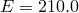 GPa and .

The response of cohesive behavior in the enriched elements in the model is specified. The maximum principal stress failure criterion is selected for damage initiation; and a mixed-mode, energy-based damage evolution law based on a power law criterion is selected for damage propagation. The relevant material data are as follows: 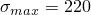 MPa, 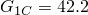  103 N/m, 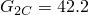  103 N/m, 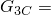 42.2 103 N/m, and . The relevant material data defined above are also used in the model simulated using the XFEM-based LEFM approach. When the low-cycle fatigue analysis using the Paris law is performed, the additional relevant data are as follows: 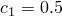, 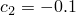, 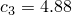  106, , 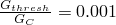, and 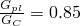.

### Results and discussion

[Figure 1.19.1--2](ch01s19ach133.md#xfem-sen-comparison) shows plots of the prescribed displacement versus the corresponding reaction force obtained using the XFEM method under the pure Mode I loading compared with the results obtained using cohesive elements. The results displayed are from the two-dimensional plane strain analyses. The results obtained using the XFEM method agree well with those obtained using cohesive elements. The results from the equivalent three-dimensional models show similar agreement.

Under the pure Mode II or mixed-mode loading, the crack will no longer propagate along a straight path and will instead propagate along a path based on the maximum tangential stress criterion according to [Erdogan and Sih (1963)](ch01s19ach133.md#erdogan). The direction of crack propagation is given by 

where the crack propagation angle, , is measured with respect to the crack plane.  represents the crack propagation in the “straight-ahead” direction.  if  while  if 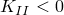. Under pure Mode II loading, the above equation predicts that the crack will propagate at an angle of 70 while the crack propagation angle predicted using XFEM is 66.5.

### Input files

##### **Pure Mode I loading**

#### XFEM-based cohesive segments method:

[crackprop_modeI_xfem_cpe4r.inp](../eif/crackprop_modeI_xfem_cpe4r.inp)

Two-dimensional plane strain model with reduced integration.

[crackprop_modeI_xfem_cpe4.inp](../eif/crackprop_modeI_xfem_cpe4.inp)

Two-dimensional plane strain model.

[crackprop_modeI_xfem_dload_cpe4.inp](../eif/crackprop_modeI_xfem_dload_cpe4.inp)

Two-dimensional plane strain model with distributed pressure loads.

[crackprop_modeI_xfem_cps4r.inp](../eif/crackprop_modeI_xfem_cps4r.inp)

Two-dimensional plane stress model with reduced integration.

[crackprop_modeI_xfem_cps4.inp](../eif/crackprop_modeI_xfem_cps4.inp)

Two-dimensional plane stress model.

[crackprop_modeI_xfem_dload_cps4.inp](../eif/crackprop_modeI_xfem_dload_cps4.inp)

Two-dimensional plane stress model with distributed pressure loads.

[crackprop_modeI_xfem_dload_cax4.inp](../eif/crackprop_modeI_xfem_dload_cax4.inp)

Axisymmetric model with distributed pressure loads.

[crackprop_modeI_xfem_c3d4.inp](../eif/crackprop_modeI_xfem_c3d4.inp)

Three-dimensional tetrahedron model.

[crackprop_modeI_xfem_dload_c3d4.inp](../eif/crackprop_modeI_xfem_dload_c3d4.inp)

Three-dimensional tetrahedron model with distributed pressure loads.

[crackprop_modeI_xfem_c3d8r.inp](../eif/crackprop_modeI_xfem_c3d8r.inp)

Three-dimensional brick model with reduced integration.

[crackprop_modeI_xfem_c3d8.inp](../eif/crackprop_modeI_xfem_c3d8.inp)

Three-dimensional brick model.

[crackprop_modeI_xfem_dload_c3d8.inp](../eif/crackprop_modeI_xfem_dload_c3d8.inp)

Three-dimensional brick model with distributed pressure loads.

[crackprop_modeI_xfem_c3d10.inp](../eif/crackprop_modeI_xfem_c3d10.inp)

Three-dimensional second-order tetrahedron model.

#### XFEM-based LEFM approach:

[crackprop_modeI_lefm_xfem_cpe4r.inp](../eif/crackprop_modeI_lefm_xfem_cpe4r.inp)

Two-dimensional plane strain model with reduced integration.

[crackprop_modeI_lefm_xfem_cpe4.inp](../eif/crackprop_modeI_lefm_xfem_cpe4.inp)

Two-dimensional plane strain model.

[crackprop_modeI_lefm_xfem_c3d4.inp](../eif/crackprop_modeI_lefm_xfem_c3d4.inp)

Three-dimensional tetrahedron model.

[crackprop_modeI_lefm_xfem_c3d8r.inp](../eif/crackprop_modeI_lefm_xfem_c3d8r.inp)

Three-dimensional brick model with reduced integration.

[crackprop_modeI_lefm_xfem_c3d10.inp](../eif/crackprop_modeI_lefm_xfem_c3d10.inp)

Three-dimensional second-order tetrahedron model.

#### XFEM-based low-cycle fatigue analysis:

[crackprop_modeI_fatigue_xfem_cpe4.inp](../eif/crackprop_modeI_fatigue_xfem_cpe4.inp)

Same as crackprop_modeI_lefm_xfem_cpe4.inp but subjected to cyclic displacement loading.

[crackprop_modeI_fatigue_xfem_c3d8r.inp](../eif/crackprop_modeI_fatigue_xfem_c3d8r.inp)

Same as crackprop_modeI_lefm_xfem_c3d8r.inp but subjected to cyclic displacement loading.

[crackprop_modeI_fatigue_xfem_c3d10.inp](../eif/crackprop_modeI_fatigue_xfem_c3d10.inp)

Same as crackprop_modeI_lefm_xfem_c3d10.inp but subjected to cyclic displacement loading.

##### **Pure Mode II loading**

#### XFEM-based cohesive segments method:

[crackprop_modeII_xfem_cpe4r.inp](../eif/crackprop_modeII_xfem_cpe4r.inp)

Two-dimensional plane strain model with reduced integration.

[crackprop_modeII_xfem_cpe4.inp](../eif/crackprop_modeII_xfem_cpe4.inp)

Two-dimensional plane strain model.

[crackprop_modeII_xfem_cps4r.inp](../eif/crackprop_modeII_xfem_cps4r.inp)

Two-dimensional plane stress model with reduced integration.

[crackprop_modeII_xfem_cps4.inp](../eif/crackprop_modeII_xfem_cps4.inp)

Two-dimensional plane stress model.

[crackprop_modeII_xfem_c3d4.inp](../eif/crackprop_modeII_xfem_c3d4.inp)

Three-dimensional tetrahedron model.

[crackprop_modeII_xfem_c3d8r.inp](../eif/crackprop_modeII_xfem_c3d8r.inp)

Three-dimensional brick model with reduced integration.

[crackprop_modeII_xfem_c3d8.inp](../eif/crackprop_modeII_xfem_c3d8.inp)

Three-dimensional brick model.

[crackprop_modeII_xfem_c3d8r_user.inp](../eif/crackprop_modeII_xfem_c3d8r_user.inp)

Same as crackprop_modeII_xfem_c3d8r.inp but with user-defined damage initiation criterion.

[crackprop_maxps_xfem_udmgini.f](../eif/crackprop_maxps_xfem_udmgini.f)

Subroutine for user-defined damage initiation criterion.

[crackprop_modeII_xfem_c3d10.inp](../eif/crackprop_modeII_xfem_c3d10.inp)

Three-dimensional second-order tetrahedron model.

#### XFEM-based LEFM approach:

[crackprop_modeII_lefm_xfem_cpe4r.inp](../eif/crackprop_modeII_lefm_xfem_cpe4r.inp)

Two-dimensional plane strain model with reduced integration.

[crackprop_modeII_lefm_xfem_cpe4.inp](../eif/crackprop_modeII_lefm_xfem_cpe4.inp)

Two-dimensional plane strain model.

[crackprop_modeII_lefm_xfem_c3d4.inp](../eif/crackprop_modeII_lefm_xfem_c3d4.inp)

Three-dimensional tetrahedron model.

[crackprop_modeII_lefm_xfem_c3d8r.inp](../eif/crackprop_modeII_lefm_xfem_c3d8r.inp)

Three-dimensional brick model with reduced integration.

[crackprop_modeII_lefm_xfem_c3d10.inp](../eif/crackprop_modeII_lefm_xfem_c3d10.inp)

Three-dimensional second-order tetrahedron model.

#### XFEM-based low-cycle fatigue analysis:

[crackprop_modeII_fatigue_xfem_cpe4.inp](../eif/crackprop_modeII_fatigue_xfem_cpe4.inp)

Same as crackprop_modeII_lefm_xfem_cpe4.inp but subjected to cyclic displacement loading.

[crackprop_modeII_fatigue_xfem_c3d8r.inp](../eif/crackprop_modeII_fatigue_xfem_c3d8r.inp)

Same as crackprop_modeII_lefm_xfem_c3d8r.inp but subjected to cyclic displacement loading.

[crackprop_modeII_fatigue_xfem_c3d10.inp](../eif/crackprop_modeII_fatigue_xfem_c3d10.inp)

Same as crackprop_modeII_lefm_xfem_c3d10.inp but subjected to cyclic displacement loading.

##### **Mixed-mode loading**

#### XFEM-based cohesive segments method:

[crackprop_mixmode_xfem_cpe4r.inp](../eif/crackprop_mixmode_xfem_cpe4r.inp)

Two-dimensional plane strain model with reduced integration.

[crackprop_mixmode_xfem_cpe4.inp](../eif/crackprop_mixmode_xfem_cpe4.inp)

Two-dimensional plane strain model.

[crackprop_mixmode_xfem_cps4r.inp](../eif/crackprop_mixmode_xfem_cps4r.inp)

Two-dimensional plane stress model with reduced integration.

[crackprop_mixmode_xfem_cps4.inp](../eif/crackprop_mixmode_xfem_cps4.inp)

Two-dimensional plane stress model.

[crackprop_mixmode_xfem_c3d4.inp](../eif/crackprop_mixmode_xfem_c3d4.inp)

Three-dimensional tetrahedron model.

[crackprop_mixmode_xfem_c3d8r.inp](../eif/crackprop_mixmode_xfem_c3d8r.inp)

Three-dimensional brick model with reduced integration.

[crackprop_mixmode_xfem_c3d8.inp](../eif/crackprop_mixmode_xfem_c3d8.inp)

Three-dimensional brick model.

[crackprop_mixmode_xfem_c3d10.inp](../eif/crackprop_mixmode_xfem_c3d10.inp)

Three-dimensional second-order tetrahedron model.

### Python scripts

### Reference

Erdogan,  F., and G. C. Sih, “On the Crack Extension in Plates under Plane Loading and Transverse Shear,” Journal of Basic Engineering, vol. 85 519–527, 1963.

### Figures

**Figure 1.19.1–1** Model geometry for crack propagation in a single-edge notch specimen.

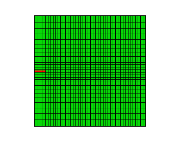

**Figure 1.19.1–2** Reaction force versus prescribed displacement: XFEM and cohesive element results.

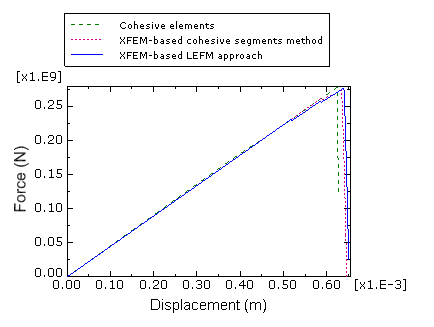

