# 1.19.2 Crack propagation in a plate with a hole simulated using XFEM

**Products: **Abaqus/Standard  Abaqus/CAE  

### Problem description

This example verifies and illustrates the use of the extended finite element method (XFEM) in Abaqus/Standard to predict crack initiation and propagation due to stress concentration in a plate with a hole. Both the XFEM-based cohesive segments method and the XFEM-based linear elastic fracture mechanics (LEFM) approach are used to analyze this problem. The specimen is subjected to pure Mode I loading. In some cases distributed pressure loads are applied to the cracked element surfaces as the crack initiates and propagates in the specimen. The results presented are compared to the available analytical solution. In addition, the same model is analyzed using the XFEM-based low-cycle fatigue  (LCF) criterion to assess the fatigue life when the model is subjected to sub-critical cyclic loading.

### Geometry and model

A plate with a circular hole is studied. The specimen, shown in [Figure 1.19.2--1](ch01s19ach134.md#xfem-hole-geometry), has a length of  0.34 m, a thickness of 0.02 m, a width of 0.2 m, and a hole radius of 0.02 m, under pure Mode I loading. [Figure 1.19.2--1](ch01s19ach134.md#xfem-hole-geometry) defines the dimensions used to calculate the variation of crack length, 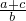: *a* is the crack length, *b* is half the specimen width, and *c* is the hole radius. Equal and opposite displacements are applied at both ends in the longitudinal direction.  The maximum displacement value is set equal to 0.00055 m. To examine the mesh sensitivity, three different mesh discretizations of the same geometry are studied. Symmetry conditions reduce the specimen to a half model. The original mesh, as depicted in [Figure 1.19.2--2](ch01s19ach134.md#xfem-hole-mesh), has 2060 plane strain elements. The second mesh has four times as many elements as the original one, while the third mesh has sixteen times as many elements as the original one. In the low-cycle fatigue analysis, two steps are involved. A static step is used to nucleate a crack at the site of stress concentration prior to the low-cycle fatigue direct cyclic step, in which a cyclic distributed loading with a peak value of  1.25 MPa is specified. Three different mesh discretizations of the same geometry are studied. The second mesh has twice as many elements as the original mesh, while the third mesh has four times as many elements as the original mesh.

### Material

The material data for the bulk material properties in the enriched elements are 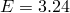 GPa and  = 0.3.

The response of cohesive behavior in the enriched elements in the model is specified. The maximum principal stress failure criterion is selected for damage initiation, and an energy-based damage evolution law based on a BK law criterion is selected for damage propagation. The relevant material data are as follows: 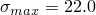 MPa, 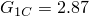  103 N/m, 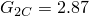  103 N/m, and . The relevant material data defined above are also used in the model simulated using the XFEM-based LEFM approach. When the low-cycle fatigue analysis using the Paris law is performed, the additional relevant data are as follows: , ,   106, , , and .

### Results and discussion

[Figure 1.19.2--3](ch01s19ach134.md#xfem-hole-force-displ) shows plots of the prescribed displacement versus the corresponding reaction force with different mesh discretizations when the XFEM-based cohesive segments method is used. The figure clearly illustrates the convergence of the response to the same solution with mesh refinement. A plot of the applied stress versus the variation of crack length is presented in [Figure 1.19.2--4](ch01s19ach134.md#xfem-hole-comparison) and compared with the results obtained by using the XFEM-based LEFM approach as well as the analytical solution of [Tada et al. (1985)](ch01s19ach134.md#tada). The agreement is better than 10% except when the crack length is small, in which case the stress singularity ahead of the crack is not considered by the XFEM approach. However, as indicated in this figure, the crack initiates (i.e., 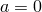) when the applied stress, , reaches a level of 8.37 MPa, giving a ratio of 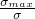 equal to 2.63. This value is in close agreement with the stress concentration factor of 2.52 obtained analytically for the same geometry. In addition, the results in terms of crack length versus the cycle number obtained using the low-cycle fatigue criterion in Abaqus are compared with the theoretical results in [Figure 1.19.2--5](ch01s19ach134.md#xfem-hole-fatigue-comparison). Reasonably good agreement is obtained.

### Input files

[crackprop_hole_xfem_cpe4.inp](../eif/crackprop_hole_xfem_cpe4.inp)

Abaqus/Standard two-dimensional plane strain model with a hole under pure Mode I loading simulated using the XFEM-based cohesive segments method.

[crackprop_hole_xfem_dload_cpe4.inp](../eif/crackprop_hole_xfem_dload_cpe4.inp)

Same as crackprop_hole_xfem_cpe4.inp but with distributed pressure loads.

[crackprop_hole_xfem_dload_user_cpe4.inp](../eif/crackprop_hole_xfem_dload_user_cpe4.inp)

Same as crackprop_hole_xfem_cpe4.inp but with user-defined distributed pressure loads.

[crackprop_hole_xfem_dload_user_cpe4.f](../eif/crackprop_hole_xfem_dload_user_cpe4.f)

Subroutine for user-defined distributed pressure loads.

[crackprop_hole_lefm_xfem_cpe4.inp](../eif/crackprop_hole_lefm_xfem_cpe4.inp)

Abaqus/Standard two-dimensional plane strain model with a hole under pure Mode I loading simulated using the XFEM-based LEFM approach.

[crackprop_hole_xfem_cpe4_user.inp](../eif/crackprop_hole_xfem_cpe4_user.inp)

Same as crackprop_hole_xfem_cpe4.inp but with user-defined damage initiation criterion.

[crackprop_maxps_quads_xfem_udmgini.f](../eif/crackprop_maxps_quads_xfem_udmgini.f)

Subroutine for a user-defined damage initiation criterion with two different failure mechanisms.

[crackprop_hole_fatigue_xfem_cpe4.inp](../eif/crackprop_hole_fatigue_xfem_cpe4.inp)

Same as crackprop_hole_lefm_xfem_cpe4.inp but subjected to cyclic distributed loading.

[crackprop_hole_fatigue_xfem_cpe4_2.inp](../eif/crackprop_hole_fatigue_xfem_cpe4_2.inp)

Same as crackprop_hole_fatigue_xfem_cpe4.inp but with twice as many elements.

[crackprop_hole_fatigue_xfem_cpe4_3.inp](../eif/crackprop_hole_fatigue_xfem_cpe4_3.inp)

Same as crackprop_hole_fatigue_xfem_cpe4.inp but with four times as many elements.

### Python scripts

### Reference

Tada,  H., P. C. Paris, and G. R. Irwin, “The Stress Analysis of Cracks Handbook, 2nd Edition,” Paris Productions Incorporated, 226 Woodbourne Drive, St. Louis, Missouri, 63105, 1985.

### Figures

**Figure 1.19.2–1** Model geometry of the plate with a hole specimen.

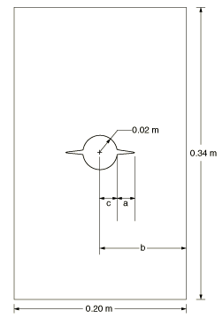

**Figure 1.19.2–2** Original mesh of the half model for crack propagation in a plate with a hole.

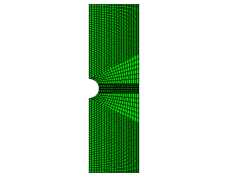

**Figure 1.19.2–3** Reaction force versus prescribed displacement with different mesh discretizations (XFEM-based cohesive segments method).

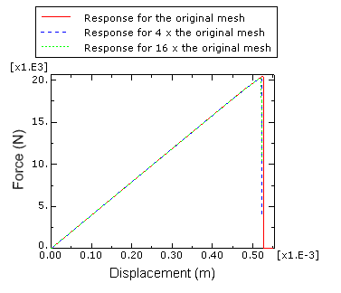

**Figure 1.19.2–4** Applied stress versus variation of crack length: XFEM and analytical solution.

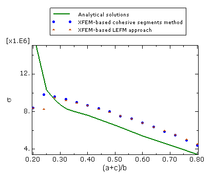

**Figure 1.19.2–5** Crack length versus cycle number in a low-cycle fatigue analysis with different mesh densities.

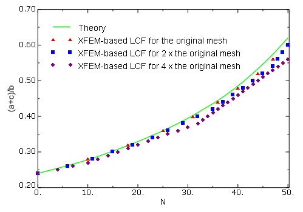

