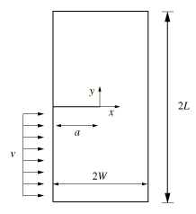
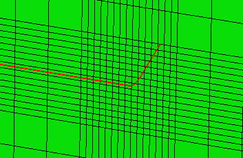

# 1.19.4 Dynamic shear failure of a single-edge notch simulated using XFEM

**Product: **Abaqus/Standard  

### Problem description

This example verifies and illustrates the use of the extended finite element method (XFEM) in Abaqus/Standard to predict dynamic crack propagation of a plate with an edge crack. The specimen is subjected to a high rate shear impact loading. The crack paths and crack initiation angles presented are compared to the experimental results of [Kalthoff and Winkler (1987)](#kalthoff).

### Geometry and model

A plate with a single edge crack is studied. The specimen, shown in [Figure 1.19.4--1](ch01s19ach136.md#xfem-shearbar-geometry), has dimensions L = 0.003 m and W = 0.0015 m and an initial crack with length a = 0.0015 m. The lower part of the specimen is subjected to an impulse load along the horizontal direction, which is modeled as a prescribed velocity:

 where  = 25 m/s and  = 1.0  10–7 s.

### Material

The material data for the bulk material properties in the enriched elements are  = 3.24 GPa,  = 1190  kg/m3, and  = 0.35.

The response of cohesive behavior in the enriched elements in the model is specified. The maximum principal stress failure criterion is selected for damage initiation, and an energy-based damage evolution law based on a power law fracture criterion is selected for damage propagation. The relevant material data are as follows:  = 100.0 MPa,  = 700 N/m,  = 700 N/m,  = 700 N/m,  = 1.0,  = 1.0, and  = 1.0. 

### Results and discussion

[Figure 1.19.4--2](ch01s19ach136.md#xfem-shearbar-crack-profile) shows the crack profile when  = 6.0  10–6 s. The crack propagates at an angle of 62, which is in reasonable agreement with the experimental result of 65.

### Input file

[crackprop_shear_xfem_3d_dyn.inp](../eif/crackprop_shear_xfem_3d_dyn.inp)

Three-dimensional brick model with reduced integration under shear impact loading.

### Python script

### Reference

Kalthoff,  J. K., and S. Winkler, “Failure Mode Transition at High Rates of Loading,” Proceedings of the International Conference on Impact Loading and Dynamic Behavior of Materials 185–195, 1987.

### Figures

**Figure 1.19.4–1** Model geometry of the plate with an edge crack subjected to shear impact loading.

**Figure 1.19.4–2** Crack profile at  = 6.0  10–6 s.

