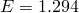
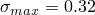
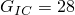
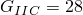
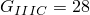
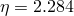
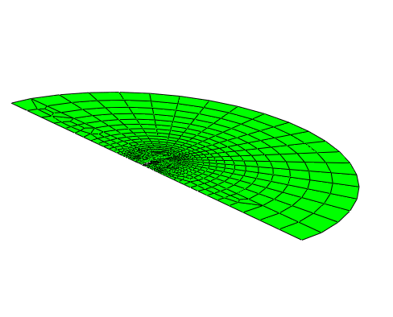
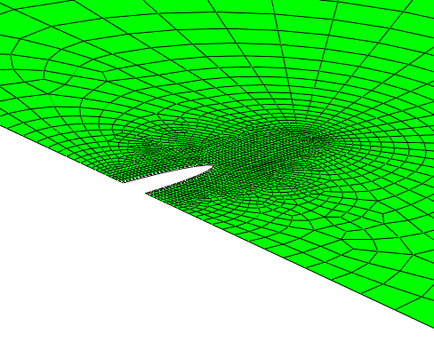
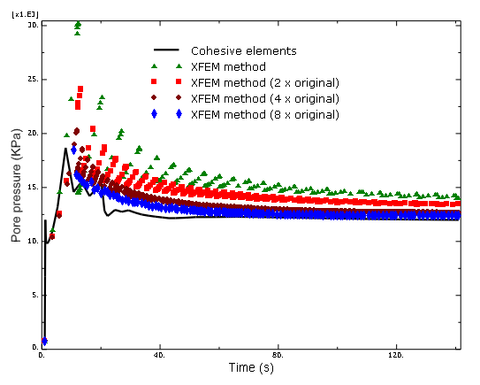
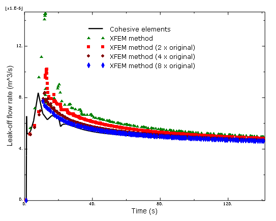

# 1.19.5 Propagation of hydraulically driven fracture using XFEM

**Product: **Abaqus/Standard  

### Problem description

This example verifies and illustrates the use of the extended finite element method (XFEM) in Abaqus/Standard to model hydraulically driven crack propagation in a permeable porous medium. The results presented are compared to those obtained using cohesive elements.

### Geometry and model

The domain of the problem considered in this example is a 1 m thick circular slice of oil-bearing rock with a small initial crack modeled. The domain has a diameter of 160 m.

Due to symmetry only one-half of the domain is modeled. [Figure 1.19.5--1](ch01s19ach137.md#bmk-hydraulicfracture-mesh) shows the finite element model. The rock is modeled with two-dimensional CPE4P elements. Four different mesh discretizations of the same geometry are studied. The second mesh has two times as many elements as the original one, the third mesh has four times as many elements as the original one, while the fourth mesh has eight times as many elements as the original one. Similar analyses are performed using C3D8P, C3D8RP, C3D4P, CAX4P, CAX4RP, and CPE4RP elements.

A two-step analysis is performed, and crack propagation is simulated. A geostatic step is performed where equilibrium is achieved after applying the initial pore pressure to the formation and the initial in-situ stresses. The next step represents the hydraulic fracture stage where the main volume of fluid is being injected into the well. Flow at a rate of 5.0  106  m3 per second is injected in the target formation in the model, and the enriched elements adjacent to the well bore are defined as initially open to permit entry of fluid. The duration of this stage is 140 seconds.

### Material

The material data for the bulk material properties in the enriched elements are  GPa and  = 0.25.

The response of cohesive behavior in the enriched elements in the model is specified. The maximum principal stress failure criterion is selected for damage initiation, and an energy-based damage evolution law based on a BK law criterion is selected for damage propagation. The relevant material data are as follows:  MPa,   103 N/m,   103 N/m,   103 N/m, and . 

Tangential and normal flow are both modeled in the fracture zone of the enriched elements. The following parameters are specified:
- Gap flow is specified as Newtonian with a viscosity of 1 106 kPas, roughly the viscosity of water.
- Fluid leakoff is specified as 5.879 1010 m/(kPas).

### Results and discussion

The flow injected during Step 2, the pumping stage, initiated and grew a crack extending outward from the well bore. [Figure 1.19.5--2](ch01s19ach137.md#bmk-hydraulicfracture-fracturegeometry) shows the resulting geometry of the fracture at the end of the 140-second pumping period. [Figure 1.19.5--3](ch01s19ach137.md#bmk-hydraulicfracture-fracturepressure) shows the pore pressure as a function of time at the crack mouth with different mesh discretizations obtained using the XFEM method compared with those obtained using cohesive elements. This figure clearly indicates that the fluid flow has stabilized. The results obtained using the XFEM method converge with mesh refinement and agree well with those obtained using cohesive elements. The differences are largely due to the fact that the pore pressure averaged over an element is output when the XFEM method is used, while the pore pressure is output at the node when cohesive elements are used. A similar history of the leakoff flow rate at the crack mouth is illustrated in [Figure 1.19.5--4](ch01s19ach137.md#bmk-hydraulicfracture-fractureleakoff).

### Input file

[hydrfract_xfem_cpe4p.inp](../eif/hydrfract_xfem_cpe4p.inp)

Abaqus/Standard two-dimensional plane strain model using CPE4P elements.

[hydrfract_xfem_cpe4p_2.inp](../eif/hydrfract_xfem_cpe4p_2.inp)

Same as hydrfract_xfem_cpe4p.inp but with twice as many elements.

[hydrfract_xfem_cpe4p_3.inp](../eif/hydrfract_xfem_cpe4p_3.inp)

Same as hydrfract_xfem_cpe4p.inp but with four times as many elements.

[hydrfract_xfem_cpe4p_4.inp](../eif/hydrfract_xfem_cpe4p_4.inp)

Same as hydrfract_xfem_cpe4p.inp but with eight times as many elements.

[hydrfract_xfem_cpe4rp.inp](../eif/hydrfract_xfem_cpe4rp.inp)

 Two-dimensional plane strain model using CPE4RP elements.

[hydrfract_xfem_cax4p.inp](../eif/hydrfract_xfem_cax4p.inp)

Axisymmetric model using CAX4P elements.

[hydrfract_xfem_cax4rp.inp](../eif/hydrfract_xfem_cax4rp.inp)

Axisymmetric model using CAX4RP elements.

[hydrfract_xfem_c3d8rp.inp](../eif/hydrfract_xfem_c3d8rp.inp)

Three-dimensional model using C3D8RP elements.

### Figures

**Figure 1.19.5–1** Near well bore mesh.

**Figure 1.19.5–2** Fracture geometry following the injection stage.

**Figure 1.19.5–3** History of the pore pressure at the crack mouth.

**Figure 1.19.5–4** History of the leakoff flow rate at the crack mouth.

