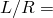
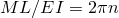
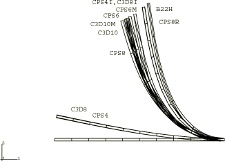
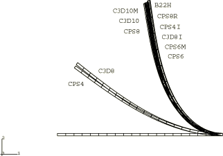
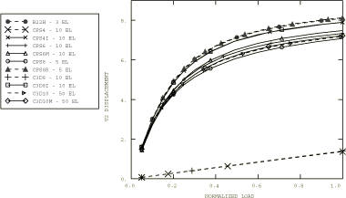
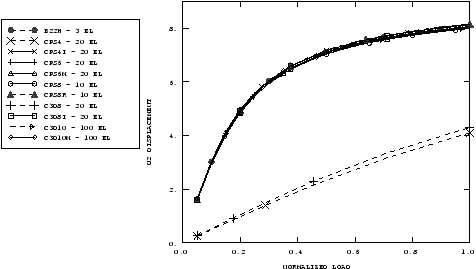
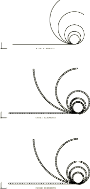
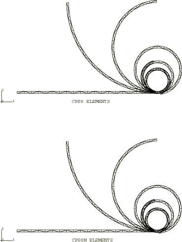

# 2.1.2 Geometrically nonlinear analysis of a cantilever beam

**Product: **Abaqus/Standard  

Most of the elements in Abaqus are written for arbitrarily large displacements and rotations in geometrically nonlinear analysis. Such a capability is particularly important for slender (thin) structures, such as beams and shells. The two problems presented here illustrate the accuracy of several of the beam and continuum elements in large-displacement cases. The first problem is a cantilever loaded at its tip by a load of constant vertical direction. The second is the problem of a cantilever with a tip moment.

### Problem description

The cantilever is 10 m long. A circular pipe cross-section of outer radius 0.1 m and wall thickness 0.01 m is used for closed-section beam elements so that the beam is moderately slender (100). This type of problem becomes considerably more difficult numerically as the slenderness ratio increases. The standard beam elements in Abaqus should have little difficulty up to slenderness ratios of 1000, but above that the hybrid elements are usually required. However, for this example we have elected to use hybrid elements throughout since they result in better convergence for problems where the beam remains inextensible—in this case, the moment load problem, and to a certain degree, the transverse load problem. Young's modulus is chosen as 100 MPa. The model consists of three elements for the transverse load case and either 10 or 20 elements for the moment load problem, depending on whether linear or quadratic elements are used.

Open-section beam elements of type B31OS, B32OS, B31OSH, and B32OSH can be used with ARBITRARY, GENERAL, and I section types. To test these elements, the cross-section is defined as an I-beam with a height of 200 mm, a width of 100 mm, and web and flange thicknesses of 10 mm. An additional degree of freedom (7) defines the amplitude of the cross-sectional warping. Since the problems considered here are two-dimensional, the torsion and warping considerations are irrelevant.

For the continuum elements the solid section thickness and height are chosen to be 100 mm and 147.8 mm, respectively, so that the section moment of inertia is identical to that of the pipe section defined above. The section moment of inertia determines the bending behavior, which is the dominant deformation for both cases since axial deformation is insignificant. We measure the performance of the incompatible mode elements, CPS4I and C3D8I; the second-order elements, CPS8, CPS8R, CPS6, CPS6M, C3D10, C3D10I, and C3D10M; and the first-order elements, CPS4, CPS4R, C3D8, and C3D8R. The corresponding second-order three-dimensional elements, C3D20 and C3D20R, are not included but can be expected to provide about the same results as the CPS8 and CPS8R elements, respectively. A single layer of elements is used in all the meshes. The reduced-integration, linear elements, CPS4R and C3D8R, when used with enhanced hourglass control give good results that match the results obtained using incompatible mode elements since both are based on an assumed strain formulation. Two mesh types are used for the transverse load case: a coarse mesh of 1  10 for the first-order elements and 1  5 for the second-order elements and a fine mesh of 1  20 for the first-order elements and 1  10 for the second-order elements. For the moment load case a 1  40 mesh is used with the element types tested (CPS4I, CPS4R, CPS8R, CPS6, CPS6M, and C3D8R). A fine mesh is needed to converge to the correct result; for this loading case a 1  20 mesh results in a noticeably stiffer response.

For comparison purposes, reduced-integration linear membrane (M3D4R), shell (S4R), and continuum shell (SC8R) elements are used with enhanced hourglass control for the transverse load and moment load cases with the same meshes as for CPS4R elements. In addition, continuum shell meshes are provided for the transverse load and moment load cases with similar meshes as for C3D8R elements.

### Loading

For the transverse load case a total vertical load of 269.35 N is applied at the tip of the cantilever, which causes the tip to deflect more than 8 m.

For the moment load problem two different methods of applying the load to the beam tip are used. In the first a moment of 3384.78 N-m is applied to the end of the closed-section pipe beam and a moment of 2873.09 N-m is applied to the open-section I-beam. In the second method, which is most commonly used for prescribing rotations of more than  radians, a constant angular velocity of 12.5664 rad/time is prescribed at the tip. Since the problem under consideration is a static analysis, Abaqus interprets the angular velocity in terms of the normalized time used for incrementation. An amplitude reference is used to keep the angular velocity constant. The beam will wind around itself twice with either the applied moment or the prescribed angular velocity. ["Boundary conditions in Abaqus/Standard and Abaqus/Explicit," Section 34.3.1 of the Abaqus Analysis User's Guide](../usb/usb-link.md#usb-prc-pboundary), provides details of the method illustrated here to prescribe rotations of more than  radians.

For the continuum elements the moment is applied through a distributing coupling constraint. The distributing coupling constraint is used to couple the nodes at the cantilever tip to a reference node placed at the tip. The moment is applied to this reference node resulting in a force-couple at the bottom and top nodes of the cantilever tip.

### Results and discussion

Displacement plots for the transverse load case are shown for the coarse and fine meshes in [Figure 2.1.2--1](ch02s01ach139.md#sxmnlbeam-dispplotscoarse) and [Figure 2.1.2--2](ch02s01ach139.md#sxmnlbeam-dispplotsfine). [Figure 2.1.2--3](ch02s01ach139.md#sxmnlbeam-disphistcoarse) and [Figure 2.1.2--4](ch02s01ach139.md#sxmnlbeam-disphistfine) plot the displacement histories of the tip of the cantilever for the various elements. For both coarse and fine meshes using B22H, CPS8R, CPS4I, and C3D8I elements the displacements compare well with the exact solution for the inextensible beam, as given by Bisshopp and Drucker (1945). The displacements for CPS8, CPS6, CPS6M, C3D10, C3D10I, and C3D10M improve significantly with the fine mesh, indicating good convergence. As expected, the linear full-integration elements, CPS4 and C3D8, give very stiff responses.

For the moment load problem the deformed shapes of the beams for elements B21H, CPS4I, CPS6, CPS6M, and CPS8R, at various increments throughout the step, are shown in [Figure 2.1.2--5](ch02s01ach139.md#sxmnlbeam-dispmoment-3) and [Figure 2.1.2--6](ch02s01ach139.md#sxmnlbeam-dispmoment-2). The analytical solution for this problem is , where *n* is the number of times the rod will wind around itself. In our problem we have 2, as shown by the final deformed shapes. These analyses can be extended, by minor modifications to the data, to several other interesting large-displacement beam problems (see Love, 1944).

The reduced-integration, linear elements (CPS4R, C3D8R, M3D4R, S4R, and SC8R) with enhanced hourglass control give good results that match the results of incompatible mode elements for both load cases.

### Input files

[nlgeocantilever_b22h_tload.inp](../eif/nlgeocantilever_b22h_tload.inp)

Transverse load case using element B22H.

[nlgeocantilever_b32h_tload.inp](../eif/nlgeocantilever_b32h_tload.inp)

Transverse load case using element B32H.

[nlgeocantilever_b31osh_tload.inp](../eif/nlgeocantilever_b31osh_tload.inp)

Transverse load case using element B31OSH.

[nlgeocantilever_b21h_mload.inp](../eif/nlgeocantilever_b21h_mload.inp)

Moment load case using an applied moment and element B21H.

[nlgeocantilever_b31h_mload.inp](../eif/nlgeocantilever_b31h_mload.inp)

Moment load case using a prescribed rotation and element B31H.

[nlgeocantilever_b32osh_mload.inp](../eif/nlgeocantilever_b32osh_mload.inp)

Moment load case using an applied moment and element B32OSH.

[nlgeocantilever_c3d8_coarse.inp](../eif/nlgeocantilever_c3d8_coarse.inp)

Transverse load case using element C3D8; coarse mesh. The transverse load is applied via DCOUP3D elements instead of the [*COUPLING](../key/key-link.md#usb-kws-mcoupling) option.

[nlgeocantilever_c3d8_fine.inp](../eif/nlgeocantilever_c3d8_fine.inp)

Transverse load case using element C3D8; fine mesh.

[nlgeocantilever_c3d8i_coarse.inp](../eif/nlgeocantilever_c3d8i_coarse.inp)

Transverse load case using element C3D8I; coarse mesh. The transverse load is applied via DCOUP3D elements instead of the [*COUPLING](../key/key-link.md#usb-kws-mcoupling) option.

[nlgeocantilever_c3d8i_fine.inp](../eif/nlgeocantilever_c3d8i_fine.inp)

Transverse load case using element C3D8I; fine mesh. The transverse load is applied via DCOUP3D elements instead of the [*COUPLING](../key/key-link.md#usb-kws-mcoupling) option.

[nlgeocantilever_c3d8r_coarse_eh.inp](../eif/nlgeocantilever_c3d8r_coarse_eh.inp)

Transverse load case using element C3D8R; coarse mesh. The transverse load is applied via DCOUP3D elements instead of the [*COUPLING](../key/key-link.md#usb-kws-mcoupling) option.

[nlgeocantilever_c3d8r_fine_eh.inp](../eif/nlgeocantilever_c3d8r_fine_eh.inp)

Transverse load case using element C3D8R; fine mesh.

[nlgeocantilever_c3d10_coarse.inp](../eif/nlgeocantilever_c3d10_coarse.inp)

Transverse load case using element C3D10; coarse mesh.

[nlgeocantilever_c3d10_fine.inp](../eif/nlgeocantilever_c3d10_fine.inp)

Transverse load case using element C3D10; fine mesh.

[nlgeocantilever_c3d10i_coarse.inp](../eif/nlgeocantilever_c3d10i_coarse.inp)

Transverse load case using element C3D10I; coarse mesh.

[nlgeocantilever_c3d10i_fine.inp](../eif/nlgeocantilever_c3d10i_fine.inp)

Transverse load case using element C3D10I; fine mesh.

[nlgeocantilever_c3d10m_coarse.inp](../eif/nlgeocantilever_c3d10m_coarse.inp)

Transverse load case using element C3D10M; coarse mesh.

[nlgeocantilever_c3d10m_fine.inp](../eif/nlgeocantilever_c3d10m_fine.inp)

Transverse load case using element C3D10M; fine mesh.

[nlgeocantilever_cps4_coarse.inp](../eif/nlgeocantilever_cps4_coarse.inp)

Transverse load case using element CPS4; coarse mesh. The transverse load is applied via DCOUP2D elements instead of the [*COUPLING](../key/key-link.md#usb-kws-mcoupling) option.

[nlgeocantilever_cps4_fine.inp](../eif/nlgeocantilever_cps4_fine.inp)

Transverse load case using element CPS4; fine mesh.

[nlgeocantilever_10cps4i_tload.inp](../eif/nlgeocantilever_10cps4i_tload.inp)

Transverse load case using element CPS4I.

[nlgeocantilever_20cps4i_tload.inp](../eif/nlgeocantilever_20cps4i_tload.inp)

Transverse load case using element CPS4I.

[nlgeocantilever_cps4r_coarse_eh.inp](../eif/nlgeocantilever_cps4r_coarse_eh.inp)

Transverse load case using element CPS4R; coarse mesh. The transverse load is applied via DCOUP2D elements instead of the [*COUPLING](../key/key-link.md#usb-kws-mcoupling) option.

[nlgeocantilever_cps4r_fine_eh.inp](../eif/nlgeocantilever_cps4r_fine_eh.inp)

Transverse load case using element CPS4R; fine mesh.

[nlgeocantilever_cps6_coarse.inp](../eif/nlgeocantilever_cps6_coarse.inp)

Transverse load case using element CPS6; coarse mesh.

[nlgeocantilever_cps6_fine.inp](../eif/nlgeocantilever_cps6_fine.inp)

Transverse load case using element CPS6; fine mesh.

[nlgeocantilever_cps6m_coarse.inp](../eif/nlgeocantilever_cps6m_coarse.inp)

Transverse load case using element CPS6M; coarse mesh. The transverse load is applied via DCOUP2D elements instead of the [*COUPLING](../key/key-link.md#usb-kws-mcoupling) option.

[nlgeocantilever_cps6m_fine.inp](../eif/nlgeocantilever_cps6m_fine.inp)

Transverse load case using element CPS6M; fine mesh.

[nlgeocantilever_cps8_coarse.inp](../eif/nlgeocantilever_cps8_coarse.inp)

Transverse load case using element CPS8; coarse mesh.

[nlgeocantilever_cps8_fine.inp](../eif/nlgeocantilever_cps8_fine.inp)

Transverse load case using element CPS8; fine mesh.

[nlgeocantilever_cps8r_coarse.inp](../eif/nlgeocantilever_cps8r_coarse.inp)

Transverse load case using element CPS8R; coarse mesh. The transverse load is applied via DCOUP2D elements instead of the [*COUPLING](../key/key-link.md#usb-kws-mcoupling) option.

[nlgeocantilever_cps8r_fine.inp](../eif/nlgeocantilever_cps8r_fine.inp)

Transverse load case using element CPS8R; fine mesh.

[nlgeocantilever_m3d4r_coarse_eh.inp](../eif/nlgeocantilever_m3d4r_coarse_eh.inp)

Transverse load case using element M3D4R; coarse mesh. The transverse load is applied via DCOUP3D elements instead of the [*COUPLING](../key/key-link.md#usb-kws-mcoupling) option.

[nlgeocantilever_m3d4r_fine_eh.inp](../eif/nlgeocantilever_m3d4r_fine_eh.inp)

Transverse load case using element M3D4R; fine mesh.

[nlgeocantilever_s4r_coarse_eh.inp](../eif/nlgeocantilever_s4r_coarse_eh.inp)

Transverse load case using element S4R; coarse mesh. The transverse load is applied via DCOUP3D elements instead of the [*COUPLING](../key/key-link.md#usb-kws-mcoupling) option.

[nlgeocantilever_s4r_fine_eh.inp](../eif/nlgeocantilever_s4r_fine_eh.inp)

Transverse load case using element S4R; fine mesh.

[nlgeocantilever_sc6r_fine.inp](../eif/nlgeocantilever_sc6r_fine.inp)

Transverse load case using element SC6R; fine mesh. The transverse load is applied via the [*COUPLING](../key/key-link.md#usb-kws-mcoupling) option.

[nlgeocantilever_sc8r_fine.inp](../eif/nlgeocantilever_sc8r_fine.inp)

Transverse load case using element SC8R; fine mesh. The transverse load is applied via the [*COUPLING](../key/key-link.md#usb-kws-mcoupling) option.

[nlgeocantilever_cps4i_mload.inp](../eif/nlgeocantilever_cps4i_mload.inp)

Moment load case using an applied moment and element CPS4I.

[nlgeocantilever_cps4r_mload_eh.inp](../eif/nlgeocantilever_cps4r_mload_eh.inp)

Moment load case using an applied moment and element CPS4R.

[nlgeocantilever_cps6_mload.inp](../eif/nlgeocantilever_cps6_mload.inp)

Moment load case using element CPS6. The moment is applied via DCOUP2D elements instead of the [*COUPLING](../key/key-link.md#usb-kws-mcoupling) option.

[nlgeocantilever_cps6m_mload.inp](../eif/nlgeocantilever_cps6m_mload.inp)

Moment load case using element CPS6M.

[nlgeocantilever_cps8r_mload.inp](../eif/nlgeocantilever_cps8r_mload.inp)

Moment load case using element CPS8R.

[nlgeocantilever_c3d8r_mload_eh.inp](../eif/nlgeocantilever_c3d8r_mload_eh.inp)

Moment load case using element C3D8R.

[nlgeocantilever_m3d4r_mload_eh.inp](../eif/nlgeocantilever_m3d4r_mload_eh.inp)

Moment load case using an applied moment and element M3D4R.

[nlgeocantilever_s4r_mload_eh.inp](../eif/nlgeocantilever_s4r_mload_eh.inp)

Moment load case using an applied moment and element S4R.

[nlgeocantilever_sc6r_mload.inp](../eif/nlgeocantilever_sc6r_mload.inp)

Moment load case using element SC6R. The moment is applied via the [*COUPLING](../key/key-link.md#usb-kws-mcoupling) option.

[nlgeocantilever_sc8r_mload.inp](../eif/nlgeocantilever_sc8r_mload.inp)

Moment load case using element SC8R. The moment is applied via the [*COUPLING](../key/key-link.md#usb-kws-mcoupling) option.

[nlgeocantilever_sc8r_mload_eh.inp](../eif/nlgeocantilever_sc8r_mload_eh.inp)

Moment load case using element SC8R with enhanced hourglass control. The moment is applied via the [*COUPLING](../key/key-link.md#usb-kws-mcoupling) option.

### References

Bisshopp,  R. E., and D. C. Drucker, “Large Deflection of Cantilever Beams,” Quarterly of Applied Mathematics, vol. 3, no.1, 1945.

Love,  A. E. H., *A Treatise on the Mathematical Theory of Elasticity, *Dover Publications, New York, 1944.

### Figures

**Figure 2.1.2–1** Displacement plots for coarse mesh of cantilever beam with transverse loading.

**Figure 2.1.2–2** Displacement plots for fine mesh of cantilever beam with transverse loading.

**Figure 2.1.2–3** Displacement history of tip of coarse mesh of cantilever beam with transverse loading.

**Figure 2.1.2–4** Displacement history of tip of fine mesh of cantilever beam with transverse loading.

**Figure 2.1.2–5** Displacement plots of cantilever with moment loading.

**Figure 2.1.2–6** Displacement plots of cantilever with moment loading.

