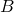
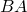
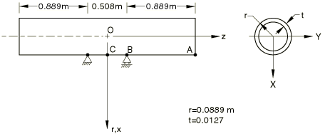

# 2.1.4 Two-point bending of a pipe due to self weight: CAXA and SAXA elements

**Product: **Abaqus/Standard  

### Problem description

The material is linear elastic with a Young's modulus of 207 GPa, a Poisson's ratio of 0.3, and a weight density of 0.15 MN/m3.  on the  plane;  at point . A gravity force is considered to be acting in the positive *x*-direction.

#### CAXA mesh

In the analyses that test the CAXA elements, only the symmetric half of the structure is considered. The models using full-integration and reduced-integration second-order elements employ one element through the thickness and seven elements along the pipe, with two equal-sized elements along  and five equal-sized elements along . The models using the lower-order fully integrated elements employ twice as many elements in both the radial and axial directions. The models using the lower-order reduced-integration elements employ four times as many elements in both the radial and axial directions.

#### SAXA mesh

 In the analyses that test the SAXA elements, only the symmetric half of the structure is considered. Second-order element models use seven elements along the pipe, with two equal-sized elements along  and five equal-sized elements along . First-order element models use 14 elements along the pipe, with four equal-sized elements along  and 10 equal-sized elements along . 

### Reference solution

This problem provides a test on the body force type BX for the axisymmetric solid elements with nonlinear, asymmetric deformation. The reference solution is obtained from the analysis of an equivalent three-dimensional model using the 20-node brick element C3D20. The three-dimensional mesh employs one element in the radial direction, six elements in the circumferential direction, and seven elements along the pipe. The input file for the reference solution is [eref3ksg.inp](../eif/eref3ksg.inp).

### Results and discussion

The solutions are linear, small-displacement solutions and are in good agreement with the reference solution.

### Input files

[ecnssfsg.inp](../eif/ecnssfsg.inp)

CAXA41 elements.

[ecnssrsg.inp](../eif/ecnssrsg.inp)

CAXA4R1 elements.

[ecnsshsg.inp](../eif/ecnsshsg.inp)

CAXA4H1 elements.

[ecnssysg.inp](../eif/ecnssysg.inp)

CAXA4RH1 elements.

[ecntsfsg.inp](../eif/ecntsfsg.inp)

CAXA42 elements.

[ecntsrsg.inp](../eif/ecntsrsg.inp)

CAXA4R2 elements.

[ecntshsg.inp](../eif/ecntshsg.inp)

CAXA4H2 elements.

[ecntsysg.inp](../eif/ecntsysg.inp)

CAXA4RH2 elements.

[ecnusfsg.inp](../eif/ecnusfsg.inp)

CAXA43 elements.

[ecnusrsg.inp](../eif/ecnusrsg.inp)

CAXA4R3 elements.

[ecnushsg.inp](../eif/ecnushsg.inp)

CAXA4H3 elements.

[ecnusysg.inp](../eif/ecnusysg.inp)

CAXA4RH3 elements.

[ecnvsfsg.inp](../eif/ecnvsfsg.inp)

CAXA44 elements.

[ecnvsrsg.inp](../eif/ecnvsrsg.inp)

CAXA4R4 elements.

[ecnvshsg.inp](../eif/ecnvshsg.inp)

CAXA4H4 elements.

[ecnvsysg.inp](../eif/ecnvsysg.inp)

CAXA4RH4 elements.

[ecnwsfsg.inp](../eif/ecnwsfsg.inp)

CAXA81 elements.

[ecnwsrsg.inp](../eif/ecnwsrsg.inp)

CAXA8R1 elements.

[ecnwshsg.inp](../eif/ecnwshsg.inp)

CAXA8H1 elements.

[ecnwsysg.inp](../eif/ecnwsysg.inp)

CAXA8RH1 elements.

[ecnxsfsg.inp](../eif/ecnxsfsg.inp)

CAXA82 elements.

[ecnxsrsg.inp](../eif/ecnxsrsg.inp)

CAXA8R2 elements.

[ecnxshsg.inp](../eif/ecnxshsg.inp)

CAXA8H2 elements.

[ecnxsysg.inp](../eif/ecnxsysg.inp)

CAXA8RH2 elements.

[ecnysfsg.inp](../eif/ecnysfsg.inp)

CAXA83 elements.

[ecnyshsg.inp](../eif/ecnyshsg.inp)

CAXA8H3 elements.

[ecnwpfsg.inp](../eif/ecnwpfsg.inp)

CAXA8P1 elements.

[ecnwprsg.inp](../eif/ecnwprsg.inp)

CAXA8RP1 elements.

[ecnxpfsg.inp](../eif/ecnxpfsg.inp)

CAXA8P2 elements.

[ecnxprsg.inp](../eif/ecnxprsg.inp)

CAXA8RP2 elements.

[ecnypfsg.inp](../eif/ecnypfsg.inp)

CAXA8P3 elements.

[ecnyprsg.inp](../eif/ecnyprsg.inp)

CAXA8RP3 elements.

[esnssxsg.inp](../eif/esnssxsg.inp)

SAXA11 elements.

[esntsxsg.inp](../eif/esntsxsg.inp)

SAXA12 elements.

[esnusxsg.inp](../eif/esnusxsg.inp)

SAXA13 elements.

[esnvsxsg.inp](../eif/esnvsxsg.inp)

SAXA14 elements.

[esnwsxsg.inp](../eif/esnwsxsg.inp)

SAXA21 elements.

[esnxsxsg.inp](../eif/esnxsxsg.inp)

SAXA22 elements.

[esnysxsg.inp](../eif/esnysxsg.inp)

SAXA23 elements.

[esnzsxsg.inp](../eif/esnzsxsg.inp)

SAXA24 elements.

### Figure

**Figure 2.1.4–1** Two-point bending of a pipe.

