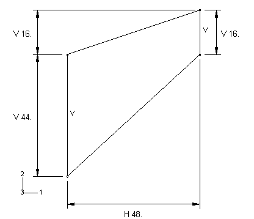
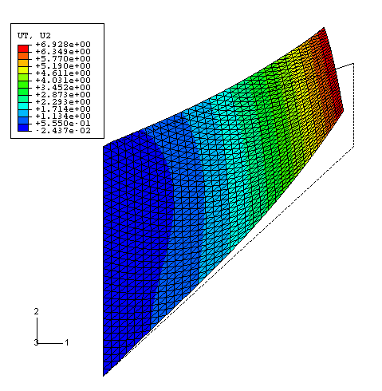
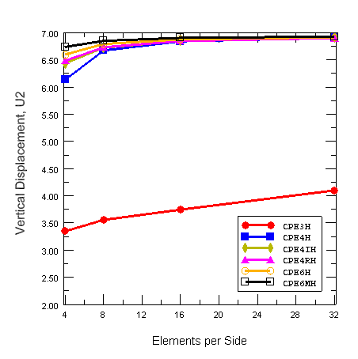
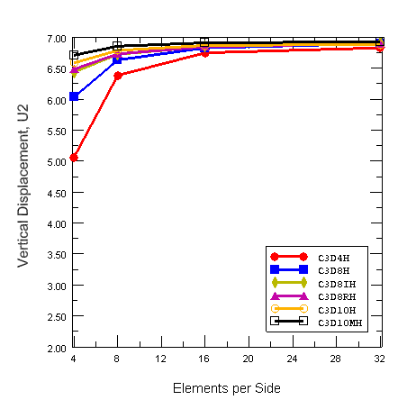

# 2.1.5 Cook's membrane problem

**Product: **Abaqus/Standard  

 “Cook's membrane problem” is a standard test for combined bending and shear response with moderate distortion. It consists of a tapered panel of nearly incompressible hyperelastic material clamped on one side while a shearing load is applied on the opposite side. The problem is solved with both plane strain and three-dimensional hybrid elements. A mesh convergence study is performed.

### Problem description

The panel measures 44 mm on the left-hand side and 16 mm on the right-hand side. The two sides are parallel and 48 mm apart. The top right-hand corner is initially 16 mm above the top left-hand corner, as shown in [Figure 2.1.5--1](ch02s01ach142.md#bmk-elm-panel). The panel is clamped on its left edge and loaded in shear with a 1.0 N force on its right edge. It is composed of nearly incompressible neo-Hookean material with parameters =0.4 and =2.5  104 to enable comparison with the results of Simo and Armero (1992) and Brink and Stein (1996). When solving the problem with three-dimensional elements, a thickness of 5 mm is assumed and symmetry boundary conditions are applied on the *X–Y* plane faces. 

Hybrid elements are used due to the nearly incompressible nature of the material. The plane strain problem is solved with meshes composed of triangular (CPE3H, CPE6H, and CPE6MH) and quadrilateral (CPE4H, CPE4IH, and CPE4RH) elements. The three-dimensional problem is solved with meshes composed of tetrahedral (C3D4H, C3D10H, and C3D10MH) and hexahedral (C3D8H, C3D8IH, and C3D8RH) elements. A mesh convergence study is performed: for each element type the problem is solved with increasingly refined meshes of 4, 8, 16, and 32 elements on each side of the panel. For three-dimensional elements, a fixed number of two elements through the thickness is considered.

### Loading

The concentrated load of 1.0 N is applied through a distributing coupling constraint. The distributing coupling constraint is used to couple the nodes on the right edge of the panel to a reference node where the load is applied. 

### Results and discussion

[Figure 2.1.5--2](ch02s01ach142.md#bmk-elm-c3d4h32) shows the deformed configuration corresponding to a mesh consisting of 32 C3D4H elements per side. [Figure 2.1.5--3](ch02s01ach142.md#bmk-elm-cook2d) shows the vertical displacement of the top right-edge node versus the number of elements per side for the plane strain elements considered, while [Figure 2.1.5--4](ch02s01ach142.md#bmk-elm-cook3d) shows a similar plot for the three-dimensional elements. The CPE3H element results are particularly stiff due to their poor bending and nearly incompressible behavior. All other elements converge to the same result as the meshes are refined; however, we note the stiff response in coarse meshes exhibited by the full-integration quadrilateral (CPE4H) elements, the full-integration hexahedral (C3D8H) elements, and the linear tetrahedral (C3D4H) elements. Reduced-integration quadrilateral (CPE4RH) and hexadedral (C3D8RH) elements show good agreement with the converged solution even for coarse meshes; however, the predicted stress in the reduced-integration coarse meshes is compromised by the reduced number of sampling points. When an accurate stress distribution is required, quadratic or incompatible mode elements should be used.

### Input files

[cook_2d.inp](../eif/cook_2d.inp)

Solution using plane strain elements.

[cook_3d.inp](../eif/cook_3d.inp)

Solution using three-dimensional elements.

### References

Simo,  J. C., and F. Armero, “Geometrically Nonlinear Enhanced Strain Mixed Methods and the Method of Incompatible Modes,” International Journal for Numerical Methods in Engineering, vol. 33, pp. 1413–1449, 1992.

Brink,  U., and E. Stein, “On some Mixed Finite Element Methods for Incompressible and Nearly Incompressible Finite Elasticity,” Computational Mechanics, vol. 19, pp. 105–119, 1996.

### Figures

**Figure 2.1.5–1** Cook's membrane problem: initial geometry.

**Figure 2.1.5–2** Final deformed configuration (C3D4H elements, 32 elements per side).

**Figure 2.1.5–3** Mesh convergence study for plane strain elements.

**Figure 2.1.5–4** Mesh convergence study for three-dimensional elements.

