# 2.2.2 Infinite elements: the Boussinesq and Flamant problems

**Product: **Abaqus/Standard  

In this example we solve two problems to verify the performance of infinite elements in modeling the far-field domain. The results from the problem of a point load on a half-space and a line load on a half-space are compared with the analytical solutions due to Boussinesq and Flamant (Timoshenko and Goodier, 1970), respectively. For comparison purposes results obtained using only finite elements are also given.

### Problem description

For the Boussinesq problem of a point load on a half-space two mesh configurations are used. The infinite element mesh, [Figure 2.2.2--1](ch02s02ach144.md#sxmbousflam-fin-infmesh), is composed of 12 finite elements extending to a radius of 4.0, with 4 infinite elements modeling the far-field domain. The finite element mesh, [Figure 2.2.2--2](ch02s02ach144.md#sxmbousflam-finmesh), is made up of 16 finite elements, truncated at a radius of 5.0, where fully fixed boundary conditions are applied.

The positioning of the second node in the infinite direction in the infinite elements is such that the first node is equidistant between the source of loading and the second node.

For the Flamant problem of a line load on a half-space, the same mesh configurations are used. In this case they are in plane strain, and a vertical plane of symmetry is used.

The material is linear elastic, with Young's modulus  1.0 and Poisson's ratio  0.1. A unit load is applied in both problems.

### Results and discussion

Boussinesq's analytical solution for the problem of a point load on a half-space gives the vertical displacement as 

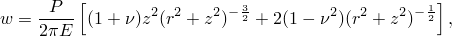

where *r* and *z* are the radial and vertical distance from the point load, respectively. This equation clearly shows the 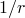 singularity at the point of application of the load (0). Here we compare the displacement variation along a vertical line beneath the point load where, for the given elastic properties, 

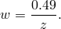

This analytical result is plotted in [Figure 2.2.2--3](ch02s02ach144.md#sxmbousflam-bousdisp), together with results obtained with the finite and infinite element models.

It is clear that the results obtained with the infinite element meshes show a significant improvement over the finite element meshes with the same number of elements, and that the infinite elements provide reasonable accuracy even with such relatively coarse modeling. In this case the load is a point load, so that the infinite elements can be focused on the pole of the solution. ["Infinite elements: circular load on half-space," Section 2.2.3](ch02s02ach145.md), considers a distributed load, for which the infinite element mesh design is not as obvious.

Flamant's analytical solution for the problem of a line load on a half-space gives the vertical displacement along a vertical line beneath the line load as 

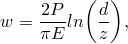

where *d* is an arbitrary large distance at which the displacement is assumed to be zero (see the discussion in ["Infinite elements," Section 28.3.1 of the Abaqus Analysis User's Guide](../usb/usb-link.md#usb-elm-einfinite)). Here, we have chosen to fix the far-field nodes on the infinite elements so that 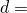 8.0. This analytical result is plotted in [Figure 2.2.2--4](ch02s02ach144.md#sxmbousflam-flamdisp). The results obtained with the finite and infinite element models are also shown in this figure. Even though the infinite elements contain displacement interpolations in the infinite direction with terms of order 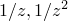 while the analytical solution is of a 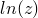 nature, they provide a significant improvement over the solutions obtained with finite elements only.

### Input files

[bousflamant_bous_cax4_cinax4.inp](../eif/bousflamant_bous_cax4_cinax4.inp)

First-order coupled finite/infinite element axisymmetric mesh.

[bousflamant_bous_cax4_cinax4_po.inp](../eif/bousflamant_bous_cax4_cinax4_po.inp)

[*POST OUTPUT](../key/key-link.md#usb-kws-hpostoutput) analysis.

[bousflamant_bous_cax8r_cinax5r.inp](../eif/bousflamant_bous_cax8r_cinax5r.inp)

Second-order coupled finite/infinite element axisymmetric mesh.

[bousflamant_flam_cpe4_cinpe4.inp](../eif/bousflamant_flam_cpe4_cinpe4.inp)

Plane strain Flamant problem; first-order coupled finite/infinite element axisymmetric mesh.

[bousflamant_flam_cpe8r_cinpe5r.inp](../eif/bousflamant_flam_cpe8r_cinpe5r.inp)

Plane strain Flamant problem; second-order coupled finite/infinite element axisymmetric mesh.

### Reference

Timoshenko,  S. P., and J. N. Goodier, *Theory of Elasticity, *McGraw-Hill, New York, 1970.

### Figures

**Figure 2.2.2–1** Finite/infinite element mesh.

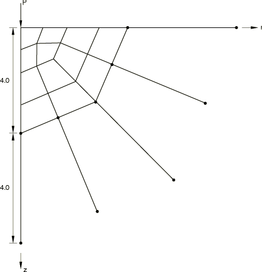

**Figure 2.2.2–2** Mesh of finite elements only.

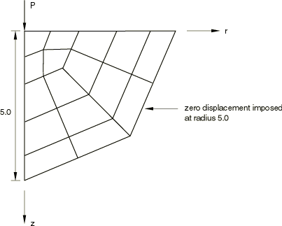

**Figure 2.2.2–3** The Boussinesq problem: displacement results.

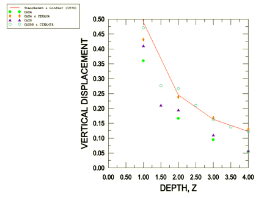

**Figure 2.2.2–4** The Flamant problem: displacement results.

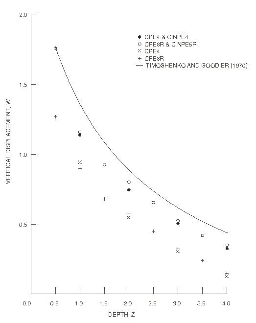

