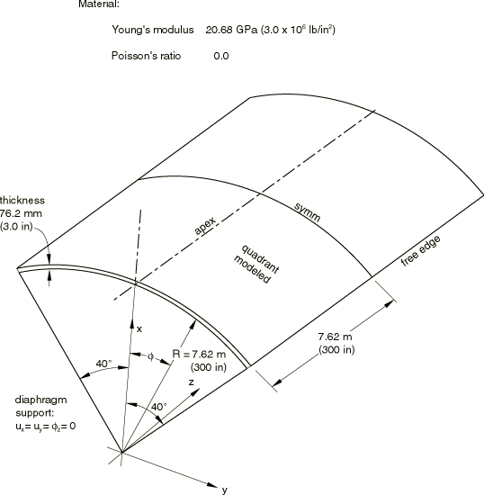
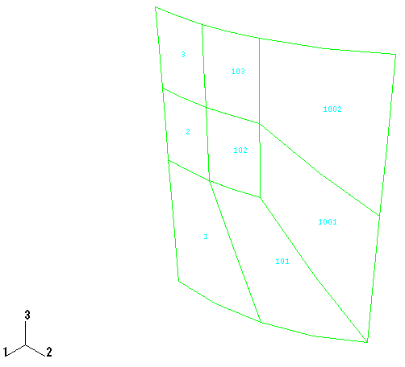

# 2.3.1 The barrel vault roof problem

**Products: **Abaqus/Standard  Abaqus/Explicit  

Over the past several years a small set of linear test cases has emerged as a critical test set for shell elements (see, for example, the collection of papers on numerical modeling of shells—edited by Ashwell and Gallagher, 1976—and the survey paper by Belytschko, 1986). The set contains three cases: the barrel vault roof (this example), the cylinder with end diaphragm support subjected to pinching loads (["The pinched cylinder problem," Section 2.3.2](ch02s03ach148.md)), and the point loaded hemispherical shell (["LE3: Hemispherical shell with point loads," Section 4.2.3](ch04s02anf03.md)). It has been generally accepted that any elements that perform well on all three cases should provide accurate results for most general shell problems. These test cases are included in this guide so that the performance of the shell elements offered in Abaqus can be assessed.

Most modern shell elements, including those in Abaqus, do a good job on these problems. Although this is an indication that the elements usually provide good results, it should not be taken as a sufficient demonstration of the quality of an element's performance in all cases. For example, all three of these problems are completely regular geometries; the candidate element's usefulness in irregular geometries (and most practical cases involve a high degree of geometric irregularity) is not tested. In this example we make some attempt to address this issue by modeling not only with the regular mesh that would be the natural choice for the problem, but also with a mesh that might be the basis of analysis of a problem with the same underlying shape but with some type of local, irregular feature, such as a crack. Results for both types of mesh are reported below. As would be expected, the irregular mesh results are not as good as those provided by a regular mesh with the same number of variables.

The problem is analyzed using various shell elements available in Abaqus and different mesh densities. Thus, the example provides an indication of the relative efficiency of these elements.

### Problem description

The problem is shown in [Figure 2.3.1--1](ch02s03ach147.md#sxmbarrel-geom). The physical basis of the problem is a deeply arched roof supported only by diaphragms at its curved edges (an aircraft hanger), deforming under its own weight. It is interesting to observe that the geometry is such that the center point of the roof moves upward under the self-weight (downwardly directed) load. Perhaps this is one reason why the problem is not straightforward numerically.

Two discretizations are studied: a regular meshing and an irregular meshing of the type that might be used when a local refinement is desired ([Figure 2.3.1--2](ch02s03ach147.md#sxmbarrel-mesh)). This method of mesh refinement is not being recommended: the irregular meshing is introduced here simply to record some results for the shell element used in this way.

The actual roof spans 15.24 m (600 in) between supports and has a thickness of 76.2 mm (3 in), so it would be considered to be a “thin” shell. Some of the shell elements in Abaqus/Standard (element types S4R5, S8R5, S9R5, STRI3, and STRI65) are intended to be used as thin shells. In these elements the Kirchhoff assumption, that lines initially normal to the shell's reference surface remain normal to that surface during the deformation, is imposed either algebraically (in element type STRI3) or numerically (in element types S4R5, S8R5, S9R5, and STRI65). Shell elements S4R, S4, and S3R and continuum shell elements SC6R and SC8R use an assumed strain treatment for the transverse shear that imposes the Kirchhoff constraint numerically for thin shells and provides accurate transverse shear predictions for thick shells. Element types S4R, S4, S3R, SC6R, and SC8R are, hence, valid for both thin and thick applications. Element type S8R is mainly intended to be used for thick shell modeling, where transverse shear flexibility may be an important part of the deformation. When this element is used to model thin shells, the transverse shear stiffness is treated as a penalty to impose the Kirchhoff assumption discretely, the penalty being chosen based on the technique described by Hughes et al. (1977).

In Abaqus/Explicit the problem is modeled using S4 elements, S4R elements with enhanced hourglass control, S3R elements, and S3RS elements.

### Results and discussion

The results for both the regular and irregular meshes are described below.

#### Regular mesh

These results are summarized in [Table 2.3.1--1](ch02s03ach147.md#table-barrel-disp-reg), where the vertical motion of the center of the free edge is recorded. The generally accepted solution for this single displacement value, based on deep shell theory, is 91.2 mm (3.59 in) (see the chapter by Ashwell in Ashwell and Gallagher (1976) for a discussion of both semianalytical and purely numerical solutions to this example). [Table 2.3.1--1](ch02s03ach147.md#table-barrel-disp-reg) records the error in this single displacement value compared to this “exact” solution.

From [Table 2.3.1--1](ch02s03ach147.md#table-barrel-disp-reg) it is apparent that the second-order thin shell elements (S8R5, S9R5) are the most effective elements for this problem, with S8R, STRI65, and the first-order quadrilaterals (S4, S4R5, S4R) providing almost as good a solution except for the coarsest mesh used.

#### Irregular mesh

The results provided by the irregular mesh models are summarized in [Table 2.3.1--2](ch02s03ach147.md#table-barrel-disp-irreg). These results are not as accurate as the results provided by regular mesh models having roughly the same number of elements and degrees of freedom. Nevertheless, when a relatively fine mesh is used, all the elements provide acceptable results even with the irregular mesh pattern. The poor accuracy of the results provided by element type S8R with the coarse irregular mesh is particularly noticeable and serves as a warning of how important it is to use a regular mesh with this element type in a thin shell in which there are high strain gradients.

#### Summary

In summary, based on this example: 

1. For thin shell modeling the most effective elements provided in Abaqus/Standard are S8R5 and S9R5. Element STRI65 is fully compatible with S8R5 and S9R5 and is recommended for mesh refinement.
2. The first-order triangular elements are not as good as the corresponding mesh of first-order quadrilateral elements. It is generally recommended that the triangles be used only to complete meshes that cannot be generated easily with quadrilaterals, and then they should only be used where both the bending and membrane strain gradients are not large.
3. Whenever possible, ensure that the mesh follows lines of principal curvature of the shell.
4. Perform convergence studies on any problem for which the elements have not been used previously.
5. Expect deterioration of the elements' performance if they are distorted.

### Input files

##### **Abaqus/Standard input files:**

#### S3R element models:

[barrelvault_s3r_reg44.inp](../eif/barrelvault_s3r_reg44.inp)

Regular 4  4 mesh.

[barrelvault_s3r_reg88.inp](../eif/barrelvault_s3r_reg88.inp)

Regular 8  8 mesh.

[barrelvault_s3r_reg1818.inp](../eif/barrelvault_s3r_reg1818.inp)

Regular 18  18 mesh.

[barrelvault_s3r_irreg.inp](../eif/barrelvault_s3r_irreg.inp)

Coarse irregular mesh.

[barrelvault_s3r_fineirreg.inp](../eif/barrelvault_s3r_fineirreg.inp)

Fine irregular mesh.

#### S4 element models:

[barrelvault_s4_reg44.inp](../eif/barrelvault_s4_reg44.inp)

Regular 4  4 mesh.

[barrelvault_s4_reg88.inp](../eif/barrelvault_s4_reg88.inp)

Regular 8  8 mesh.

[barrelvault_s4_reg1818.inp](../eif/barrelvault_s4_reg1818.inp)

Regular 18  18 mesh.

[barrelvault_s4_irreg.inp](../eif/barrelvault_s4_irreg.inp)

Coarse irregular mesh.

[barrelvault_s4_fineirreg.inp](../eif/barrelvault_s4_fineirreg.inp)

Fine irregular mesh.

#### S4R element models:

[barrelvault_s4r_reg44.inp](../eif/barrelvault_s4r_reg44.inp)

Regular 4  4 mesh.

[barrelvault_s4r_reg88.inp](../eif/barrelvault_s4r_reg88.inp)

Regular 8  8 mesh.

[barrelvault_s4r_reg1818.inp](../eif/barrelvault_s4r_reg1818.inp)

Regular 18  18 mesh.

[barrelvault_s4r_irreg.inp](../eif/barrelvault_s4r_irreg.inp)

Coarse irregular mesh.

[barrelvault_s4r_fineirreg.inp](../eif/barrelvault_s4r_fineirreg.inp)

Fine irregular mesh.

#### S4R5 element models:

[barrelvault_s4r5_reg44.inp](../eif/barrelvault_s4r5_reg44.inp)

Regular 4  4 mesh.

[barrelvault_s4r5_reg88.inp](../eif/barrelvault_s4r5_reg88.inp)

Regular 8  8 mesh.

[barrelvault_s4r5_reg1818.inp](../eif/barrelvault_s4r5_reg1818.inp)

Regular 18  18 mesh.

[barrelvault_s4r5_irreg.inp](../eif/barrelvault_s4r5_irreg.inp)

Coarse irregular mesh.

[barrelvault_s4r5_fineirreg.inp](../eif/barrelvault_s4r5_fineirreg.inp)

Fine irregular mesh.

#### S8R element models:

[barrelvault_s8r_reg22.inp](../eif/barrelvault_s8r_reg22.inp)

Regular 2  2 mesh.

[barrelvault_s8r_reg44.inp](../eif/barrelvault_s8r_reg44.inp)

Regular 4  4 mesh.

[barrelvault_s8r_reg99.inp](../eif/barrelvault_s8r_reg99.inp)

Regular 9  9 mesh.

[barrelvault_s8r_reg2020.inp](../eif/barrelvault_s8r_reg2020.inp)

Regular 20  20 mesh.

[barrelvault_s8r_reg3030.inp](../eif/barrelvault_s8r_reg3030.inp)

Regular 30  30 mesh.

[barrelvault_s8r_irreg.inp](../eif/barrelvault_s8r_irreg.inp)

Coarse irregular mesh.

[barrelvault_s8r_fineirreg.inp](../eif/barrelvault_s8r_fineirreg.inp)

Fine irregular mesh.

#### S8R5 element models:

[barrelvault_s8r5_reg22.inp](../eif/barrelvault_s8r5_reg22.inp)

Regular 2  2 mesh.

[barrelvault_s8r5_reg44.inp](../eif/barrelvault_s8r5_reg44.inp)

Regular 4  4 mesh.

[barrelvault_s8r5_reg99.inp](../eif/barrelvault_s8r5_reg99.inp)

Regular 9  9 mesh.

[barrelvault_s8r5_reg2020.inp](../eif/barrelvault_s8r5_reg2020.inp)

Regular 20  20 mesh.

[barrelvault_s8r5_reg3030.inp](../eif/barrelvault_s8r5_reg3030.inp)

Regular 30  30 mesh.

[barrelvault_s8r5_irreg.inp](../eif/barrelvault_s8r5_irreg.inp)

Coarse irregular mesh.

[barrelvault_s8r5_fineirreg.inp](../eif/barrelvault_s8r5_fineirreg.inp)

Fine irregular mesh.

[barrelvault_s8r5_post_reg44.inp](../eif/barrelvault_s8r5_post_reg44.inp)

[*POST OUTPUT](../key/key-link.md#usb-kws-hpostoutput) of barrelvault_s8r5_reg44.inp.

#### S9R5 element models:

[barrelvault_s9r5_reg22.inp](../eif/barrelvault_s9r5_reg22.inp)

Regular 2  2 mesh.

[barrelvault_s9r5_reg44.inp](../eif/barrelvault_s9r5_reg44.inp)

Regular 4  4 mesh.

[barrelvault_s9r5_reg99.inp](../eif/barrelvault_s9r5_reg99.inp)

Regular 9  9 mesh.

[barrelvault_s9r5_reg2020.inp](../eif/barrelvault_s9r5_reg2020.inp)

Regular 20  20 mesh.

[barrelvault_s9r5_reg3030.inp](../eif/barrelvault_s9r5_reg3030.inp)

Regular 30  30 mesh.

[barrelvault_s9r5_irreg.inp](../eif/barrelvault_s9r5_irreg.inp)

Coarse irregular mesh.

[barrelvault_s9r5_fineirreg.inp](../eif/barrelvault_s9r5_fineirreg.inp)

Fine irregular mesh.

#### SC6R element models:

[barrelvault_sc6r_reg44.inp](../eif/barrelvault_sc6r_reg44.inp)

Regular 4  4 mesh.

[barrelvault_sc6r_reg88.inp](../eif/barrelvault_sc6r_reg88.inp)

Regular 8  8 mesh.

[barrelvault_sc6r_reg1818.inp](../eif/barrelvault_sc6r_reg1818.inp)

Regular 18  18 mesh.

[barrelvault_sc6r_irreg.inp](../eif/barrelvault_sc6r_irreg.inp)

Coarse irregular mesh.

[barrelvault_sc6r_fineirreg.inp](../eif/barrelvault_sc6r_fineirreg.inp)

Fine irregular mesh.

#### SC8R element models:

[barrelvault_sc8r_reg44.inp](../eif/barrelvault_sc8r_reg44.inp)

Regular 4  4 mesh.

[barrelvault_sc8r_reg88.inp](../eif/barrelvault_sc8r_reg88.inp)

Regular 8  8 mesh.

[barrelvault_sc8r_reg1818.inp](../eif/barrelvault_sc8r_reg1818.inp)

Regular 18  18 mesh.

[barrelvault_sc8r_irreg.inp](../eif/barrelvault_sc8r_irreg.inp)

Coarse irregular mesh.

[barrelvault_sc8r_fineirreg.inp](../eif/barrelvault_sc8r_fineirreg.inp)

Fine irregular mesh.

#### STRI3 element models:

[barrelvault_stri3_reg44.inp](../eif/barrelvault_stri3_reg44.inp)

Regular 4  4 mesh.

[barrelvault_stri3_reg88.inp](../eif/barrelvault_stri3_reg88.inp)

Regular 8  8 mesh.

[barrelvault_stri3_reg1818.inp](../eif/barrelvault_stri3_reg1818.inp)

Regular 18  18 mesh.

[barrelvault_stri3_irreg.inp](../eif/barrelvault_stri3_irreg.inp)

Coarse irregular mesh.

[barrelvault_stri3_fineirreg.inp](../eif/barrelvault_stri3_fineirreg.inp)

Fine irregular mesh.

#### STRI65 element models:

[barrelvault_stri65_reg22.inp](../eif/barrelvault_stri65_reg22.inp)

Regular 2  2 mesh.

[barrelvault_stri65_reg44.inp](../eif/barrelvault_stri65_reg44.inp)

Regular 4  4 mesh.

[barrelvault_stri65_reg99.inp](../eif/barrelvault_stri65_reg99.inp)

Regular 9  9 mesh.

[barrelvault_stri65_reg2020.inp](../eif/barrelvault_stri65_reg2020.inp)

Regular 20  20 mesh.

[barrelvault_stri65_reg3030.inp](../eif/barrelvault_stri65_reg3030.inp)

Regular 30  30 mesh.

[barrelvault_stri65_irreg.inp](../eif/barrelvault_stri65_irreg.inp)

Coarse irregular mesh.

[barrelvault_stri65_fineirreg.inp](../eif/barrelvault_stri65_fineirreg.inp)

Fine irregular mesh.

##### **Abaqus/Explicit input files:**

#### S3R element models:

[barrelvault_s3r_reg44_exp.inp](../eif/barrelvault_s3r_reg44_exp.inp)

Regular 4  4 mesh.

[barrelvault_s3r_reg88_exp.inp](../eif/barrelvault_s3r_reg88_exp.inp)

Regular 8  8 mesh.

[barrelvault_s3r_reg1818_exp.inp](../eif/barrelvault_s3r_reg1818_exp.inp)

Regular 18  18 mesh.

[barrelvault_s3r_irreg_exp.inp](../eif/barrelvault_s3r_irreg_exp.inp)

Coarse irregular mesh.

[barrelvault_s3r_fineirreg_exp.inp](../eif/barrelvault_s3r_fineirreg_exp.inp)

Fine irregular mesh.

#### S3RS element models:

[barrelvault_s3rs_reg44_exp.inp](../eif/barrelvault_s3rs_reg44_exp.inp)

Regular 4  4 mesh.

[barrelvault_s3rs_reg88_exp.inp](../eif/barrelvault_s3rs_reg88_exp.inp)

Regular 8  8 mesh.

[barrelvault_s3rs_reg1818_exp.inp](../eif/barrelvault_s3rs_reg1818_exp.inp)

Regular 18  18 mesh.

[barrelvault_s3rs_irreg_exp.inp](../eif/barrelvault_s3rs_irreg_exp.inp)

Coarse irregular mesh.

[barrelvault_s3rs_fineirreg_exp.inp](../eif/barrelvault_s3rs_fineirreg_exp.inp)

Fine irregular mesh.

#### S4 element models:

[barrelvault_s4_reg44_exp.inp](../eif/barrelvault_s4_reg44_exp.inp)

Regular 4  4 mesh.

[barrelvault_s4_reg88_exp.inp](../eif/barrelvault_s4_reg88_exp.inp)

Regular 8  8 mesh.

[barrelvault_s4_reg1818_exp.inp](../eif/barrelvault_s4_reg1818_exp.inp)

Regular 18  18 mesh.

[barrelvault_s4_irreg_exp.inp](../eif/barrelvault_s4_irreg_exp.inp)

Coarse irregular mesh.

[barrelvault_s4_fineirreg_exp.inp](../eif/barrelvault_s4_fineirreg_exp.inp)

Fine irregular mesh.

#### S4R element models:

[barrelvault_s4r_reg44_exp.inp](../eif/barrelvault_s4r_reg44_exp.inp)

Regular 4  4 mesh.

[barrelvault_s4r_reg88_exp.inp](../eif/barrelvault_s4r_reg88_exp.inp)

Regular 8  8 mesh.

[barrelvault_s4r_reg1818_exp.inp](../eif/barrelvault_s4r_reg1818_exp.inp)

Regular 18  18 mesh.

[barrelvault_s4r_irreg_exp.inp](../eif/barrelvault_s4r_irreg_exp.inp)

Coarse irregular mesh.

[barrelvault_s4r_fineirreg_exp.inp](../eif/barrelvault_s4r_fineirreg_exp.inp)

Fine irregular mesh.

### References

Ashwell,  D. G., and R. H. Gallagher, Editors, *Finite Elements for Thin Shells and Curved Members, *John Wiley and Sons, London, 1976.

Belytschko,  T., “A Review of Recent Developments in Plate and Shell Elements,” Computational Mechanics—Advances and Trends, AMD vol. 75, ASME, New York, 1986.

Hughes,  T. J. R., R. L. Taylor, and W. Kanoknukulchai, “A Simple and Efficient Finite Element for Plate Bending,” International Journal for Numerical Methods in Engineering, vol. 11, no.10, pp. 1529–1543, 1977.

### Tables

**Table 2.3.1–1** Shell roof: results for vertical displacement at the middle of the free edge, based on various regular meshes.
| Element type | Mesh | Vertical displacement | Error compared to 91.2 mm (3.59 in) |
| --- | --- | --- | --- |
| (mm) | (in) |
| STRI3 | 4 4 | 67.44 | 2.665 | 25.8% |
| 8 8 | 80.52 | 3.170 | 11.7% |
| 18 18 | 88.93 | 3.501 | 2.5% |
| S4R5 | 4 4 | 109.60 | 4.315 | 20.2% |
| 8 8 | 95.99 | 3.779 | 5.3% |
| 18 18 | 92.53 | 3.643 | 1.5% |
| S4R | 4 4 | 109.2 | 4.298 | 19.7% |
| 8 8 | 95.91 | 3.776 | 5.2% |
| 18 18 | 92.61 | 3.646 | 1.6% |
| S4 | 4 4 | 95.48 | 3.759 | 4.7% |
| 8 8 | 92.37 | 3.637 | 1.3% |
| 18 18 | 91.89 | 3.618 | 0.77% |
| S41 | 4 4 | 95.63 | 3.765 | 4.9% |
| 8 8 | 92.74 | 3.651 | 1.7% |
| 18 18 | 92.33 | 3.635 | 1.3% |
| S4R2 | 4 4 | 100.85 | 3.971 | 10.6% |
| 8 8 | 94.43 | 3.718 | 3.5% |
| 18 18 | 92.88 | 3.657 | 1.8% |
| S8R5 | 2 2 | 92.89 | 3.657 | 1.9% |
| 4 4 | 91.74 | 3.612 | 0.6% |
| 9 9 | 91.72 | 3.611 | 0.6% |
| S8R | 2 2 | 89.17 | 3.511 | 2.2% |
| 4 4 | 92.41 | 3.638 | 1.3% |
| 9 9 | 91.90 | 3.618 | 0.8% |
| S9R5 | 2 2 | 92.89 | 3.657 | 1.9% |
| 4 4 | 91.74 | 3.612 | 0.6% |
| 9 9 | 91.72 | 3.611 | 0.6% |
| SC6R | 4 4 | 66.42 | 2.615 | --27.1% |
| 8 8 | 80.77 | 3.180 | --11.4% |
| 18 18 | 89.586 | 3.527 | --1.75% |
| SC8R | 4 4 | 110.9 | 4.367 | 21.6% |
| 8 8 | 96.80 | 3.811 | 6.15% |
| 18 18 | 93.27 | 3.672 | 2.28% |
| STRI65 | 2 2 | 74.67 | 2.940 | 18.1% |
| 4 4 | 90.11 | 3.548 | 1.2% |
| 9 9 | 91.67 | 3.609 | 0.5% |
| S3R | 4 4 | 65.71 | 2.587 | 27.9% |
| 8 8 | 80.11 | 3.154 | 12.1% |
| 18 18 | 88.90 | 3.500 | 2.5% |
| S3R1 | 4 4 | 65.43 | 2.576 | 28.2% |
| 8 8 | 80.37 | 3.164 | 11.9% |
| 18 18 | 90.68 | 3.57 | 0.6% |
| S3RS1 | 4 4 | 67.87 | 2.672 | 25.6% |
| 8 8 | 84.61 | 3.331 | 7.2% |
| 18 18 | 91.14 | 3.588 | 0.06% |
| 1 Abaqus/Explicit element |
| 2 Abaqus/Explicit element with enhanced hourglass control |

**Table 2.3.1–2** Shell roof: results for vertical displacement at the middle of the free edge, based on irregular meshes.
| Element type | Mesh | Vertical displacement | Error compared to 91.2 mm (3.59 in) |
| --- | --- | --- | --- |
| (mm) | (in) |
| STRI3 | coarse (258 d.o.f.) | 72.57 | 2.857 | 20.4% |
| fine (894 d.o.f.) | 83.34 | 3.281 | 8.6% |
| S4R5 | coarse (258 d.o.f.) | 96.57 | 3.802 | 5.9% |
| fine (894 d.o.f.) | 93.98 | 3.700 | 3.1% |
| S4R | coarse (270 d.o.f.) | 96.16 | 3.786 | 5.5% |
| fine (918 d.o.f.) | 93.93 | 3.698 | 3.0% |
| S4 | coarse (270 d.o.f.) | 88.37 | 3.479 | 3.1% |
| fine (918 d.o.f.) | 91.94 | 3.620 | 0.83% |
| S41 | coarse (270 d.o.f.) | 90.50 | 3.563 | 0.75% |
| fine (918 d.o.f.) | 92.66 | 3.648 | 1.6% |
| S4R2 | coarse (270 d.o.f.) | 86.66 | 3.412 | 4.95% |
| fine (918 d.o.f.) | 93.11 | 3.666 | 2.11% |
| S8R5 | coarse (270 d.o.f.) | 79.98 | 3.149 | 12.3% |
| fine (918 d.o.f.) | 91.03 | 3.584 | 0.2% |
| S8R | coarse (210 d.o.f.) | 55.78 | 2.196 | 38.8% |
| fine (702 d.o.f.) | 89.64 | 3.529 | 1.7% |
| S9R5 | coarse (270 d.o.f.) | 82.75 | 3.258 | 9.2% |
| fine (918 d.o.f.) | 93.80 | 3.693 | 2.9% |
| SC6R | coarse (270 d.o.f.) | 71.0 | 2.796 | --22.1% |
| fine (918 d.o.f.) | 83.7 | 3.294 | --8.24% |
| SC8R | coarse (270 d.o.f.) | 97.6 | 3.843 | 7.05% |
| fine (918 d.o.f.) | 94.7 | 3.730 | 3.90% |
| STRI65 | coarse (270 d.o.f.) | 81.53 | 3.209 | 10.5% |
| fine (918 d.o.f.) | 90.80 | 3.575 | 0.41% |
| S3R | coarse (258 d.o.f.) | 70.56 | 2.778 | 22.6% |
| fine (894 d.o.f.) | 82.96 | 3.266 | 9.0% |
| S3R1 | coarse (258 d.o.f.) | 72.59 | 2.858 | 20.4% |
| fine (894 d.o.f.) | 84.28 | 3.318 | 7.6% |
| S3RS1 | coarse (258 d.o.f.) | 74.85 | 2.947 | 17.9% |
| fine (894 d.o.f.) | 89.33 | 3.517 | 2.0% |
| 1 Abaqus/Explicit element |
| 2 Abaqus/Explicit element with enhanced hourglass control |

### Figures

**Figure 2.3.1–1** Barrel vault roof problem.

**Figure 2.3.1–2** Coarse irregular mesh for barrel vault.

