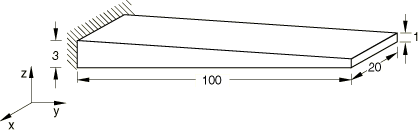
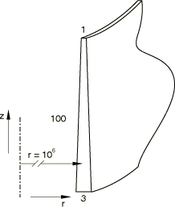

# 2.3.13 Variable thickness shells and membranes

**Products: **Abaqus/Standard  Abaqus/Explicit  

### Problem description

For the general shell, membrane, and continuum shell elements the model consists of a tapered plate of length 100 and width 20, as shown in [Figure 2.3.13--1](ch02s03ach159.md#exxvarthick-plate). The plate is clamped at one end, and the thickness varies linearly across the plate from 3 at the clamped end to 1 at the free end. The model consists of 10 elements along the length and 2 across the width. For the model using continuum shell elements the thickness is defined by the nodal geometry.

For the axisymmetric elements the model consists of a tapered cylinder, with a radius of 1  106 and a length of 100, as shown in [Figure 2.3.13--2](ch02s03ach159.md#exxvarthick-cylinder). The cylinder is clamped at one end, and the thickness varies linearly along the length of the cylinder from 3 at the clamped end to 1 at the free end. The radius is chosen to be very large to ensure that the effects of circumferential stresses are negligible. The cylinder is meshed with 10 elements.

A linear elastic material with a Young's modulus of 10  109, a Poisson's ratio of 0, and a density of 8000 is used for all the tests. The thicker ends of the plate and cylinder are fully clamped. The shell elements are loaded with a bending moment of 3 per unit length at the thin end of the shell, and the membrane elements are loaded with an in-plane force of 50 per unit length at the thin end of the membrane.

### Results and discussion

The Abaqus/Standard results for shell and continuum shell elements are shown in [Table 2.3.13--1](ch02s03ach159.md#table-varthick-std). The Abaqus/Explicit results for shell and continuum shell elements are shown in [Table 2.3.13--2](ch02s03ach159.md#table-varthick-shellbend) and for membrane elements in [Table 2.3.13--3](ch02s03ach159.md#table-varthick-membrane). The differences in the Abaqus/Explicit results are due to dynamic effects and mesh discretization. For the shell elements in Abaqus/Explicit the results using a shell offset with a value of 0.5 are also shown in [Table 2.3.13--2](ch02s03ach159.md#table-varthick-shellbend).

### Input files

##### **Abaqus/Standard input files**

[varthick_std_s3r.inp](../eif/varthick_std_s3r.inp)

S3R element using [*SHELL SECTION](../key/key-link.md#usb-kws-mshellsection) to define section properties.

[varthick_std_s4r.inp](../eif/varthick_std_s4r.inp)

S4R element using [*SHELL SECTION](../key/key-link.md#usb-kws-mshellsection) to define section properties.

[varthick_std_s4r_edmom.inp](../eif/varthick_std_s4r_edmom.inp)

S4R element using [*SHELL SECTION](../key/key-link.md#usb-kws-mshellsection) to define section properties. Bending moment applied with a distributed edge moment.

[varthick_std_sc6r.inp](../eif/varthick_std_sc6r.inp)

SC6R element using  [*SHELL SECTION](../key/key-link.md#usb-kws-mshellsection) to define section properties.

[varthick_std_sc6r_sgs.inp](../eif/varthick_std_sc6r_sgs.inp)

SC6R element using  [*SHELL GENERAL SECTION](../key/key-link.md#usb-kws-mshellgensect) to define section properties.

[varthick_std_sc8r.inp](../eif/varthick_std_sc8r.inp)

SC8R element using  [*SHELL SECTION](../key/key-link.md#usb-kws-mshellsection) to define section properties.

[varthick_std_sc8r_sgs.inp](../eif/varthick_std_sc8r_sgs.inp)

SC8R element using [*SHELL GENERAL SECTION](../key/key-link.md#usb-kws-mshellgensect) to define section properties.

[varthick_std_sc8r_eh.inp](../eif/varthick_std_sc8r_eh.inp)

SC8R element with enhanced hourglass control using [*SHELL SECTION](../key/key-link.md#usb-kws-mshellsection) to define section properties.

[varthick_std_sc8r_sgs_eh.inp](../eif/varthick_std_sc8r_sgs_eh.inp)

SC8R element with enhanced hourglass control using [*SHELL GENERAL SECTION](../key/key-link.md#usb-kws-mshellgensect) to define section properties.

##### **Abaqus/Explicit input files**

[varthick_s3r.inp](../eif/varthick_s3r.inp)

S3R element.

[varthick_s3r_offset.inp](../eif/varthick_s3r_offset.inp)

S3R element and a shell offset.

[varthick_s4r.inp](../eif/varthick_s4r.inp)

S4R element.

[varthick_s4r_offset.inp](../eif/varthick_s4r_offset.inp)

S4R element and a shell offset.

[varthick_sc6r.inp](../eif/varthick_sc6r.inp)

SC6R element.

[varthick_sc8r.inp](../eif/varthick_sc8r.inp)

SC8R element.

[varthick_sc6r_sgs.inp](../eif/varthick_sc6r_sgs.inp)

SC6R element using [*SHELL GENERAL SECTION](../key/key-link.md#usb-kws-mshellgensect) to define section properties.

[varthick_sc8r_sgs.inp](../eif/varthick_sc8r_sgs.inp)

SC8R element using [*SHELL GENERAL SECTION](../key/key-link.md#usb-kws-mshellgensect) to define section properties.

[varthick_sax1.inp](../eif/varthick_sax1.inp)

SAX1 element.

[varthick_sax1_offset.inp](../eif/varthick_sax1_offset.inp)

SAX1 element and a shell offset.

[varthick_m3d3.inp](../eif/varthick_m3d3.inp)

M3D3 element.

[varthick_m3d4r.inp](../eif/varthick_m3d4r.inp)

M3D4R element.

[varthick_m3d4r_hgc.inp](../eif/varthick_m3d4r_hgc.inp)

COMBINED hourglass option for membrane elements included for the sole purpose of testing the performance of the code.

[varthick_m3d4r_hgv.inp](../eif/varthick_m3d4r_hgv.inp)

VISCOUS hourglass option for membrane elements included for the sole purpose of testing the performance of the code.

### Tables

**Table 2.3.13–1** Abaqus/Standard shell bending results.
| Element Type | Tip Displacement () | Tip Rotation |
| --- | --- | --- |
| EXACT | 2.00 106 | 8.00 108 |
| S3R | 2.06 106 | 8.09 108 |
| S4R | 2.02 106 | 7.91 108 |
| SC6R | 1.93 106 |  |
| SC6R (sgs) | 1.93 106 |  |
| SC8R | 2.02 106 |  |
| SC8R (sgs) | 2.02 106 |  |
| SC8R* | 2.02 106 |  |
| SC8R* (sgs) | 2.02 106 |  |
| *Abaqus/Standard results with enhanced hourglass control. |

**Table 2.3.13–2** Abaqus/Explicit shell bending results.
| Element Type | Offset Value | Tip Displacement () | Tip Rotation |
| --- | --- | --- | --- |
| EXACT |  | 2.00 106 | 8.00 108 |
| SAX1 | 0 | 2.26 106 | 8.33 108 |
| SAX1 | 0.5 | 2.23 106 | 8.26 108 |
| S3R | 0 | 2.26 106 | 8.50 108 |
| S3R | 0.5 | 2.23 106 | 8.38 108 |
| S4R | 0 | 2.26 106 | 8.33 108 |
| S4R | 0.5 | 2.24 106 | 8.23 108 |
| SC6R |  | 1.93 106 |  |
| SC8R |  | 2.01 106 |  |
| SC6R (sgs) |  | 1.93 106 |  |
| SC8R (sgs) |  | 2.01 106 |  |

**Table 2.3.13–3** Abaqus/Explicit membrane element results.
| Element Type | Tip Displacement () |
| --- | --- |
| EXACT | 2.746 107 |
| M3D3 | 2.751 107 |
| M3D4R | 2.742 107 |

### Figures

**Figure 2.3.13–1** Tapered plate for general elements.

**Figure 2.3.13–2** Tapered cylinder.

