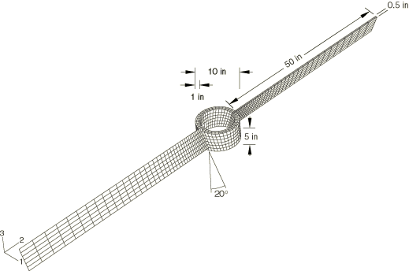
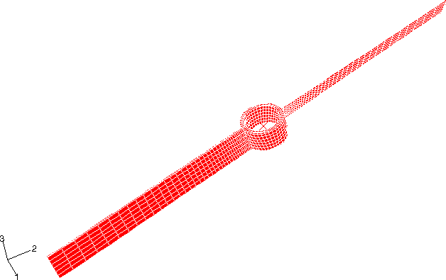
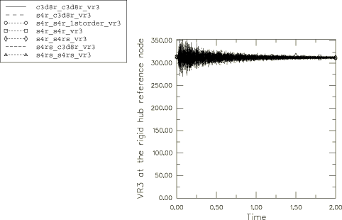
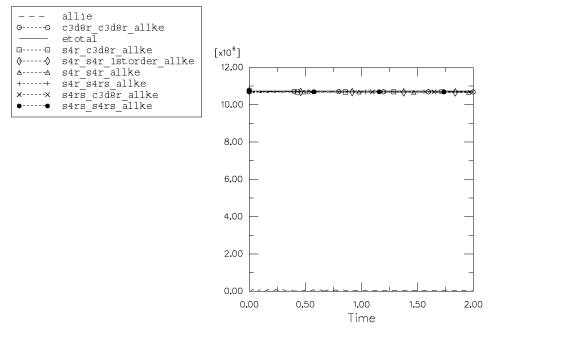

# 2.3.15 Simulation of propeller rotation

**Product: **Abaqus/Explicit  

This benchmark problem, which includes a large number of rigid body rotations, is intended to illustrate the performance of shell and solid elements in Abaqus/Explicit.

### Problem description

The rotation of a propeller that has an initial spin rate of 314.16 rad/s (3000 rpm or 50 revolutions per second) is simulated for a duration of 2 seconds. The propeller consists of a rigid central hub and two deformable blades, as shown in [Figure 2.3.15--1](ch02s03ach161.md#exxpropeller-geometry). The hollow cylindrical hub is 5 inches (0.1270 m) long and has inner and outer radii of 4 inches (0.1016 m) and 5 inches (0.1270 m), respectively. The blades are 0.5 inches (0.0127 m) thick and span 50 inches (1.27 m). The blades make a 20 angle with the central axis of the propeller. The entire propeller assembly is made of steel with the following properties:

| Young's modulus = 30.0 106 psi (207 GPa) |
| --- |
| Poisson's ratio = 0.3 |
| Density = 7.3 104 lbf-sec2/in4 (7800 kg/m3) |

The propeller is assumed to be spinning in a vacuum with zero initial stresses. Once the stress state due to the centrifugal loading is established, the solution (displacements, stresses, and strains) is expected to oscillate about this state with time. The mass moment of inertia of the propeller about its central axis increases slightly due to the stretching of the blades in the mean stress state under the centrifugal loading. Since the angular momentum is conserved, the increase in the mass moment of inertia is expected to result in a mean spin rate that is slightly less than the initial spin rate.

#### Meshing of the blades and the hub

In this study the hub region of the propeller is modeled as a rigid body that is discretized with C3D8R elements. The propeller blades are discretized with either S4R, S4RS, or C3D8R elements. Each propeller blade is discretized with a single element type, although two different element types can be used for the two blades. This leads to six different model permutations, all of which are studied in this example.

#### Order of accuracy in element formulation

Since the finite elements undergo a large number (> 5) of rigid body revolutions, the second-order accurate element formulation is specified in the section controls. The six models of the propeller problem with different element combinations are analyzed using second-order accurate elements. In addition, the model with both blades discretized using S4R elements is also analyzed using the default first-order accurate element formulation option.

### Results and discussion

All the analyses in this problem are performed using double precision floating point accuracy since the number of time increments to complete the simulation for a duration of 2 seconds is quite large (about 2.3 million increments with C3D8R elements in any of the two blades and about 1.3 million increments with shell elements in the both blades).

A representative deformed configuration plot at the end of the 2 second time period is shown in [Figure 2.3.15--2](ch02s03ach161.md#exxpropeller-deformed) for the model where S4R elements are used to discretize one blade and C3D8R elements are used for the other blade. The deformed configuration in all seven cases considered is free from element distortions, and in each case the propeller has undergone about 99.5 revolutions by the end of the 2 second time period. Correspondingly, a mean rotational velocity of about 312 rad/s is established with time as the mean stress state is reached from the initial stress-free state (see [Figure 2.3.15--3](ch02s03ach161.md#exxpropeller-vr3)).

[Figure 2.3.15--4](ch02s03ach161.md#exxpropeller-energy) shows the total model energy (ETOTAL) and the total model kinetic energy (ALLKE) for the seven cases considered here. As ETOTAL remains constant, the energy balance is clearly maintained throughout the analysis. The kinetic energy is also fairly constant with time and is only about 0.4% lower than the initial kinetic energy of the model. This difference of 0.4% is explained by the internal energy of the elements. In general, the element elastic (ALLSE), artificial (ALLAE), and viscous (ALLVD) energies are found to be insignificant compared to the model kinetic energy (ALLKE).

#### Summary

In summary, based upon this example: 

1. For problems involving a large number of rigid body rotations, the second-order accurate element formulation captures the behavior without any element distortions and is highly recommended for problems with elements undergoing more than 5 revolutions.
2. For the propeller model with both blades discretized using S4R elements, the first-order accurate formulation option yields results that compare well with the results from the second-order accurate formulation option.

### Input files

#### Second-order accurate element formulation:

[propeller_c3d8r_c3d8r.inp](../eif/propeller_c3d8r_c3d8r.inp)

Both blades made of C3D8R elements.

[propeller_s4r_s4r.inp](../eif/propeller_s4r_s4r.inp)

Both blades made of S4R elements.

[propeller_s4rs_s4rs.inp](../eif/propeller_s4rs_s4rs.inp)

Both blades made of S4RS elements.

[propeller_s4r_c3d8r.inp](../eif/propeller_s4r_c3d8r.inp)

One blade made of S4R elements and the other of C3D8R elements.

[propeller_s4r_s4rs.inp](../eif/propeller_s4r_s4rs.inp)

One blade made of S4R elements and the other of S4RS elements.

[propeller_s4rs_c3d8r.inp](../eif/propeller_s4rs_c3d8r.inp)

One blade made of S4RS elements and the other of C3D8R elements.

#### First-order accurate element formulation:

[propeller_s4r_s4r_1storder.inp](../eif/propeller_s4r_s4r_1storder.inp)

Both blades made of S4R elements.

### Figures

**Figure 2.3.15–1** Propeller problem.

**Figure 2.3.15–2** Deformed plot of propeller discretized with C3D8R elements in one blade and S4R elements in the other after about 99.5 revolutions.

**Figure 2.3.15–3** Rotational velocity of the rigid hub about its axis.

**Figure 2.3.15–4** Whole model energy history in different models of the propeller.

