# 2.6.2 Linear behavior of spring and dashpot elements

**Product: **Abaqus/Standard  

### Problem description

The linear behavior of three independent spring/dashpot/mass systems (A, B, and C, as shown in [Figure 2.6.2--1](ch02s06ach165.md#bmkspringdash-systems)) is tested. Each of the systems has a common component: a mass attached to a parallel spring/dashpot system. In system A the MASS element is attached to SPRING1 and DASHPOT1 elements, so the system is grounded. Instead of directly grounding the parallel spring/dashpot systems, systems B and C add another MASS element attached to ground by means of a second spring. Element types SPRING2 and DASHPOT2 are tested in system B, while system C tests element types SPRINGA and DASHPOTA. For SPRINGA and DASHPOTA elements, the direction of action is the line joining the two nodes. This behavior is tested by orienting system C such that the spring/dashpot line of action lies 45 counterclockwise from the horizontal, thereby undergoing motion along both the global 1- and 2-directions. All the results for system C are reported in the local coordinate system.

The mass, spring, and dashpot constants are the same for all three systems: mass = 0.02588, spring constant = 30.0, dashpot coefficient = 0.12.

#### Grounded tests

A two-step analysis is performed on each of the three systems. In the first step the mass at the free end is displaced one unit, while in systems B and C the other mass is constrained to simulate the grounded condition of system A. The end mass is then free to displace in the second step. The results of this test should be exactly the same for all three systems.

| Boundary conditions: | Step 1:  at all nodes.  at nodes 11, 12, 101, and 102. |
| --- | --- |
|  | 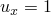 at nodes 3, 13, and 103. |
|  | Step 2:  at nodes 11, 12, 101, and 102. |

#### Node-to-node tests

A two-step analysis is performed on systems B and C. As in test [exsd3glx.inp](../eif/exsd3glx.inp), the mass at the free end is displaced one unit during the first step, while the other mass is fixed. After stretching, however, both masses are free to move. The movement is constrained to be along the 1-direction so that systems B and C can be compared. The results of this test should be exactly the same for these two systems.

| Boundary conditions: | Step 1:  at all nodes.  at nodes 11, 12, 101, and 102. |
| --- | --- |
|  |  at nodes 3, 13, and 103. |
|  | Step 2:  at nodes 11 and 101. |

### Analytical solutions

The analytical solutions for each of the analyses are presented here.

#### Grounded tests

Force balance on the system yields the second-order linear differential equation for a single degree of freedom damped oscillator. Let *x* be the position of the mass node along the *x*-axis. We obtain the equation

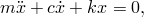

which is solved subject to 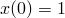 and 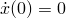 to yield

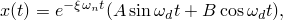

where the constants have the following values:

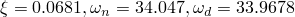

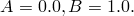

#### Node-to-node tests

The analytical solution to this problem is obtained by writing out the force balance equation for both masses. This yields a coupled system of two ordinary differential equations. Let  and  refer to the position of the middle and end mass, respectively. The following equations are obtained:

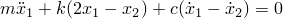

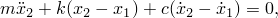

subject to 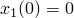, 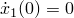, 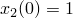, and 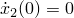.

Taking the Laplace transform and solving for 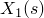 and 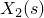 yields

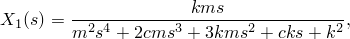

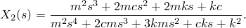

By using partial fraction expansion and taking the inverse transform of each of the terms, the following closed-form solution is obtained:

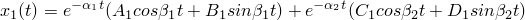

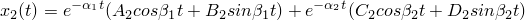

where the constants have the following values: 

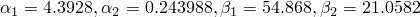

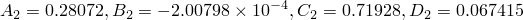

### Results and discussion

The Abaqus results for each analysis are presented here.

#### Grounded tests

This test verifies spring and dashpot elements in two ways. First, it is shown that the results compare favorably with the analytical solution. Second, the output for similar spring/dashpot systems that use different element types is shown to compare well with respect to one another (e.g., a grounded SPRING1/DASHPOT1 system should yield the same results as a SPRINGA/DASHPOTA system that has one of the nodes constrained).

[Figure 2.6.2--2](ch02s06ach165.md#bmkspringdash-ground-hist) and [Table 2.6.2--1](ch02s06ach165.md#table-noderesults-ground) to [Table 2.6.2--4](ch02s06ach165.md#table-elemresults-node) show that all three systems yield exactly the same results and that they all match the analytical solution very closely.

#### Node-to-node tests

[Figure 2.6.2--3](ch02s06ach165.md#bmkspringdash-nodetonode-hist) shows the time history of the middle and end masses. Notice that, for either mass, system B yields the same result as system C, as expected. Both systems' time histories are also very close to the analytical solution.

### Input files

[exsd3glx.inp](../eif/exsd3glx.inp)

Linear test of grounded springs and dashpots.

[exsdbnlx.inp](../eif/exsdbnlx.inp)

Linear test of node-to-node springs and dashpots.

[exsd3gla_po.inp](../eif/exsd3gla_po.inp)

[*POST OUTPUT](../key/key-link.md#usb-kws-hpostoutput) analysis.

Input files [exsd3gla.inp](../eif/exsd3gla.inp) and [exsdbnla.inp](../eif/exsdbnla.inp) are modified versions of files [exsd3glx.inp](../eif/exsd3glx.inp) and [exsdbnlx.inp](../eif/exsdbnlx.inp), respectively. They include temperature- and/or field variable-dependent behavior for spring constants and dashpot coefficients where applicable. These modified files are designed to provide the exact same results as those files from which they are derived.

### Tables

**Table 2.6.2–1** Nodal results at end of dynamic step: grounded tests.
| Node | 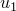 |  | 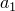 |
| --- | --- | --- | --- |
| 3 | 1.2019 103 | 6.905 | 29.89 |
| 13 | 1.2019 103 | 6.905 | 29.89 |
| 103 | 1.2019 103 | 6.905 | 29.89 |

**Table 2.6.2–2** Element results at end of dynamic step: grounded tests.
| Element | S11 | E11 |
| --- | --- | --- |
| 1 | 3.6056 102 | 1.2019 103 |
| 3 | 3.6056 102 | 1.2019 103 |
| 5 | 3.6056 102 | 1.2019 103 |
| 2 | 0.0 | 0.0 |
| 4 | 0.0 | 0.0 |
| 6 | 0.8286 | 1.2019 103 |
| 7 | 0.8286 | 1.2019 103 |
| 8 | 0.8286 | 1.2019 103 |

**Table 2.6.2–3** Nodal results at end of dynamic step: node-to-node tests.
| Node |  |  |  |
| --- | --- | --- | --- |
| 12 | 0.2105 | 6.531 | 151.8 |
| 102 | 0.2105 | 6.531 | 151.8 |
| 13 | 0.2698 | 11.55 | 91.23 |
| 103 | 0.2698 | 11.55 | 91.23 |

**Table 2.6.2–4** Element results at end of dynamic step: node-to-node tests.
| Element | S11 | E11 |
| --- | --- | --- |
| 2 | 6.315 | 0.2105 |
| 4 | 6.315 | 0.2105 |
| 3 | 1.778 | 5.9276 102 |
| 5 | 1.778 | 5.9276 102 |
| 7 | 0.6022 | 5.9276 102 |
| 8 | 0.6022 | 5.9276 102 |

### Figures

**Figure 2.6.2–1** Three independent spring/dashpot/mass systems.

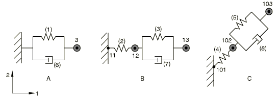

**Figure 2.6.2–2** Free node displacement history: grounded tests.

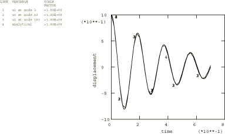

**Figure 2.6.2–3** Free node displacement history: node-to-node tests.

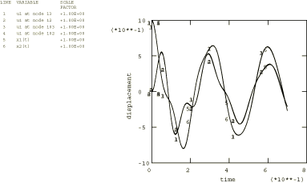

