# 2.7.1 Delamination analysis of laminated composites

**Products: **Abaqus/Standard  Abaqus/Explicit  

### Problem description

This example verifies and illustrates the use of Abaqus to predict mixed-mode multidelamination in a layered composite specimen. Cohesive elements, connector elements, traction-separation in contact, and a crack propagation analysis with VCCT criterion are used for this purpose. The problem studied is the one that appears in Alfano (2001). The results presented are compared against the experimental results included in that reference, taken from Robinson (1999).

The model with cohesive elements is analyzed in Abaqus/Standard as well as Abaqus/Explicit and uses a damaged, linear elastic constitutive model. The model with VCCT criterion is also analyzed in both Abaqus/Standard and Abaqus/Explicit to predict debond growth. In addition, the model with VCCT criterion in Abaqus/Standard is analyzed using the Paris law to assess the fatigue life when it is subjected to sub-critical cyclic displacement loading.

### Geometry and model

The problem geometry and loading are depicted in [Figure 2.7.1--1](ch02s07ach166.md#alfano-model): a layered composite specimen, 200 mm long, with a total thickness of 3.18 mm and a width of 20 mm, loaded by equal and opposite displacements in the thickness direction at one end. The maximum displacement value is set equal to 20  mm in the monotonic loading case. In the low-cycle fatigue analysis, cyclic displacement loading with a peak value of 1 mm is specified. The thickness direction is composed of 24 layers. The model has two initial cracks: the first (of length 40 mm) is positioned at the midplane of the specimen at the left end, and the second (of length 20 mm) is located to the right of the first and two layers below.

When cohesive elements are used, the problem is modeled in both two and three dimensions, using solid elements to represent the bulk behavior and cohesive elements to capture the potential delamination at the interfaces between the 10th and 11th layers and between the 12th and 13th layers, counting from the bottom. In the two-dimensional finite element model the top part of the specimen (consisting of 12 layers), the middle section (2 layers), and the bottom part (10 layers) are each modeled with a mesh of 1  200 CPE4I elements in Abaqus/Standard and CPE4R elements in Abaqus/Explicit. In both Abaqus/Standard and Abaqus/Explicit the initially uncracked portions of the two interfaces are modeled by one layer each of COH2D4 elements that share nodes with the adjacent solid elements. A similar, matching mesh is adopted for the equivalent three-dimensional model, where the corresponding element types used are C3D8I and COH3D8 in Abaqus/Standard and  C3D8R and COH3D8 in Abaqus/Explicit, with one element in the width direction. The nodes where the equal and opposite displacements are prescribed are constrained in the length direction of the specimen; these are the only boundary conditions in the two-dimensional case. For the equivalent three-dimensional model all the nodes are also constrained in the width direction to simulate the plane strain effect. In addition, contact is defined between the open faces of the second, pre-existing crack to avoid penetrations if the faces are compressed against each other during the analysis.

In Abaqus/Standard, when the surface-based traction-separation capability available with the contact pair algorithm is used, the problem is modeled in both two and three dimensions. In Abaqus/Explicit the problem is modeled in three dimensions since surface-based traction-separation is available with the general contact algorithm, which is available only for three-dimensional models. The models are very similar to those created for use with cohesive elements, as described in the previous paragraph, except that the cohesive elements are replaced with cohesive surfaces.

When the VCCT debond method is used, the problem is modeled in two dimensions in Abaqus/Standard but in three dimensions in Abaqus/Explicit. The models created above can also be adopted. Instead of using cohesive elements or traction-separation in contact in Abaqus/Standard, you can activate the crack propagation capability with the VCCT criterion. The same model is also used in a low-cycle fatigue analysis. When the same model is analyzed using Abaqus/Explicit, the VCCT criterion is obtained by assigning contact clearances, specifying cohesive behavior properties, and specifying crack propagation criteria with general contact. 

When connector elements are used, the problem is modeled only in two dimensions in Abaqus/Standard. Two node-based surfaces are generated: one along the top surface of the tenth layer and the other along the bottom surface of the eleventh layer. Both surfaces are tied to adjacent layers using surface-based tie constraints. CARTESIAN connector elements are used to bond the two node-based surfaces together to represent the interface. For the interface between the twelfth and thirteenth layers, matched solid element nodes along the interface are connected directly using connector elements.

### Material

The material data given in Alfano (2001) for the bulk material composite properties are 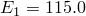 GPa, 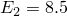 GPa, 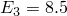 GPa, 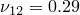, 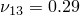, 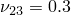, 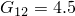 GPa, 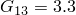 GPa, and 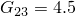 GPa.

The response of the cohesive elements in the model is specified through the cohesive section definition as a “traction-separation” response type. The elastic properties of the cohesive layer material are specified in terms of the traction-separation response with stiffness values 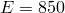 MPa, 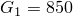 MPa, and 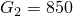 MPa. The quadratic traction-interaction failure criterion is selected for damage initiation in the cohesive elements; and a mixed-mode, energy-based damage evolution law based on a power law criterion is selected for damage propagation. The relevant material data are as follows: 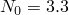 MPa, 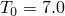 MPa, 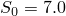 MPa, 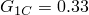  103 N/m, 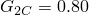  103 N/m,  0.80  103 N/m, and .

The same damage initiation criterion and damage evolution law with the same damage data are used for the surface-based traction-separation approach. However, in the absence of cohesive elements, their thickness is accounted for by scaling the elastic properties by a factor of 0.0132  10–3 (since the cohesive elements have a thickness of 0.0132 mm), and the properties are specified as  64,200 GPa, 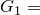 64,200 GPa, and 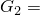 64,200 GPa.

For the VCCT debond approach, the BK mixed-mode failure law is used with the same critical energy release rates as those used for cohesive elements; i.e.,   103 N/m,   103 N/m, and  0.80  103 N/m. The exponent of the BK law is specified as . When the low-cycle fatigue analysis using the Paris law is performed, the additional relevant data are as follows: , 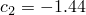, 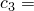 4.88  106, 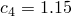, , and .

Force-based damage initiation and a tabular form of motion-based damage evolution are used to define the connector damage mechanisms. Initiation forces are calculated based on the value of 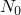 given above for cohesive elements. For example, the initiation force for the lower interface is calculated as 66 N, which is equal to  *A*. The interface area over one cohesive element, *A*, is 20  106. The stiffnesses of the connector elements are calculated as 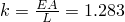  109 N/m, where *L* is the thickness of the cohesive element. To improve the convergence behavior of this model, viscous regularization has been applied.

### Results and discussion

The plots of the prescribed displacement versus the corresponding reaction force for the delamination problem are presented in [Figure 2.7.1--2](ch02s07ach166.md#alfano-exp-comparison) and compared with the experimental results included in Alfano (2001). Both the Abaqus/Standard and Abaqus/Explicit results displayed in the graph are from the two-dimensional analyses. The results from the equivalent three-dimensional models are almost identical to their two-dimensional counterparts and are not included in [Figure 2.7.1--2](ch02s07ach166.md#alfano-exp-comparison). It can be seen from [Figure 2.7.1--2](ch02s07ach166.md#alfano-exp-comparison) that the curve produced using the surface-based traction-separation approach is nearly the same as that obtained using cohesive elements. Both curves have good agreement with the experimental results up to an applied displacement of approximately 20 mm; then, a sharp drop in the reaction force is observed at this point by the Abaqus analysis, after which the reaction force values appear to be underpredicted by approximately 30% when compared to the experimental data. The reason for this deviation, which appears to coincide with the simultaneous propagation of both of the cracks, is related to the sudden failure of a relatively large number of cohesive elements in a very short period of time. On the other hand, the data predicted using the VCCT debond method agree well with the experimental results, without the sharp drop previously noted. While the Abaqus/Explicit results, both with cohesive elements as well as from the three-dimensional model with surface-based traction-separation, follow the same pattern as the Abaqus/Standard results, they are not as smooth due to inertia effects. A second-order Butterworth-type filter was applied to the nodal reaction force history output from the Abaqus/Explicit analysis to eliminate high-frequency oscillations from the response curve. 

[Figure 2.7.1--3](ch02s07ach166.md#alfano-viscoreg) shows the results using cohesive elements from a series of Abaqus/Standard analyses incorporating a viscous regularization scheme to improve convergence and demonstrates the effect on the predicted results of the choice of the viscosity parameter, μ. Larger values of μ, while providing better convergence, affect the results more than smaller viscosity values. The appropriate value of the viscosity parameter that results in the right balance between improved convergence behavior of the nonlinear system and accuracy of the results is problem dependent and requires judgement on the part of the user. In the cohesive zone approach to modeling delamination, the complex fracture process at the micro-scale is modeled using only a few macroscopic parameters (such as peak strength and fracture energy). While viscous regularization is not intended to be used to model rate effects, it does provide an additional parameter that can be “fitted” to the material model at hand. For the particular delamination problem analyzed, as can be seen from [Figure 2.7.1--3](ch02s07ach166.md#alfano-viscoreg), a larger value of μ causes the first peak of the reaction force curve to be higher than the experimental value and predicts a milder and smoother drop in the reaction force following the peak compared to the experimental data. However, the results with viscous regularization (for example, the curve for μ = 1.0  104 in [Figure 2.7.1--3](ch02s07ach166.md#alfano-viscoreg)) appear to match the experiments better for prescribed displacement values greater than 20 mm. 

[Figure 2.7.1--2](ch02s07ach166.md#alfano-exp-comparison) also shows the results from the analysis using connector elements to model the bonded interfaces. The same trend of delamination is observed as seen in the experimental data. [Figure 2.7.1--4](ch02s07ach166.md#alfano-viscoreg-connector) illustrates the effect of viscous regularization. In one case a viscous regularization factor of 0.0008 and maximum degradation factor of 0.99 are used. In the other case the values are 0.0005 and 0.9, respectively. As can be seen in [Figure 2.7.1--4](ch02s07ach166.md#alfano-viscoreg-connector), a larger value of viscous regularization causes the peak of the reaction force to be higher.

[Figure 2.7.1--5](ch02s07ach166.md#alfano-vcct-fatigue-2d) illustrates how the ratio of the peak reaction force over the corresponding peak prescribed displacement (stiffness) degrades as a function of the cycle number.

A comparison of the deformed configurations between the three-dimensional Abaqus/Explicit model and the two-dimensional Abaqus/Standard model is shown in [Figure 2.7.1--6](ch02s07ach166.md#alfano-vcct-deform-compare). [Figure 2.7.1--7](ch02s07ach166.md#alfano-vcct-deform-comp-layer) depicts the delamination of both the top and bottom layers obtained from the Abaqus/Explicit and Abaqus/Standard analyses. A comparison of reaction forces versus displacement, illustrated in [Figure 2.7.1--8](ch02s07ach166.md#alfano-vcct-force-compare), verifies the consistency in predicting the debond growth of both analyses. Inertia effects were observed in Abaqus/Explicit later in the analysis when both bonded layers started to debond. Although the forces are not as smooth, they follow the same pattern as the Abaqus/Standard results.

### Input files

[alfano_2d_std.inp](../eif/alfano_2d_std.inp)

Abaqus/Standard two-dimensional model.

[alfano_2d_reg_std.inp](../eif/alfano_2d_reg_std.inp)

Abaqus/Standard two-dimensional model using viscous regularization.

[alfano_vcct_2d_1.inp](../eif/alfano_vcct_2d_1.inp)

Abaqus/Standard two-dimensional model using the VCCT debond method.

[alfano_vcct_fatigue_2d.inp](../eif/alfano_vcct_fatigue_2d.inp)

Abaqus/Standard two-dimensional model using the Paris law to analyze the fatigue delamination growth.

[alfano_2d_std_surf.inp](../eif/alfano_2d_std_surf.inp)

Abaqus/Standard two-dimensional model using contact surface-based traction-separation behavior with a viscous regularization factor of 1  107.

[alfano_3d_std.inp](../eif/alfano_3d_std.inp)

Abaqus/Standard three-dimensional model.

[alfano_3d_std_surf.inp](../eif/alfano_3d_std_surf.inp)

Abaqus/Standard three-dimensional model using contact surface-based traction-separation behavior with a viscous regularization factor of 1  107.

[alfano_2d_xpl.inp](../eif/alfano_2d_xpl.inp)

Abaqus/Explicit two-dimensional model with cohesive elements.

[alfano_3d_xpl.inp](../eif/alfano_3d_xpl.inp)

Abaqus/Explicit three-dimensional model with cohesive elements.

[alfano_3d_xpl_surf.inp](../eif/alfano_3d_xpl_surf.inp)

Abaqus/Explicit three-dimensional model with surface-based traction-separation behavior.

[alfano_3d_xpl_vcct.inp](../eif/alfano_3d_xpl_vcct.inp)

Abaqus/Explicit three-dimensional model with VCCT criterion.

[alfano_std_conn2d_reg1.inp](../eif/alfano_std_conn2d_reg1.inp)

Abaqus/Standard two-dimensional model using connector elements and a viscous regularization factor of 0.0005.

[alfano_std_conn2d_reg2.inp](../eif/alfano_std_conn2d_reg2.inp)

Abaqus/Standard two-dimensional model using connector elements and a viscous regularization factor of 0.0008.

### Python script

### References

Alfano,  G., and M. A. Crisfield, “Finite Element Interface Models for the Delamination Analysis of Laminated Composites: Mechanical and Computational Issues,” International Journal for Numerical Methods in Engineering, vol. 50, pp. 1701–1736, 2001.

Robinson,  P., T. Besant, and D. Hitchings, “Delamination Growth Prediction Using a Finite Element Approach,” 2nd ESIS TC4 Conference on Polymers and Composites, Les Diablerets, Switzerland, 1999.

### Figures

**Figure 2.7.1–1** Model geometry for the Alfano delamination problem.

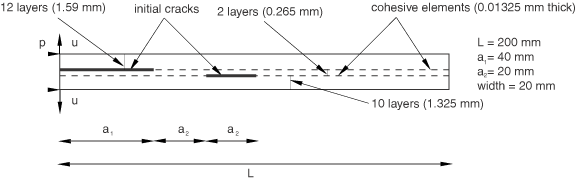

**Figure 2.7.1–2** Reaction force vs. prescribed displacement: experimental and numerical results.

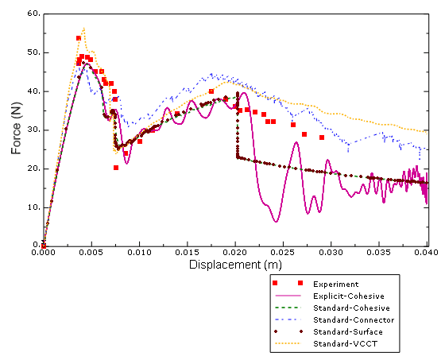

**Figure 2.7.1–3** Effect of viscous regularization on the predicted force-displacement response using cohesive elements.

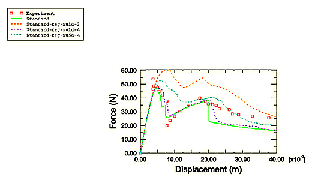

**Figure 2.7.1–4** Effect of viscous regularization on the predicted force-displacement response using connector elements.

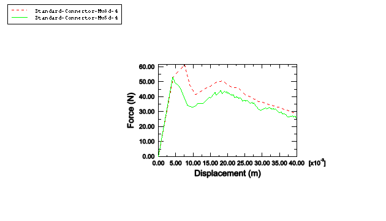

**Figure 2.7.1–5** Stiffness degradation as a function of cycle number.

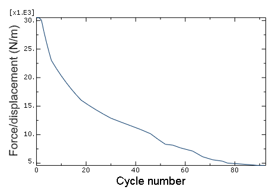

**Figure 2.7.1–6** Deformed configuration comparison between Abaqus/Explicit (top) and Abaqus/Standard (bottom).

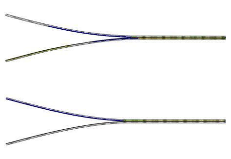

**Figure 2.7.1–7** Delamination comparison between Abaqus/Explicit (top) and Abaqus/Standard (middle and bottom).

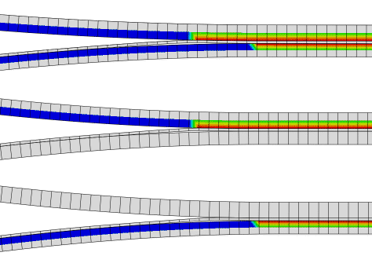

**Figure 2.7.1–8** Comparison of the force-displacement response between Abaqus/Explicit and Abaqus/Standard.

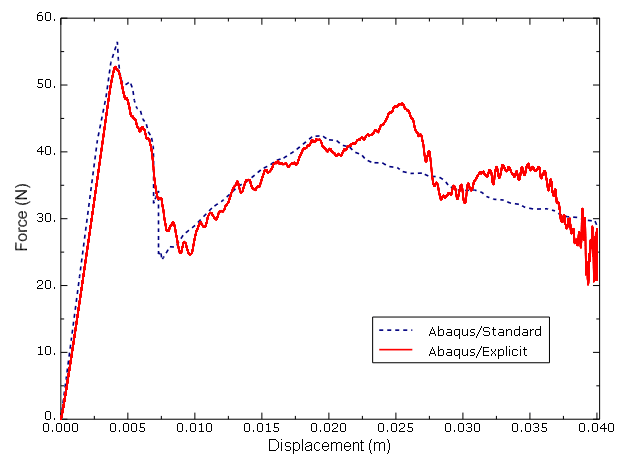

