# 3.1.1 Viscoelastic rod subjected to constant axial load

**Product: **Abaqus/Standard  

This example, taken from Collingwood et al. (1985), is intended to verify the coding of the time domain linear viscoelastic material model.

### Problem description

The problem is a rod of length of 254 mm (10 in) and diameter of 25.4 mm (1 in). The rod is fixed in the axial direction on one end and a constant axial load of 0.689 MPa (100 psi) is applied suddenly to the other end. The rod is modeled using one quadratic, axisymmetric, hybrid continuum element (CAX8H).

### Material

The linear viscoelastic material model used in this example can be represented by a combination of linear springs and a dashpot, as shown in [Figure 3.1.1--1](ch03s01ach167.md#sxmviscorod-model). The extensional relaxation function is 

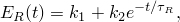

where 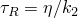,  is the damping coefficient and  and  are constants. In this case  is 6.89 MPa (1000 psi);  is 62.01 MPa (9000 psi); 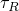 is 1.0 sec; and the bulk modulus, 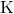, is 689 MPa (100,000 psi) and is independent of time.

Short-term material properties are specified using linear elastic behavior (["Linear elastic behavior," Section 22.2.1 of the Abaqus Analysis User's Guide](../usb/usb-link.md#usb-mat-clinearelastic)), which requires the instantaneous Young's modulus, , and Poisson's ratio, . The time-dependent behavior is specified using viscoelastic behavior, in which the shear relaxation modulus and the bulk modulus are defined by a Prony series (see ["Time domain viscoelasticity," Section 22.7.1 of the Abaqus Analysis User's Guide](../usb/usb-link.md#usb-mat-ctimevisco)). For the Abaqus analysis of this problem, it is assumed that no volumetric relaxation occurs.

 is immediately available as 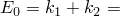 68.9 MPa (10000 psi), and  is 

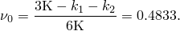

The time-dependent material behavior is approximated with a single-term Prony series for the shear relaxation modulus: 

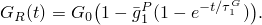

We need to compute , 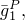 and 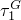 from the extensional relaxation function. The limiting cases of both the shear and extensional relaxation functions are used for this purpose. The long-term () properties of the material approach that of a linear elastic solid, with 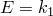. The long-term shear modulus, *G*, can be calculated using the relationship between the bulk, shear, and extensional moduli: 

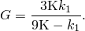

Likewise, the “instantaneous” or “glassy” shear modulus, , is 

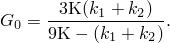

Then 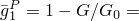 0.901001.

The shear relaxation time, , is obtained by writing the rate of change of the shear modulus in terms of the rate of change of the extensional modulus at time  0: 

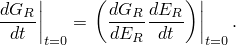

After some algebra we obtain 

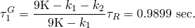

The same problem is also treated as a large-strain example. The relaxation behavior is defined in the same way, but the short-term elastic properties are given using hyperelastic behavior. The polynomial formulation with 1 is used, and the constants are  6.89 MPa (1000 psi),  4.59 MPa (666.67 psi), and  1.378  107 MPa1 (0.00002 psi1). These constants are such that the initial Young's modulus and initial Poisson's ratio are equal to  and , respectively, and produce a close fit to a linear material. (See ["Hyperelastic behavior of rubberlike materials," Section 22.5.1 of the Abaqus Analysis User's Guide](../usb/usb-link.md#usb-mat-chyperelastic), for further discussion of the choice of constants when 1.)

### Loading

A distributed load of 0.689 MPa (100 psi) is applied instantaneously and held constant throughout the analysis. To model this, we use the quasi-static procedure (["Quasi-static analysis," Section 6.2.5 of the Abaqus Analysis User's Guide](../usb/usb-link.md#usb-anl-avisco)) in two steps. The load is applied in the first step, which has a time period of 0.001 seconds, so that the instantaneous (glassy) behavior dominates. Since this step uses only one increment, a tolerance to control the accuracy of the creep integration is not specified. The second step has a time period of 50 seconds, during which the load is held constant and the rod is allowed to relax toward its long-term behavior. Automatic time incrementation is chosen by giving a tolerance value for the maximum difference in the creep strain increment over a time increment. This tolerance is selected so that its value is of the same order of magnitude as the maximum elastic strain. Therefore, for this example the tolerance is set to 5  103. The total force and the total moment on the loaded face of the model are output to the results file.

### Results and discussion

The instantaneous and long-term behaviors provide a check on the Abaqus results. The instantaneous and long-term axial displacements of the rod tip can be calculated as follows: 

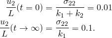

These values agree well with the Abaqus results. Similarly, the instantaneous and long-term values of the Poisson's ratio can also be calculated exactly: 

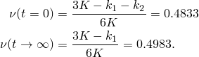

The Poisson's ratio can be extracted from the Abaqus results by taking the ratio of the lateral strain to the axial strain at  0.001 and  50: 

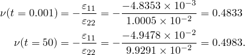

Since this is an applied stress problem, obtaining the exact solution for the entire time period of the analysis requires inverting the original constitutive integral equation defining uniaxial stress in terms of uniaxial strain. To perform this inversion, we use the following relation (Pipkin, 1972) between the time-dependent relaxation modulus, 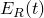, and the time-dependent creep compliance, 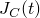: 

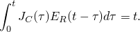

Differentiation of this relation with respect to *t* yields

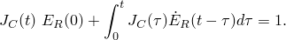

With the previously used expression for  this takes the form 

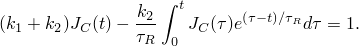

Differentiating this expression once more provides 

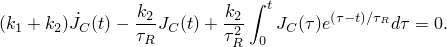

Multiplying this equation by  and adding it to the previous equation yields the differential equation 

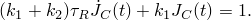

With the introduction of the creep time constant 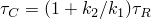 this can be written as: 

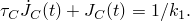

The general solution to this differential equation is 

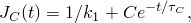

where the coefficient *C* is defined by the initial condition 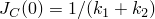, which yields 

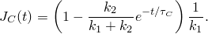

For this problem the stress 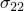 is a constant, so that 

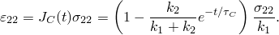

From the values given above for , 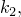 and , as well as the fact that 0.689 MPa (100 psi), 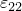 becomes 

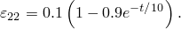

From this equation, it is evident that the effective time constant for the problem is dramatically different (by a factor of 10 in this case), depending upon whether the loading is applied force or applied displacement. [Figure 3.1.1--2](ch03s01ach167.md#sxmviscorod-strainhist) is a time history plot of  as predicted by the above equation and as calculated by Abaqus. The plot shows acceptable agreement between the Abaqus results and the exact solution. Closer agreement can be obtained by using a smaller tolerance value for the maximum difference in the creep strain increment over a time increment.

The solution obtained with the large-strain formulation differs negligibly from the small-strain solution. Abaqus automatically converts frequency domain data into a time domain Prony series representation. The analysis results using Prony parameters calibrated from tabulated frequency-dependent moduli data are in good agreement with the analyses using time domain data directly.

### Input files

[viscorod_smallstrain.inp](../eif/viscorod_smallstrain.inp)

Small-strain input data for this problem.

[viscorod_small_frq2tim.inp](../eif/viscorod_small_frq2tim.inp)

Small-strain input data for time domain analysis using Prony parameters calibrated from tabulated frequency-dependent moduli data.

[viscorod_largestrain.inp](../eif/viscorod_largestrain.inp)

Large-strain input data for this problem.

[viscorod_large_frq2tim.inp](../eif/viscorod_large_frq2tim.inp)

Large-strain input data for this problem using Prony parameters calibrated from tabulated frequency-dependent moduli data.

[viscorod_c3d8.inp](../eif/viscorod_c3d8.inp)

Model using the three-dimensional 8-node brick element, C3D8.

[viscorod_cps4.inp](../eif/viscorod_cps4.inp)

Model using the 4-node plane stress element, CPS4.

[viscorod_t3d2.inp](../eif/viscorod_t3d2.inp)

Model using the 2-node truss element, T3D2.

[viscorod_postoutput.inp](../eif/viscorod_postoutput.inp)

[*POST OUTPUT](../key/key-link.md#usb-kws-hpostoutput) job for the restart file generated in viscorod_largestrain.inp.

### References

Collingwood,  G. A., E. B. Becker, and T. Miller, *User's Manual for the TEXVISC Computer Program, *Morton Thiokol, Inc., Document Numbers U-85-4550A and U-85-4550B, 1985.

Pipkin,  A. C., *Lectures on Viscoelasticity Theory, *Springer Verlag, New York, 1972.

### Figures

**Figure 3.1.1–1** Spring and dashpot model of viscoelastic rod.

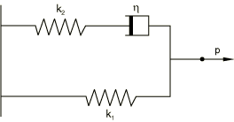

**Figure 3.1.1–2** Time history of strain in the direction of load for viscoelastic rod.

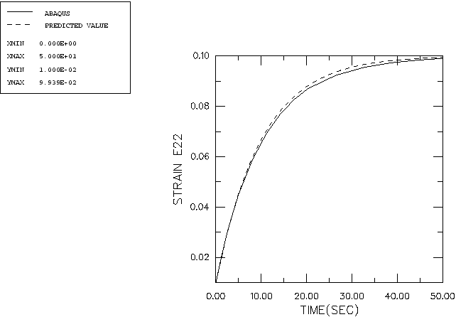

