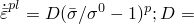
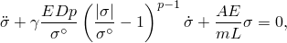
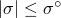
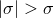
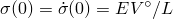
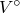
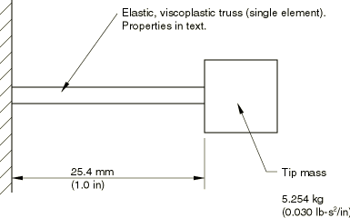
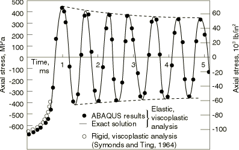
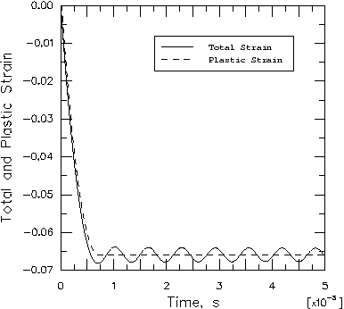

# 3.1.3 Uniform strain, viscoplastic truss

**Product: **Abaqus/Standard  

This example is intended to provide basic verification of the viscoplastic constitutive model used in Abaqus for the response of elastic-plastic materials at high strain rates. The form of viscoplastic model implemented in Abaqus is described in detail in ["Metal plasticity," Section 4.3 of the Abaqus Theory Guide](../stm/stm-link.md#stmmetalplastchap).

The problem is a one degree of freedom system, consisting of a uniformly strained truss and a point mass (see [Figure 3.1.3--1](ch03s01ach169.md#sxmunistrain-geom)). The truss is assumed to be made of an elastic, viscoplastic material. The system is excited by an initial velocity imposed while the truss is unstrained, the velocity being sufficient to cause quite extensive yield. Due to the simplicity of the system, the exact response is easily developed, thus providing a basic check case for the implementation of this constitutive model in Abaqus.

The problem has been analyzed for a rigid viscoplastic material model by Symonds and Ting (1964). In that paper the authors provide the criteria that ensure that the rigid, viscoplastic analysis will give an accurate prediction of the final strain. Essentially, the requirement is that the initial velocity be large enough such that the initial kinetic energy exceeds the maximum strain energy that can be stored in the rod. The parameters chosen for the case analyzed here satisfy this criterion comfortably.

### Problem description

The one degree of freedom model is shown in [Figure 3.1.3--1](ch03s01ach169.md#sxmunistrain-geom). The dimensions are: 

| Truss length | 25.4 mm (1 in) |
| --- | --- |
| Truss cross-sectional area | 64.52 mm2 (0.1 in2) |

The truss is assumed to have the following material properties: 

| Young's modulus | 207 GPa (30 106 lb/in2) |
| --- | --- |
| Static yield stress (0) | 276 MPa (40 103 lb/in2) (no strain hardening) |
| Mass density | 7827 kg/m3 (7.324 104 lb-s2/in4) |
| Viscoplastic parameters |  40 per s, 5 |

The mass on the end of the truss is 5.254 kg (0.030 lb-s2/in), and the initial velocity is 5.08 m/s (200 in/s).

The truss is modeled with a single truss element. The same case is also modeled using a plane stress element as an additional verification exercise. The lumped mass is modeled with a mass element. Plane stress is usually the most difficult case for implementation of plasticity models of this type, because the constitutive calculations must be done in a multidimensional stress space with the constraint that one direct stress component is zero.

### Results and discussion

The exact equation of motion for this system in terms of the stress, , in the rod, is

where *E* is Young's modulus, *D* and *p* are the viscoplastic parameters,  is the static yield stress in uniaxial tension, *A* is the cross-sectional area of the rod, *L* is the length of the rod, *m* is the attached mass, and  is 0 if ;  is 1 if .

The initial conditions on this equation are , where  is the initial velocity given to the mass.

An accurate solution to this equation can be developed by standard numerical methods. In this case the fourth-order Runge-Kutta algorithm has been used, giving the stress-time plot shown in [Figure 3.1.3--2](ch03s01ach169.md#sxmunistrain-stress-time). The rigid, viscoplastic analysis of Symonds and Ting (1964) and the solution obtained by Abaqus are also shown in the figure. The Abaqus plane stress results are identical to those obtained with the truss element. Fixed time stepping is used so that the numerical solution can be compared continuously with the exact solution. Three different time increment sizes are used to obtain the response details. These are 2.5 s, 10 s, and 25 s for the time periods 0–50 s, 50 s–0.1 ms, and 0.1–5 ms, respectively.

[Figure 3.1.3--2](ch03s01ach169.md#sxmunistrain-stress-time) shows that the numerical solution accurately predicts the exact solution until the very end of the plot, when a small phase error begins to appear in the numerical solution.

It is interesting to see the form of the solution: in the first half-cycle the stress increases very rapidly to about 2.38 times the static yield, then unloads, slowly at first, then more rapidly. During this first half-cycle about 99% of the initial kinetic energy is dissipated in plastic work (this result is available by printing a summary of the total energy content to the data file). The remaining response analyzed (up to 5 ms) continues to have some dissipation at peak stress in each half-cycle. Since there is so little energy left in the system compared to the rod's ability to store strain energy, the resulting damping of the response amplitude in each cycle is not large. The rigid, viscoplastic solution of Symonds and Ting (1964) follows the elastic, viscoplastic curves accurately because the initial energy is so large compared to the strain energy that can be stored. The rigid, viscoplastic solution estimates a final strain of 6.75% in the rod. The numerical analysis shows a total plastic strain of 6.59% at 0.7 ms, with still some slight increase of this value during each half-cycle, as the peak stress continues to exceed static yield.

### Input files

[viscoplastictruss_t3d2.inp](../eif/viscoplastictruss_t3d2.inp)

Truss element problem.

[viscoplastictruss_cps4.inp](../eif/viscoplastictruss_cps4.inp)

Plane stress model with the overstress power law entered as a piecewise linear function.

### Reference

Symonds,  P. S., and T. C. T. Ting, “Longitudinal Impact on Visco-Plastic Rods—Approximate Methods and Comparisons,” Journal of Applied Mechanics, vol. 31, pp. 611–620, 1964.

### Figures

**Figure 3.1.3–1** One degree of freedom elastic, viscoplastic verification problem.

**Figure 3.1.3–2** Stress-time history of the uniform-strain viscoplastic truss.

**Figure 3.1.3–3** Total strain and plastic strain versus time.

