# 3.1.4 Fitting of rubber test data

**Product: **Abaqus/Standard  

In Abaqus elastomeric (rubber) materials are modeled using the hyperelasticity material model. Several hyperelastic strain energy potentials are available—the polynomial model (including its particular cases, such as the reduced polynomial, neo-Hookean, Mooney-Rivlin, and Yeoh forms), the Ogden form, the Arruda-Boyce form, the Van der Waals form (which is also known as the Kilian model), and the Marlow form.

### Problem description

The form of the polynomial strain energy potential is

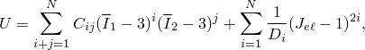

where *U* is the strain energy potential;  is the elastic volume ratio;  and  are the first and second invariants of the deviatoric strain; and *N*, , and  are material constants.  describes the shear behavior of the material, and  introduces compressibility.

Particular forms of the polynomial model can be obtained by setting specific coefficients to zero. If all  with 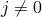 are set to zero, the reduced polynomial form is obtained: 

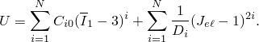

If in addition *N* is set to 3, the Yeoh model is obtained. For , the reduced polynomial model reduces to the neo-Hookean model. If in the (general) polynomial model *N* is set to 1, the Mooney-Rivlin form is obtained.

The form of the Ogden strain energy potential is

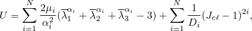

where , 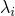 are the principal stretches and *J* is the volume ratio. The constants  and 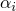 describe the shear behavior of the material, and , the compressibility.

The Arruda-Boyce model—also known as the eight-chain model—has the form 

where

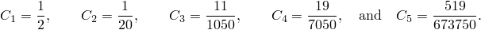

The shear behavior is described by the parameters  and , while *D* governs the compressibility.

The Van der Waals strain energy potential has the form 

where

The parameters , , *a*, and  describe the deviatoric behavior, while the coefficient *D* controls the compressibility.

The Marlow strain energy potential has the form 

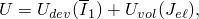

where *U* is the strain energy per unit of reference volume, with  as its deviatoric part and  as its volumetric part. The deviatoric part of the potential is defined by providing uniaxial, equibiaxial, or planar test data; while the volumetric part is defined by providing volumetric test data, defining the Poisson's ratio, or specifying the lateral strains on the uniaxial, equibiaxial, or planar test data.

Details of the formulation are given in ["Hyperelastic behavior of rubberlike materials," Section 22.5.1 of the Abaqus Analysis User's Guide](../usb/usb-link.md#usb-mat-chyperelastic); ["Hyperelastic material behavior," Section 4.6.1 of the Abaqus Theory Guide](../stm/stm-link.md#stm-mat-hyperelastic); and ["Fitting of hyperelastic and hyperfoam constants," Section 4.6.2 of the Abaqus Theory Guide](../stm/stm-link.md#stm-mat-fithyperconst).

The hyperelastic constants 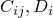 (polynomial form); 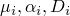 (Ogden form); 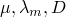 (Arruda-Boyce form); and 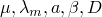 (Van der Waals form) are determined from the material test data. This example illustrates the steps in doing so.

### Specification of material data

The following steps are needed to specify the material data in an analysis: 
- Perform different types of tests to measure stress-strain data.
- Fit hyperelastic constants to the test data.
- Check correlation between the numerical results from hyperelastic model and test data.
- If satisfactory, proceed with finite element analysis; otherwise, perform corrective measures, and try the fitting procedure again.

When evaluating the curve fits, the following criteria should be used:- If uniaxial, biaxial, and planar data are available, how well do the calculated curves approximate measured data?
- If only limited test data are available, how realistic is the prediction of deformation modes other than those measured? In the absence of material data this would require some engineering judgement. In this example we simulate this situation by restricting the curve fit to uniaxial tension data even though all data are available.
- Is the Drucker stability criterion satisfied?

### Experimental data of Treloar

For this example experimental test data measured by Treloar (1944) are used. The stress-strain data were measured for 8% sulfur rubber, which exhibits highly reversible behavior. Nevertheless, specimens were conditioned by prestraining to induce any permanent deformation before actual measurements were performed. Some slight hysteresis was observed at higher strains. The hyperelasticity model assumes ideal elasticity. Separate viscoelastic material data can be defined with viscoelastic behavior to model the hysteresis effects.

With the assumption of full incompressibility, 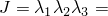1. The deformation modes for the tests described in terms of the principal stretches  are: 
- Uniaxial tension: 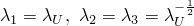
- Equibiaxial tension: 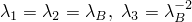
- Planar tension (pure shear): 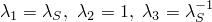

The principal stretch  is related to the principal nominal strain  through 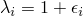. The nominal stress–nominal strain curves are shown in [Figure 3.1.4--1](ch03s01ach170.md#sxmrubber-treloardata). The curves are quite nonlinear and extend into fairly large strains: the maximum uniaxial tensile strain is 6.64, the maximum equibiaxial tensile strain is 3.45, and the maximum planar tensile strain is 4.06. The stress has units of kgf/cm2 (1 kgf/cm2=0.0981 MPa). These units are consistent with the units Treloar used in presenting his experimental results.

### Fitting procedures

In Abaqus the test data are specified as nominal stress–nominal strain data pairs using uniaxial test data, biaxial test data, and planar test data for hyperelastic behavior with material constants computed by Abaqus from the test data: shear constants  (polynomial forms); 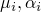 (Ogden form); 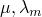 (Arruda-Boyce form); or 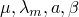 (Van der Waals form). If required, pressure-volume ratio data can be specified using volumetric test data to determine the compressibility constants  (polynomial and Ogden forms) or *D* (Arruda-Boyce and Van der Waals forms).

For each stress-strain data pair Abaqus generates an equation for the stress in terms of the strain invariants or stretches and the unknown hyperelastic constants, assuming incompressibility. For example, in the uniaxial deformation case the nominal stress  is 

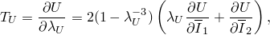

where *U* is the strain energy potential, 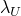 is the stretch in the uniaxial direction, and 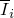 are the deviatoric strain invariants. If the Mooney-Rivlin form (*N*=1) of the polynomial strain energy potential is used, then 

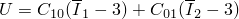

and, thus,

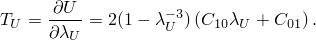

["Hyperelastic behavior of rubberlike materials," Section 22.5.1 of the Abaqus Analysis User's Guide](../usb/usb-link.md#usb-mat-chyperelastic), discusses the different stress expressions used for the different deformation modes. Since the number of stress equations will be greater than the number of unknown constants, a least-squares fit must be performed to determine the hyperelastic constants. For the *n* stress-strain pairs that make up the test data, the following error measure *E* is minimized: 

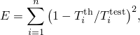

where  is a stress value from the test data and 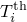 is a theoretical stress expression described above.

The polynomial potential is linear in the coefficients . Therefore, a linear least-squares procedure can be used. The Ogden potential is linear in the coefficients  but strongly nonlinear in the exponents . Similarly, the Arruda-Boyce and Van der Waals models are linear in the parameter  but nonlinear in the other shear coefficients. A nonlinear least-squares procedure similar to that of Twizell and Ogden (1983) is used in Abaqus to determine the material parameters simultaneously.

Upon deriving a set of constants, Abaqus performs material stability checks along the primary deformation modes using the Drucker stability criterion: 

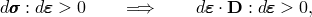

where  is the change in stress due to an infinitesimal change in strain  and 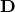 is the tangential material stiffness. For the stability criterion to be satisfied,  must be positive-definite. The analysis input file processor will issue warning messages defining the strain states at which  becomes singular with the potential for unstable material behavior. The deformation modes covered are the tensile and compressive cases of the uniaxial, equibiaxial, and planar modes.

#### Fitting case 1---using all three types of test data

The following cases are analyzed: 
- Polynomial form with  1 (Mooney-Rivlin form) and  2.
- Reduced polynomial form with  1 (neo-Hookean form) and  3 (Yeoh form).
- Ogden form with  2 and  3.
- Arruda-Boyce form.
- Van der Waals form.

All three types of test data are used simultaneously in fitting the hyperelastic constants. To evaluate the hyperelastic behavior in Abaqus, a single continuum, reduced-integration, hybrid C3D8RH element with unit dimensions is subjected to uniaxial tension, equibiaxial tension, and planar tension. The deformation modes are illustrated in [Figure 3.1.4--2](ch03s01ach170.md#sxmrubber-3deformmodes). The Abaqus nominal stress–nominal strain results are compared with the test data in [Figure 3.1.4--3](ch03s01ach170.md#sxmrubber-uniaxial) to [Figure 3.1.4--8](ch03s01ach170.md#sxmrubber-planarneo).

For the polynomial potential the case  1 (Mooney-Rivlin) gives a reasonable fit at low strains but is unable to reproduce the stiffening response of the rubber at higher strains. The case  2 provides the higher-order terms to enable closer correlation to the test data at all strain levels. Similar observations apply to the reduced polynomial with  1 (neo-Hookean) and  3 (Yeoh); the neo-Hookean model offers only a linear dependence of the first invariant and, thus, fails to provide an accurate representation of the upturn. In contrast, the three-term reduced polynomial (Yeoh) provides a more accurate representation than the full polynomial with  2, which has five coefficients. In addition, the Yeoh model does not exhibit any instabilities when fitting the Treloar test data.

For the Ogden potential both the cases  2 and  3 give very close fits to all three deformation modes, with the case  3 providing the best correlation among all fits.

The Arruda-Boyce model also gives a satisfactory fit. In the uniaxial case the upturn is not as steep as in the experiment; in the middle stretch range the stresses are overestimated. Other curve fits have been reported in the literature; for example, Boyce (1996) reports 0.27 MPa  2.75 kgf/cm2 and 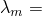5.15. These differ from our values, 3.28 kgf/cm2 and 5.24. The differences can be attributed to the fact that the relative error in stress is minimized. Another potential source of discrepancies could be different spacing of the Treloar test data.

The Van der Waals model gives a better fit than the Arruda-Boyce model, although not as good as the Ogden model. All stretch ranges of the stress-strain curve are fitted with high accuracy. Our fit compares favorably with those reported in the literature (Vilgis and Kilian, 1984); however, we use a more refined model since we take into account a slight dependence on the second invariant.

#### Fitting case 2---using uniaxial tension data only

Commonly, not all three or even two types of test data are available. [Figure 3.1.4--9](ch03s01ach170.md#sxmrubber-uniaxialonly) to [Figure 3.1.4--15](ch03s01ach170.md#sxmrubber-uniaxialmarlow) show the consequences of using different hyperelastic forms with only the uniaxial tension data. The following cases are analyzed: 
- Polynomial form with  1 (Mooney-Rivlin form) and  2.
- Reduced polynomial form with  1 (neo-Hookean form) and  3 (Yeoh form).
- Ogden form with  2 and  3.
- Arruda-Boyce form.
- Van der Waals form with .
- Marlow form.

Except for the polynomial model with  1 (both the neo-Hookean and Mooney-Rivlin forms), the uniaxial tension results correlate very closely to the uniaxial test data. This is expected since the hyperelastic constants are fitted using the uniaxial data. However, the (general) polynomial and Ogden models show large differences between the numerical and test data for the equibiaxial tension and planar tension cases.

For the case with polynomial  1 (Mooney-Rivlin), instabilities in the equibiaxial and planar tension cases occur immediately. For the case with polynomial  2, the stress increases very rapidly at higher strains.

For the Ogden potential the case  3 starts diverging significantly at moderate strains but not as severely as the case of polynomial  2. Notably, the Ogden  2 case still gives reasonably close fits even at higher strains. Experience with additional sets of test data indicates that it may be possible to generalize these observations. 

By omitting the dependence of the polynomial model on the second invariant, a much better prediction of the unmeasured stress states is obtained. This observation is in agreement with results reported in the literature; see Kaliske and Rothert (1997) or Yeoh (1993). In particular, the neo-Hookean model provides good first-order approximations to all stress states even though the coefficient  was measured from only a uniaxial test, whereas in our example the Mooney-Rivlin model is not even able to predict the qualitative tendencies correctly. The Yeoh model (or reduced polynomial, N=3) provides a good third-order approximation for all stress states without exhibiting any instabilities in the present case. Higher-order reduced polynomials, which are more likely to suffer from Drucker instability, are rarely needed, except, for example, when the stress-strain curve is “double-S-shaped.”

The best fit to all three deformation modes, when the strain energy potential is derived from uniaxial data, is obtained with the Van der Waals, Arruda-Boyce, and Marlow models. If the test data in the small stretch range were more densely spaced and the S-shape were more pronounced, as is common for filled rubbers, the Van der Waals model is likely to show an even clearer superiority, since the additional parameters create enhanced flexibility in representing complex stress-strain curves.

### Results and discussion

For Treloar's test data, when taking into account uniaxial, biaxial, and planar test data, the Ogden and Van der Waals forms give a closer fit than the polynomial forms. The Arruda-Boyce and Yeoh forms also provide an accurate representation. The (general) polynomial form exhibits some instabilities for  2 and provides only a first-order approximation for  1.

A completely different conclusion is reached when only limited test data are available. In this case the Van der Waals model (with ) and the Arruda-Boyce model are clearly superior to the Ogden model. The polynomial model is significantly enhanced when the dependence on the second invariant is omitted. The Yeoh model gives a very good third-order representation even for the deformation modes that have not been incorporated in the curve fit. Similarly, the neo-Hookean model gives a good first-order approximation for all stress states even when the fit is based on only one deformation state.

The high quality of the Ogden fit, as opposed to the (general) polynomial, in the presence of test data for all three deformation modes can be explained by the Ogden potential's flexibility in conforming to test data—the exponents  can assume any real values, whereas the polynomial potential can only have integer exponents.

However, for accurate analyses with the most general models—Ogden and (general) polynomial—it is important that multiple and independent types of test data be used in fitting the hyperelastic constants if the actual elastomeric model to be analyzed will experience general stress-strain states.

In accordance with Yeoh (1993), we suggest that the dependence on the second invariant be omitted when incomplete or limited material data are available; the curve fit for the Van der Waals model should be performed with , and the reduced polynomial form should be preferred over the (general) polynomial model. The Arruda-Boyce model is, by definition, independent of the second invariant. It is not possible to suppress the dependence on the second invariant for the Ogden model.

[Figure 3.1.4--15](ch03s01ach170.md#sxmrubber-uniaxialmarlow) to [Figure 3.1.4--17](ch03s01ach170.md#sxmrubber-planarmarlow) show the results for the Marlow model using different test data. It can be seen that the model can represent the material's behavior in the deformation mode for which test data are available exactly and have reasonable behavior in other modes of deformation.

Other considerations for achieving accurate and stable fits are discussed in ["Hyperelastic behavior of rubberlike materials," Section 22.5.1 of the Abaqus Analysis User's Guide](../usb/usb-link.md#usb-mat-chyperelastic).

### Input files

[rubberfit_ogden_n3.inp](../eif/rubberfit_ogden_n3.inp)

Treloar's test data and five static analysis steps composed of three deformation steps with two unloading steps in between the deformation steps. It is set up to use the Ogden model by specifying the OGDEN parameter in the [*HYPERELASTIC](../key/key-link.md#usb-kws-mhyperelast) option. As an alternative procedure for postprocessing purposes, it may be more straightforward to run the three deformation modes in this example individually by using three separate input files with only a single (deformation) step each.

[rubberfit_ogden_n2.inp](../eif/rubberfit_ogden_n2.inp)

Ogden model with N=2.

[rubberfit_mooneyrivlin.inp](../eif/rubberfit_mooneyrivlin.inp)

Mooney-Rivlin model.

[rubberfit_poly.inp](../eif/rubberfit_poly.inp)

Polynomial model.

[rubberfit_neohook.inp](../eif/rubberfit_neohook.inp)

Neo-Hookean model.

[rubberfit_yeoh.inp](../eif/rubberfit_yeoh.inp)

Yeoh model.

[rubberfit_arrudaboyce.inp](../eif/rubberfit_arrudaboyce.inp)

Arruda-Boyce model.

[rubberfit_vdwaal.inp](../eif/rubberfit_vdwaal.inp)

Van der Waals model.

[rubberfit_ogden_n3_uni.inp](../eif/rubberfit_ogden_n3_uni.inp)

Ogden model with N=3, uniaxial test data only.

[rubberfit_ogden_n2_uni.inp](../eif/rubberfit_ogden_n2_uni.inp)

Ogden model with N=2, uniaxial test data only.

[rubberfit_mooneyrivlin_uni.inp](../eif/rubberfit_mooneyrivlin_uni.inp)

Mooney-Rivlin model, uniaxial test data only.

[rubberfit_poly_uni.inp](../eif/rubberfit_poly_uni.inp)

Polynomial model, uniaxial test data only.

[rubberfit_neohook_uni.inp](../eif/rubberfit_neohook_uni.inp)

Neo-Hookean model, uniaxial test data only.

[rubberfit_yeoh_uni.inp](../eif/rubberfit_yeoh_uni.inp)

Yeoh model, uniaxial test data only.

[rubberfit_arrudaboyce_uni.inp](../eif/rubberfit_arrudaboyce_uni.inp)

Arruda-Boyce model, uniaxial test data only.

[rubberfit_vdwaal_uni.inp](../eif/rubberfit_vdwaal_uni.inp)

Van der Waals model, uniaxial test data only.

[rubberfit_marlow_uni.inp](../eif/rubberfit_marlow_uni.inp)

Marlow model, uniaxial test data only.

[rubberfit_marlow_bia.inp](../eif/rubberfit_marlow_bia.inp)

Marlow model, biaxial test data only.

[rubberfit_marlow_pla.inp](../eif/rubberfit_marlow_pla.inp)

Marlow model, planar test data only.

### References

Boyce,  M. C., “Direct Comparison of the Gent and the Arruda-Boyce Constitutive Models for Rubber Elasticity,” Rubber Chemistry and Technology, vol. 69, pp. 781–785, 1996.

Kaliske,  M., and H. Rothert, “On the Finite Element Implementation of Rubber-like Material at Finite Strains,” Engineering Computations, vol. 14, no.2, pp. 216–232, 1997.

Treloar,  L. R. G., “Stress-Strain Data for Vulcanised Rubber under Various Types of Deformation,” Transactions of the Faraday Society, vol. 40, pp. 59–70, 1940.

Twizell,  E. H., and R. W. Ogden, “Non-Linear Optimization of the Material Constants in Ogden's Stress-Deformation Function for Incompressible Isotropic Elastic Materials,” J. Austral. Math. Soc. Ser. B, vol. 24, pp. 424–434, 1983.

Yeoh,  O. H., “Some Forms of the Strain Energy Function for Rubber,” Rubber Chemistry and Technology, vol. 66, pp. 754–771, 1993.

Vilgis,  Th., and H. G. Kilian, “The Van der Waals-network—A Phenomenological Approach to Dense Networks,” Polymer, vol. 25, pp. 71–74, January, 1984.

### Figures

**Figure 3.1.4–1** Treloar's experimental data.

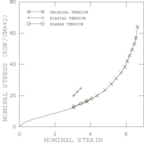

**Figure 3.1.4–2** Three deformation modes.

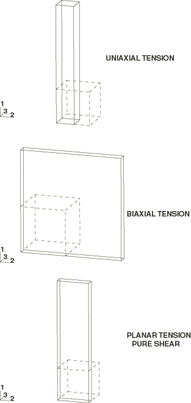

**Figure 3.1.4–3** Uniaxial tension results using three types of test data (polynomial and Ogden models).

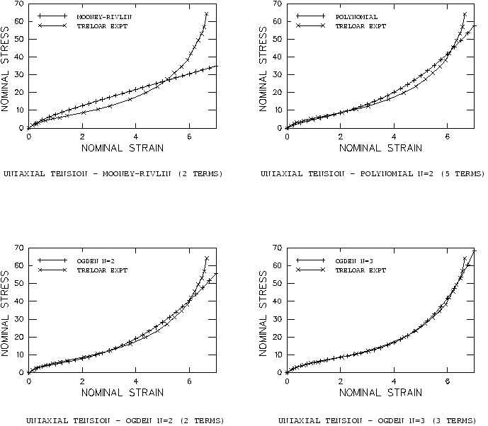

**Figure 3.1.4–4** Uniaxial tension results using three types of test data (neo-Hookean, Yeoh, Arruda-Boyce, and Van der Waals models).

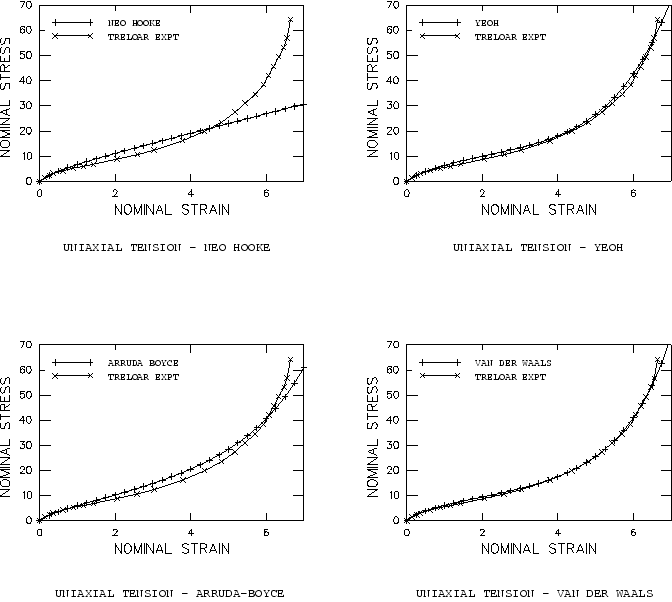

**Figure 3.1.4–5** Equibiaxial tension results using three types of test data (polynomial and Ogden models).

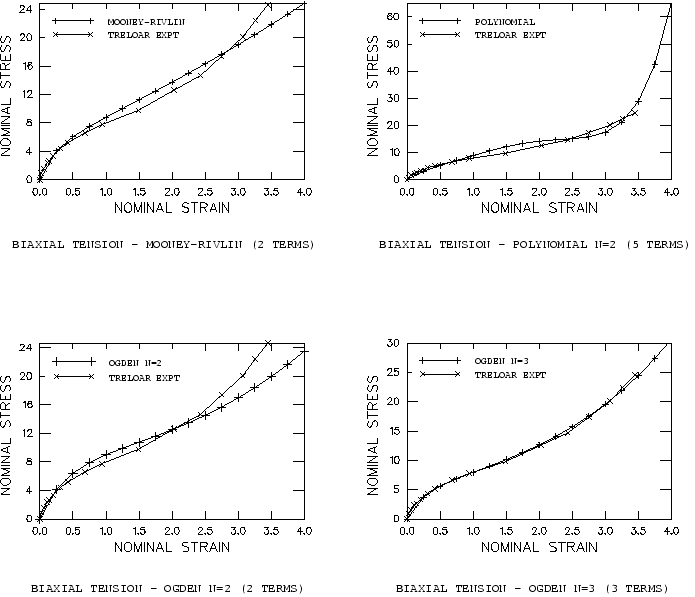

**Figure 3.1.4–6** Equibiaxial tension results using three types of test data (neo-Hookean, Yeoh, Arruda-Boyce, and Van der Waals models).

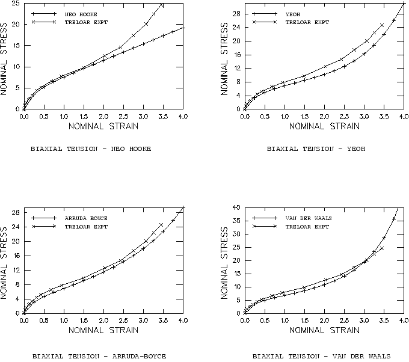

**Figure 3.1.4–7** Planar tension (pure shear) results using three types of test data (polynomial and Ogden models).

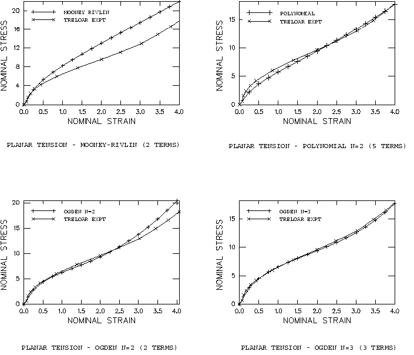

**Figure 3.1.4–8** Planar tension (pure shear) results using three types of test data (neo-Hookean, Yeoh, Arruda-Boyce, and Van der Waals models).

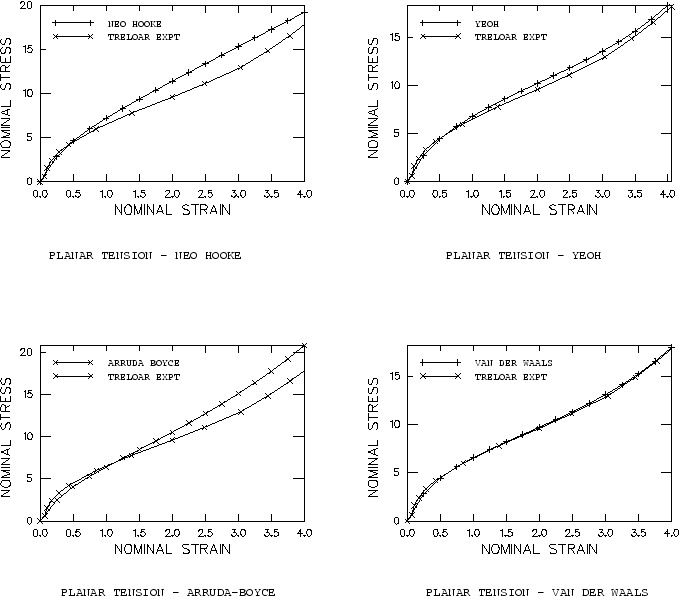

**Figure 3.1.4–9** Uniaxial tension results using uniaxial tension test data only (polynomial and Ogden models).

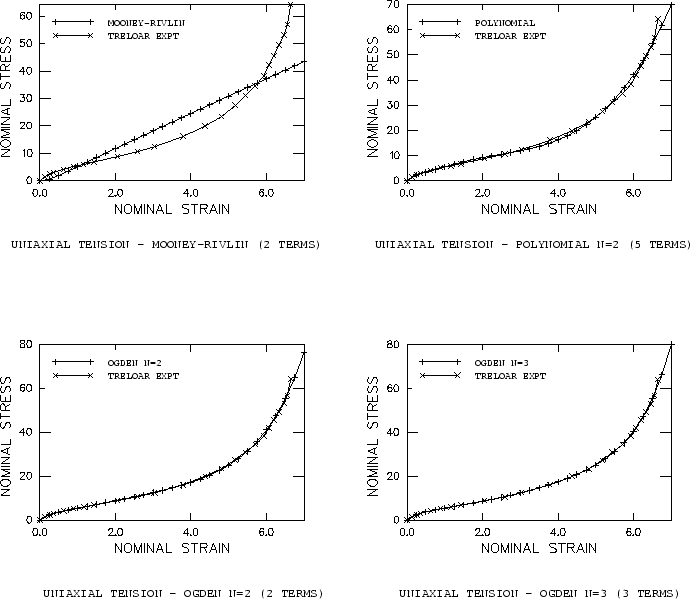

**Figure 3.1.4–10** Uniaxial tension results using uniaxial tension test data only (neo-Hookean, Yeoh, Arruda-Boyce, and Van der Waals models).

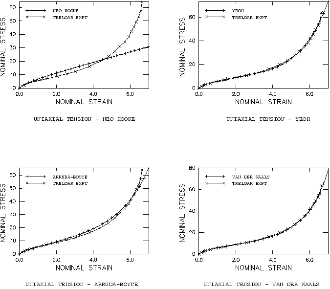

**Figure 3.1.4–11** Equibiaxial tension results using uniaxial tension test data only (polynomial and Ogden models).

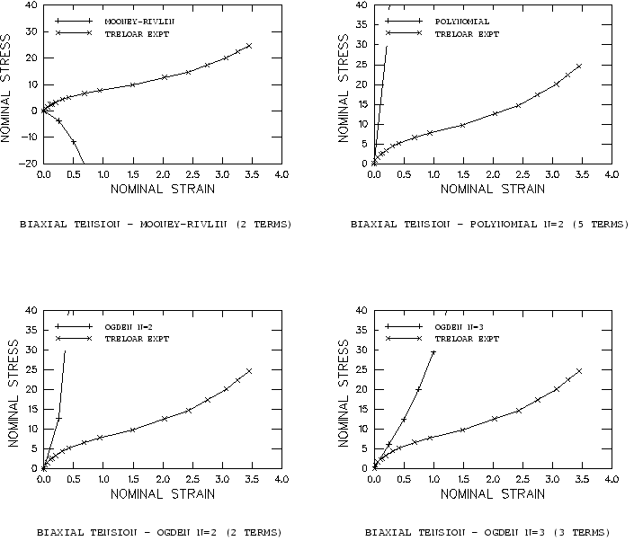

**Figure 3.1.4–12** Equibiaxial tension results using uniaxial tension test data only (neo-Hookean, Yeoh, Arruda-Boyce, and Van der Waals models).

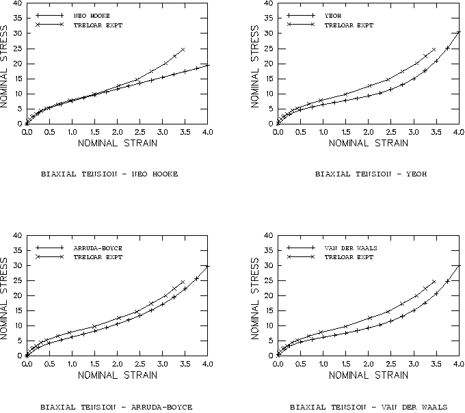

**Figure 3.1.4–13** Planar tension (pure shear) results using uniaxial tension test data only (polynomial and Ogden models).

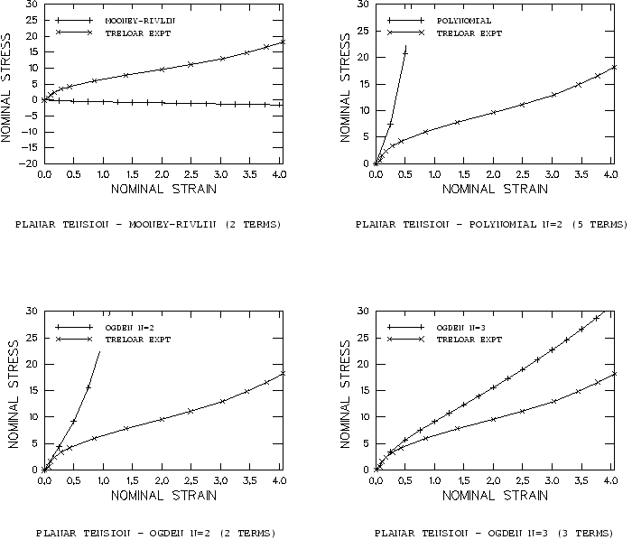

**Figure 3.1.4–14** Planar tension (pure shear) results using uniaxial tension test data only (neo-Hookean, Yeoh, Arruda-Boyce, and Van der Waals models).

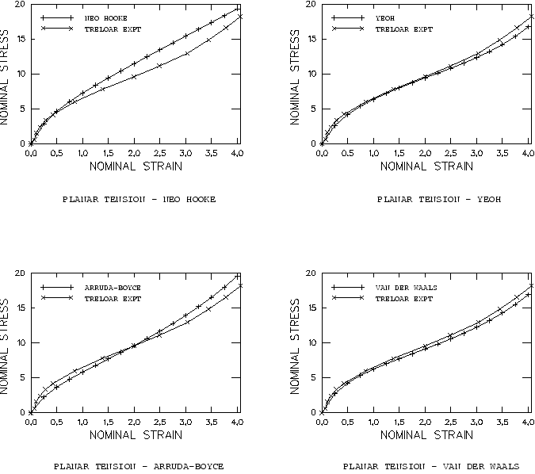

**Figure 3.1.4–15** The results under different loading using uniaxial tension test data only (Marlow model).

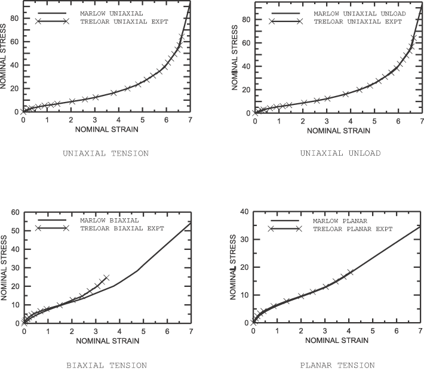

**Figure 3.1.4–16** The results under different loading using biaxial tension test data only (Marlow model).

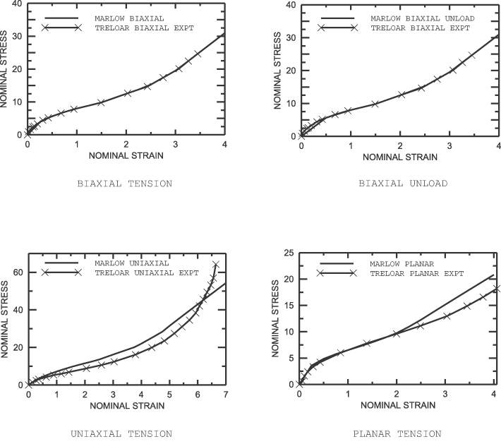

**Figure 3.1.4–17** The results under different loading using planar tension test data only (Marlow model).

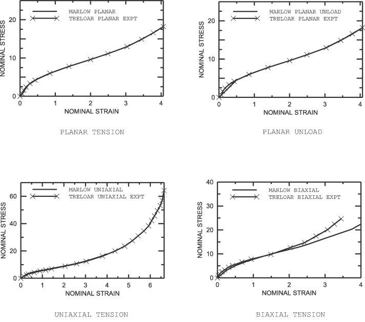

