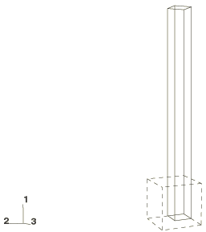
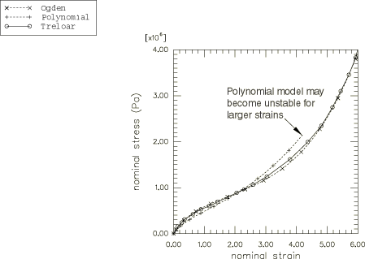
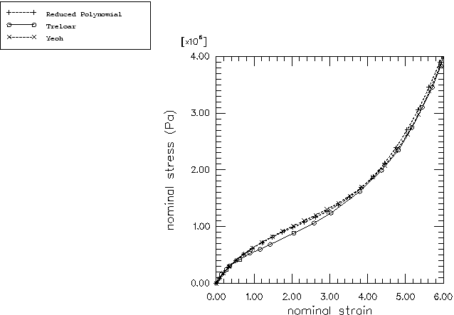
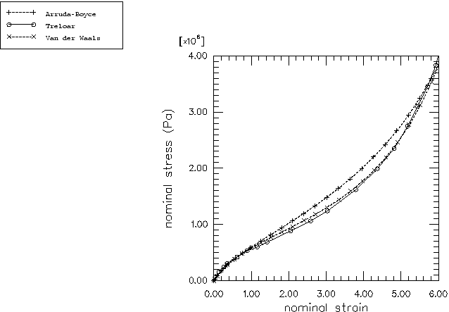

# 3.1.6 Rubber under uniaxial tension

**Product: **Abaqus/Explicit  

### Problem description

This test is a case of homogeneous deformation of a cube of unit dimension. Four types of hyperelastic strain energy potentials are used: the polynomial (including the reduced polynomial and Yeoh forms, which are the most common particular cases of the general polynomial model), Ogden, Arruda-Boyce, and Van der Waals forms with coefficients drawn from Treloar's experimental data (Treloar, 1940).

Stress and strain data are entered using uniaxial test data, biaxial test data, planar test data, and volumetric test data for the hyperelastic material model. A least squares method is used to fit the experimental data. For the polynomial and Ogden forms the order of the series (N) is specified for the hyperelastic material model. The following cases are analyzed:
- Polynomial form with N=2 (5 deviatoric terms).
- Reduced polynomial form with N=4 (4 deviatoric terms).
- Yeoh form, which is equivalent to the reduced polynomial form with N=3.
- Ogden form with N=3 (3 deviatoric terms).
- Arruda-Boyce form.
- Van der Waals form.

The stress values are given in pascals. The density of the material is 1000 kg/m3. A state of simple uniaxial tension is induced in the cube up to a strain of 600%. The stretching velocity is ramped up from zero to 6.0 m/s within 2.0 seconds. The coefficients fitted by using the polynomial strain energy potential with N=2 may lead to unstable material behavior when the nominal strain in a uniaxial tensile test reaches approximately 440%. (Unstable regimes for hyperelastic materials are discussed in ["Hyperelastic behavior of rubberlike materials," Section 22.5.1 of the Abaqus Analysis User's Guide](../usb/usb-link.md#usb-mat-chyperelastic).) Therefore, for that particular analysis the final deformation was set to be 400% by ramping the velocity from zero to 4.2 m/s within 2.0 seconds.

### Results and discussion

[Figure 3.1.6--1](ch03s01ach172.md#exxhypertest-model) shows the initial and deformed shapes. [Figure 3.1.6--2](ch03s01ach172.md#exxhypertest-stress-strain) through [Figure 3.1.6--4](ch03s01ach172.md#exxhypertest-stress-strain3) show comparisons of the computed nominal stress and strain in the stretching direction with Treloar's experimental data. The Abaqus results are seen to match the experimental results closely for the entire range of deformation, especially when the Ogden model or the Van der Waals potential is used. Analogous results were obtained for all the material models using C3D10M elements.

### Input files

[hypertest.inp](../eif/hypertest.inp)

Polynomial hyperelasticity case; C3D8R elements.

[hyper_reducedpoly.inp](../eif/hyper_reducedpoly.inp)

Reduced polynomial hyperelasticity case; C3D8R elements.

[hyper_yeoh.inp](../eif/hyper_yeoh.inp)

Yeoh hyperelasticity case; C3D8R elements.

[hyper_ogden.inp](../eif/hyper_ogden.inp)

Ogden hyperelasticity case; C3D8R elements.

[hyper_ab_all.inp](../eif/hyper_ab_all.inp)

Arruda-Boyce hyperelasticity case; C3D8R elements.

[hyper_vw_all.inp](../eif/hyper_vw_all.inp)

Van der Waals hyperelasticity case; C3D8R elements.

[hypertest_c3d10m.inp](../eif/hypertest_c3d10m.inp)

Polynomial hyperelasticity case; C3D10M elements.

[hyper_reducedpoly_c3d10m.inp](../eif/hyper_reducedpoly_c3d10m.inp)

Reduced polynomial hyperelasticity case; C3D10M elements.

[hyper_yeoh_c3d10m.inp](../eif/hyper_yeoh_c3d10m.inp)

Yeoh hyperelasticity case; C3D10M elements.

[hyper_ogden_c3d10m.inp](../eif/hyper_ogden_c3d10m.inp)

Ogden hyperelasticity case; C3D10M elements.

[hyper_ab_all_c3d10m.inp](../eif/hyper_ab_all_c3d10m.inp)

Arruda-Boyce hyperelasticity case; C3D10M elements.

[hyper_vw_all_c3d10m.inp](../eif/hyper_vw_all_c3d10m.inp)

Van der Waals hyperelasticity case; C3D10M elements.

Two additional input files are also included with the Abaqus release for the purpose of testing the implementation of the Arruda-Boyce and Van der Waals strain energy potentials (file names: [hyper_ab_uni.inp](../eif/hyper_ab_uni.inp) and [hyper_vw_uni.inp](../eif/hyper_vw_uni.inp)).

### Reference

Treloar,  L. R. G., “Stress-Strain Data for Vulcanised Rubber under Various Types of Deformation,” Transactions of the Faraday Society, vol. 40, pp. 59–70, 1940.

### Figures

**Figure 3.1.6–1** Deformed and initially undeformed element.

**Figure 3.1.6–2** Stresses vs. strains in the stretching direction for the polynomial and Ogden forms.

**Figure 3.1.6–3** Stresses vs. strains in the stretching direction for the reduced polynomial and Yeoh forms.

**Figure 3.1.6–4** Stresses vs. strains in the stretching direction for the Arruda-Boyce and Van der Waals forms.

