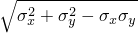
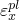
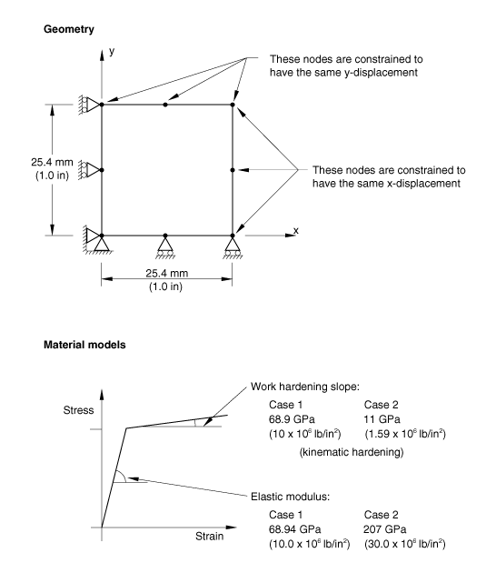
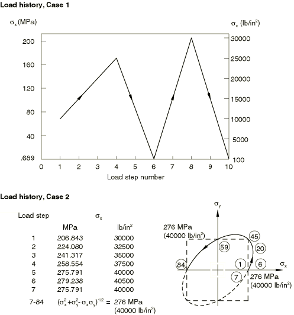
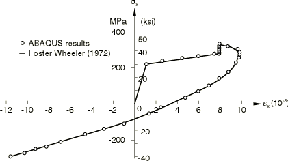

# 3.2.1 Uniformly loaded, elastic-plastic plate

**Product: **Abaqus/Standard  

This example is intended to serve two functions: to verify the coding of a standard rate-independent plasticity theory for metals and to assess the accuracy of the integration of the plasticity equations, especially in the case of nonproportional stressing. Integration of elastic-plastic material models is a potential source of error in numerical structural analysis. See, for example, the discussions by Krieg and Krieg (1977) and Schreyer et al. (1979). Usually the error is most severe when kinematic hardening is used in plane stress with nonproportional stressing (perhaps because of the complexity of the motion of the stress point and yield surface in stress space in this theory). This example contains two such problems. The exact solutions are available for both problems (Foster Wheeler report, 1972). Experience with a number of other computer programs has suggested that the second example, in particular, is a severe test of the numerical implementation of the plasticity theory. Both problems involve states of uniform plane stress and, hence, are done here by using a single plane stress element.

### Problem description

The material models for the unixially and biaxially loaded cases are described below.

#### Case 1---Uniaxial loading

[Figure 3.2.1--1](ch03s02ach174.md#sxmuniload-geomandmat) shows the material model for this case. The elastic modulus is 68.94 GPa (10.0  106 lb/in2), the yield stress is 68.9 MPa (10.0  103 lb/in2), and the work hardening slope is 68.9 GPa (10.0  106 lb/in2). This is specified by giving a yield stress of 34.57 GPa (5.01  106 lb/in2) at a plastic strain of 0.5. The total force and the total moment on the loaded face of the model are output to the results file.

#### Case 2---Biaxial loading

[Figure 3.2.1--1](ch03s02ach174.md#sxmuniload-geomandmat) shows the material model for this case. The elastic modulus is 207 GPa (30.0  106 lb/in2), the yield stress is 207 MPa (30.0  103 lb/in2), and the work hardening slope is 11 GPa (1.59  106 lb/in2). This is specified by giving a yield stress of 10.62 GPa (1.53  106 lb/in2) at a plastic strain of 0.95.

### Model and loading

The geometries and loading distributions for the unixial and biaxial cases are described below.

#### Case 1---Uniaxial loading

[Figure 3.2.1--1](ch03s02ach174.md#sxmuniload-geomandmat) shows the geometry for this case. Two types of meshes are provided: a single-element mesh using higher-order plane stress and shell elements (CPS8R, S8R5, S9R5, and STRI65) and a mesh using linear shell and continuum shell elements (S4R and SC8R). Two edges have simple support. The load history is shown in [Figure 3.2.1--2](ch03s02ach174.md#sxmuniload-loadhistories) and is prescribed with an amplitude curve (["Amplitude curves," Section 34.1.2 of the Abaqus Analysis User's Guide](../usb/usb-link.md#usb-prc-pamplitude)). The load distribution is a uniform, direct stress on the element edge. Since the strain should be uniform, the edge nodes are constrained using an equation constraint (["Linear constraint equations," Section 35.2.1 of the Abaqus Analysis User's Guide](../usb/usb-link.md#usb-cni-pequation)) to move together in the direction normal to the edge. Then the total load on the edge is simply given on one of the edge nodes.

#### Case 2---Biaxial loading

The case is set up with the same geometric model ([Figure 3.2.1--1](ch03s02ach174.md#sxmuniload-geomandmat)). However, the loading is more complex (see [Figure 3.2.1--2](ch03s02ach174.md#sxmuniload-loadhistories)).

First, the plate is loaded into the plastic range in uniaxial tension in the *x*-direction, unloaded slightly, and reloaded. Biaxial loading then follows, with  and  prescribed, as shown in [Figure 3.2.1--2](ch03s02ach174.md#sxmuniload-loadhistories), so that the quantity  remains constant at 276 MPa (40000 lb/in2). This loading is defined by an amplitude curve by reading in a file of values previously calculated in the small program AMP (see [elasticplasticplate_amplitude.f](../eif/elasticplasticplate_amplitude.f)).

### Results and discussion

Exact solutions for these two problems have been developed by Chern in a Foster Wheeler report (1972), where they are documented as Problems 8 and 9. These solutions provide a basis for the comparison of the Abaqus results.

#### Case 1---Uniaxial loading

The plastic strains are the basic solution in these cases (since stress is prescribed). The results for this case are summarized in [Table 3.2.1--1](ch03s02ach174.md#table-uniload-results). The Abaqus results agree with the exact solution. [Table 3.2.1--1](ch03s02ach174.md#table-uniload-results) also records the number of iterations required to achieve equilibrium.

#### Case 2---Biaxial loading

The results in this case are best represented by the  versus  plot shown in [Figure 3.2.1--3](ch03s02ach174.md#sxmuniload-stressvstrain). The agreement with the exact solution is again very close.

### Input files

[elasticplasticplate_cps8r_uni.inp](../eif/elasticplasticplate_cps8r_uni.inp)

Uniaxial loading case using the CPS8R element.

[elasticplasticplate_cps8r_bi.inp](../eif/elasticplasticplate_cps8r_bi.inp)

Biaxial loading case using the CPS8R element.

[elasticplasticplate_amplitude.f](../eif/elasticplasticplate_amplitude.f)

Program used to generate the amplitude data records.

[elasticplasticplate_s8r5_uni.inp](../eif/elasticplasticplate_s8r5_uni.inp)

Uniaxial loading case using the S8R5 element.

[elasticplasticplate_s8r5_bi.inp](../eif/elasticplasticplate_s8r5_bi.inp)

Biaxial loading case using the S8R5 element.

[elasticplasticplate_s9r5_uni.inp](../eif/elasticplasticplate_s9r5_uni.inp)

Uniaxial loading case using the S9R5 element.

[elasticplasticplate_s9r5_bi.inp](../eif/elasticplasticplate_s9r5_bi.inp)

Biaxial loading case using the S9R5 element.

[elasticplasticplate_stri65_uni.inp](../eif/elasticplasticplate_stri65_uni.inp)

Uniaxial loading case using the STRI65 element.

[elasticplasticplate_stri65_bi.inp](../eif/elasticplasticplate_stri65_bi.inp)

Biaxial loading case using the STRI65 element.

[elasticplasticplate_s4r_uni.inp](../eif/elasticplasticplate_s4r_uni.inp)

Uniaxial loading case using the S4R element.

[elasticplasticplate_s4r_bi.inp](../eif/elasticplasticplate_s4r_bi.inp)

Biaxial loading case using the S4R element.

[elasticplasticplate_sc8r_uni.inp](../eif/elasticplasticplate_sc8r_uni.inp)

Uniaxial loading case using the SC8R element.

[elasticplasticplate_sc8r_bi.inp](../eif/elasticplasticplate_sc8r_bi.inp)

Biaxial loading case using the SC8R element.

### References

Foster Wheeler Corporation, “Intermediate Heat Exchanger for Fast Flux Test Facility: Evaluation of the Inelastic Computer Programs,” report prepared for Westinghouse ARD, Foster Wheeler Corporation, Livingston, NJ, 1972.

Krieg,  R. D., and D. B. Krieg, “Accuracies of Numerical Solution Methods for the Elastic-Perfectly Plastic Model,” ASME Journal of Pressure Vessel Technology, vol. 99, no.4, pp. 510–515, 1977.

Schreyer,  H. L., R. F. Kulak, and J. M. Kramer, “Accurate Numerical Solutions for Elastic-Plastic Models,” ASME Journal of Pressure Vessel Technology, vol. 101, no.3, pp. 226–234, 1979.

### Table

**Table 3.2.1–1** Some results for uniaxial load.
| Load increment | Number of iterations |  |  (103) |
| --- | --- | --- | --- |
| (MPa) | (lb/in2) | (Abaqus) | (exact) |
| 1 | 1 | 68.947 | 10000 | 0 | 0 |
| 2 | 1 | 103.422 | 15000 | 0.500 | 0.500 |
| 3 | 1 | 137.895 | 20000 | 1.000 | 1.000 |
| 4 | 1 | 172.369 | 25000 | 1.500 | 1.500 |
| 5 | 3 | 86.529 | 12550 | 1.500 | 1.500 |
| 6 | 2 | 0.69 | 100 | 1.010 | 1.010 |
| 7 | 3 | 103.77 | 15050 | 1.010 | 1.010 |
| 8 | 2 | 206.83 | 30000 | 2.000 | not shown |
| 9 | 3 | 103.77 | 15050 | 2.000 | not shown |
| 10 | 2 | 0.69 | 100 | 1.010 | 1.010 |

### Figures

**Figure 3.2.1–1** Geometry and material models for plasticity test cases.

**Figure 3.2.1–2** Load histories.

**Figure 3.2.1–3**  versus , biaxially loaded plate.

