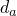
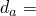

# 3.2.5 Uniaxial tests on jointed material

**Product: **Abaqus/Standard  

This example illustrates the fundamental material behavior obtained with the jointed material model in Abaqus. We construct a failure envelope for a material containing two sets of joints and subjected to uniaxial stress conditions. A complete description of the model is given in ["Constitutive model for jointed materials," Section 4.5.4 of the Abaqus Theory Guide](../stm/stm-link.md#stm-mat-jointedmat).

### Problem description

We consider a sample of material subjected to uniaxial compression/tension. The material has two sets of planes of weakness having an included angle of 2. We seek to construct the failure envelope of the material as the orientation ( in [Figure 3.2.5--1](ch03s02ach178.md#sxmuniaxial-geom)) of the planes of weakness is varied.

In the Abaqus model the failure surface for sliding on the joint systems is defined as 

where  is the pressure stress across the joint,  is the shear stress magnitude in the joint,  is the friction angle of the joint, and  is its cohesion. For this problem we assume that for both joints 1000 (the units are not important),  45, and that plastic flow in the joints is associated.

The behavior of the bulk material is based on the Drucker-Prager failure criterion 

where  is the Mises equivalent deviatoric stress (here  is the deviatoric stress ),  is the equivalent pressure stress,  is the friction angle of the bulk material, and  is the cohesion of the bulk material. For this problem we assume that  8000,  45, and that plastic flow of the bulk material is associated.

When all the joints are closed, the material is assumed to be isotropic and linear elastic with a Young's modulus of 3  105 and a Poisson's ratio of 0.3. When a joint opens, the material is assumed to have no elastic stiffness with respect to direct strain across the joint system or with respect to shearing associated with this direction. Open joints, thus, create anisotropic elastic response.

Each test performed in this example is carried out using a cube (one C3D8 element) of unit dimensions. Displacements are prescribed at the nodes of the cube to simulate homogeneous deformation and stress conditions.

### Results and discussion

[Figure 3.2.5--2](ch03s02ach178.md#sxmuniaxial-failure) shows the variation of the compressive failure stress  with , the angle which the bisector of the joints forms with the direction of the load. Compression failure envelopes are developed for  0, 20, 30. It is clear that for certain ranges of orientation of the joints with respect to the loading direction, failure along the planes of weakness becomes increasingly improbable and failure of the bulk material takes place first. It may be noted that the case when 0 corresponds to the theory of a single plane of weakness proposed by Jeager (1960).

When the load is applied in tension, the material cannot carry any stress since the joints open readily.

### Input files

[jointedmat_comp_alpha20thete0.inp](../eif/jointedmat_comp_alpha20thete0.inp)

Compression test with  20 and  0.

[jointedmat_comp_alpha20thete20.inp](../eif/jointedmat_comp_alpha20thete20.inp)

Compression test with  20 and  20.

[jointedmat_tens_alpha0theta10.inp](../eif/jointedmat_tens_alpha0theta10.inp)

Tension test with  0 and  10.

[jointedmat_tens_alpha20theta20.inp](../eif/jointedmat_tens_alpha20theta20.inp)

Tension test with  20 and  20.

[jointedmat_comp_pert.inp](../eif/jointedmat_comp_pert.inp)

A version of jointedmat_comp_alpha20thete0.inp including linear perturbation steps.

[jointedmat_tens_pert.inp](../eif/jointedmat_tens_pert.inp)

A version of jointedmat_tens_alpha0theta10.inp including linear perturbation steps.

The remaining cases analyzed in this example problem can be generated by changing the orientation of the joints.

### Reference

Jeager,  J. C., “Shear Failure of Anisotropic Rocks,” Geological Magazine, vol. 97, pp. 65–72, 1960.

### Figures

**Figure 3.2.5–1** Problem geometry.

**Figure 3.2.5–2** Uniaxial compression failure envelopes.

