# 3.2.6 Verification of creep integration

**Product: **Abaqus/Standard  

This two-part example is intended to verify the algorithms used to integrate creep constitutive behavior by comparison with closed-form solutions. In the first part the constitutive creep behavior for simple creep and relaxation tests are verified. In the second part solutions for the Mises, the Drucker-Prager, and the extended Drucker-Prager/Cap creep and plasticity models are verified for tests in which the load is ramped from zero over a given period of time.

### Problem description

#### Model for simple creep and relaxation tests

The model for the simple creep and relaxation tests contains eight independent, single-element specimens, as shown in [Figure 3.2.6--1](ch03s02ach179.md#sxmcreep-elements). The input files for both the creep and relaxation tests are given in [creep_usr_creep.inp](../eif/creep_usr_creep.inp) and [creep_relax_usr_creep.inp](../eif/creep_relax_usr_creep.inp). All of the elements are plane stress elements. The plane stress case provides the most rigorous verification because plane stress is usually the most difficult case for integrating the type of rate constitutive model that arises in classical metal creep theories. The eight elements are divided into two groups of four. One group is subjected to a creep test, and the other group models a relaxation experiment. Creep behavior can be defined in Abaqus directly on data lines (for simple creep laws) or by a user subroutine. In either case time or strain hardening can be used. To test all of these possibilities, the material definitions for the elements are set up as follows:

| Material behavior and method | Element number for | Element number for |
| --- | --- | --- |
| of input | creep test | relaxation test |
| Data defined time hardening | 1 | 5 |
| Data defined strain hardening | 2 | 6 |
| User subroutine defined time hardening | 3 | 7 |
| User subroutine defined strain hardening | 4 | 8 |

#### Models for coupled creep and plasticity tests

The models used to verify the integration of coupled creep and plasticity constitutive behavior consist of a single element of unit dimension. The test case employing the Mises model ([creep_mises.inp](../eif/creep_mises.inp)) uses a plane stress element simulating a tensile test. The test cases using the Drucker-Prager model ([creep_druckercap_ramp.inp](../eif/creep_druckercap_ramp.inp)) and extended Drucker-Prager/Cap model ([creep_druckercap_ramp.inp](../eif/creep_druckercap_ramp.inp)) use a solid element. The first simulates a tensile test, and the second, a compression test. A time hardening creep law is used for the Mises and the Drucker-Prager test cases; a Singh-Mitchell type creep law is defined for the modified Drucker-Prager/Cap model.

### Material

For all test cases the elastic material properties use a Young's modulus of 138 GPa (20  106 psi) and a Poisson's ratio of 0.3. In the creep and relaxation tests (first part of the example) the material definition uses creep behavior with the Mises stress potential and the equivalent uniaxial creep strain rate defined by 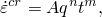 where *q* is the Mises equivalent stress, *t* is time in the time hardening case, or—in the strain hardening case— 

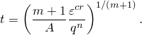

*A*, *n*, and *m* are constants, which are defined here as  1.6  1016 MPa5 sec0.8 (2.5  1027 psi5sec0.8),  5, and  0.2.

For the strain hardening case *t* can be eliminated from the creep strain rate definition, giving 

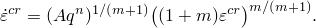

The time hardening creep law defined above with  1.6  1016 MPa5 sec0.8 (2.5  1027 psi5sec0.8) is specified for the coupled Mises and the coupled Drucker-Prager models. The plasticity hardening curve is given by 

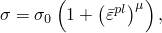

where  is the equivalent plastic strain, 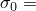 69 MPa (1  104 psi), and  0.2. The Drucker-Prager model is reduced to a Mises model by specifying the material angle of friction,  0.0, and the dilation angle,  0.0. No intermediate principal stress effect is used (i.e.,  1.0), as is required by this type of model.

A Singh-Mitchell type creep law is used for the case employing the modified Drucker-Prager/Cap model, activating the cohesion mechanism only. This creep strain rate is defined by 

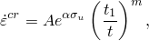

where 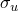 is the equivalent uniaxial compression creep stress, and the constants  2.5  105 sec1 (2.5  105  sec1),  1.45  102 MPa1 ( 0.0001 psi1), 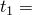 1.0, and  0.0.

### Solution control

Abaqus begins the analysis with explicit integration and continues to use that method unless its stability limit appears to be too severe a restriction on the size of the time increment or if plasticity occurs. If one of these conditions occurs, Abaqus switches to the backward difference method; thus, the integration is unconditionally stable, and the only limitation on time increment size is solution accuracy. This approach is usually the most economic method for applications involving this type of material behavior.

The accuracy of the time integration of the creep behavior is determined by the size of the time increments chosen by the automatic time incrementation scheme, which is controlled by a tolerance specified in the quasi-static procedure (["Quasi-static analysis," Section 6.2.5 of the Abaqus Analysis User's Guide](../usb/usb-link.md#usb-anl-avisco)). This tolerance limits the difference between the creep strain increments computed from the creep strain rates calculated from conditions at the beginning and at the end of the increment. In a case such as this, where the creep strain rate depends strongly on the stress, the usual guideline for setting this tolerance is to decide on a value that represents a small error in the stress and then divide that value by the elastic modulus to determine the setting. For the creep and relaxation tests we have used 0.69 MPa (100 lb/in2) as a small stress; hence, the tolerance is chosen as 5  106. For the coupled Mises and coupled Drucker-Prager tests a tolerance of 1  104 showed sufficient accuracy, and for the modified Drucker-Prager/Cap test a tolerance of 5  106 was selected.

### Exact solutions

For the one-dimensional cases observed here, the uniaxial stress is equal to the effective stress, *q*, and also equal to the equivalent creep test stress, 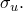 In the creep test the creep law can be integrated directly to give 

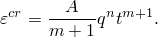

This solution is the same for both time and strain hardening. It is plotted in [Figure 3.2.6--2](ch03s02ach179.md#sxmcreep-testhistory).

In the relaxation test the strain is constant, so 

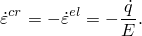

For the time hardening assumption this gives 

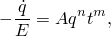

which integrates to give 

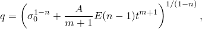

where  is the stress at the start of the event. This solution is shown in [Figure 3.2.6--3](ch03s02ach179.md#sxmcreep-relaxation).

For the strain hardening assumption the governing equation becomes 

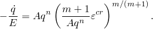

Since the strain is constant, 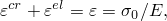 and 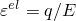 at any time. Thus, the governing equation defines the stress by 

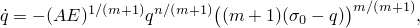

so *q* is defined by 

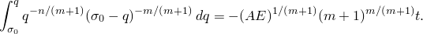

This equation is integrated numerically, using a fourth-order Runge-Kutta scheme, with a time increment of one second, which should provide a solution of high accuracy. The solution is plotted in [Figure 3.2.6--3](ch03s02ach179.md#sxmcreep-relaxation). For the relaxation test the solutions provided by the time hardening and strain hardening models are slightly different.

In the second part of this example, the closed-form solution for the creep strain of both the Mises and the Drucker-Prager models can be obtained by integrating the strain rate. The following is the exact solution for the total strain prior to yielding: 

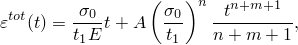

where  is the initial yield stress occurring at time . After the onset of yield, the exact solution for the total strain is as follows: 

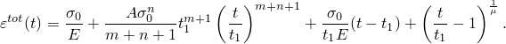

For the case employing the modified Drucker-Prager/Cap model, a very high value of yield stress is specified to prevent yielding. Thus, a closed-form solution of the total strain can easily be obtained: 

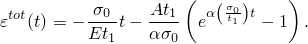

### Results and discussion

In the creep test ([creep_usr_creep.inp](../eif/creep_usr_creep.inp)) Abaqus uses explicit integration for the first 2.57 sec. When the time increment is 1.28 sec and is being restricted to that value by the conditional stability of the explicit operator, the switch to implicit integration occurs. Toward the end of the time period, time increments of more than 40,000 seconds are being used. For this case the Abaqus results all agree with the exact solution, which is to be expected. The creep test is a constant stress test; and when creep behavior is defined directly on data lines, the exact integration defined above for constant stress is used in Abaqus for each increment. The same technique has been used in the user subroutine [`CREEP`](../sub/sub-link.md#sub-xsl-creep) for use with[creep_usr_creep.inp](../eif/creep_usr_creep.inp) and [creep_relax_usr_creep.inp](../eif/creep_relax_usr_creep.inp).

[Figure 3.2.6--3](ch03s02ach179.md#sxmcreep-relaxation) shows the Abaqus results for the relaxation test ([creep_relax_usr_creep.inp](../eif/creep_relax_usr_creep.inp)), compared to the exact solutions described above. The agreement is quite good. Accuracy can be improved by using a smaller value for the accuracy tolerance, which causes Abaqus to use smaller time increments initially. Generally this is not done because the creep data from which the material behavior are defined show considerable scatter, so it is not worthwhile to attempt to obtain very high accuracy in the response prediction.

[Figure 3.2.6--4](ch03s02ach179.md#sxmcreep-misesdp) shows the results for the coupled creep and plasticity tests. The closed-form solutions for the total strain (solid line), the plastic strain (short dashed line), the creep strain (long dashed line), and the elastic strain (dotted line) are shown as lines. The Abaqus solution is shown as symbols. Triangles are plotted for the Mises case, and circles are plotted for the Drucker-Prager case. The symbols are plotted at various intervals and show excellent agreement with the closed-form solution.

For the case using the modified Drucker-Prager/Cap model the creep strain in the direction of the loading (variable CE22) and the equivalent creep strain (variable CEEQ) deviate slightly from the theoretical values of the creep strain (see [Figure 3.2.6--5](ch03s02ach179.md#sxmcreep-dpcap-ramp)). The discrepancy develops while the stress is low, after which no additional deviations occur. This behavior is a shortcoming of the creep potentials used by Abaqus, as described in ["Models for granular or polymer behavior," Section 4.4.2 of the Abaqus Theory Guide](../stm/stm-link.md#stm-mat-granularpoly). This kind of discrepancy is not observed in more typical creep analyses that have a short-term (“static”) preloading, followed by long-term creep. Such behavior is highlighted if the ramp amplitude of the load is replaced by a step function. In that case the closed-form solution becomes 

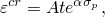

where 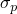 represents the prescribed stress at 0. [Figure 3.2.6--6](ch03s02ach179.md#sxmcreep-dpcap-step) shows the same three curves thus obtained.

### Input files

[creep_usr_creep.inp](../eif/creep_usr_creep.inp)

Creep test. The load is applied in Step 1, and the response is obtained in Step 2.

[creep_usr_creep.f](../eif/creep_usr_creep.f)

User subroutine [`CREEP`](../sub/sub-link.md#sub-xsl-creep) used in creep_usr_creep.inp and creep_postoutput.inp.

[creep_relax_usr_creep.inp](../eif/creep_relax_usr_creep.inp)

Relaxation test. The displacement is prescribed in Step 1, and the response obtained in Step 2.

[creep_relax_usr_creep.f](../eif/creep_relax_usr_creep.f)

User subroutine [`CREEP`](../sub/sub-link.md#sub-xsl-creep) used in creep_relax_usr_creep.inp.

[creep_exact.f](../eif/creep_exact.f)

Runge-Kutta integration of the equation that defines the solution to the strain hardening relaxation test.

[creep_mises.inp](../eif/creep_mises.inp)

Mises creep and plasticity test case.

[creep_postoutput.inp](../eif/creep_postoutput.inp)

[*POST OUTPUT](../key/key-link.md#usb-kws-hpostoutput) analysis.

[creep_misescurve.inp](../eif/creep_misescurve.inp)

Hardening data for the Mises creep and plasticity test case given in creep_mises.inp.

[creep_drucker.inp](../eif/creep_drucker.inp)

Drucker-Prager creep and plasticity test case.

[creep_druckercap_ramp.inp](../eif/creep_druckercap_ramp.inp)

Modified Drucker-Prager/Cap creep and plasticity test case. The stress is applied as a ramp function with time.

[creep_druckercap_step.inp](../eif/creep_druckercap_step.inp)

Modified Drucker-Prager/Cap creep and plasticity test case. The stress is applied as a step function and held constant with time.

[creep_exact_closedform.f](../eif/creep_exact_closedform.f)

FORTRAN program for the closed-form solutions to verify the coupled creep and plasticity option.

### Figures

**Figure 3.2.6–1** Typical elements for creep and relaxation tests.

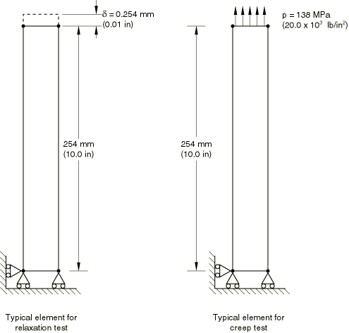

**Figure 3.2.6–2** Creep test history.

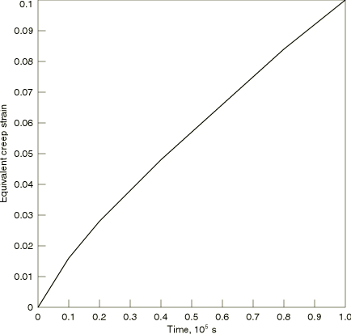

**Figure 3.2.6–3** Relaxation test history.

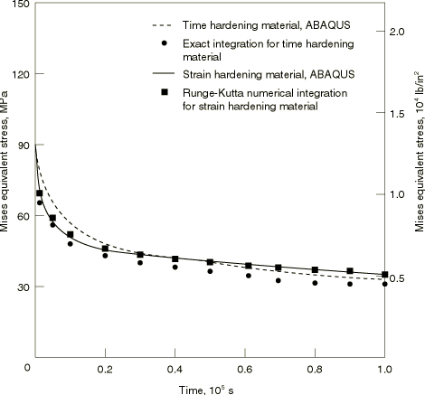

**Figure 3.2.6–4** Mises and Drucker-Prager creep and plasticity models.

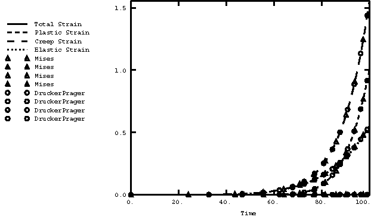

**Figure 3.2.6–5** Modified Drucker Prager/Cap model (stress applied as a ramp function).

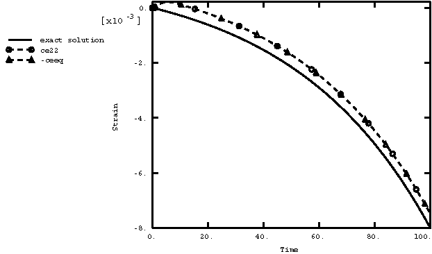

**Figure 3.2.6–6** Modified Drucker Prager/Cap model (stress applied as a step function).

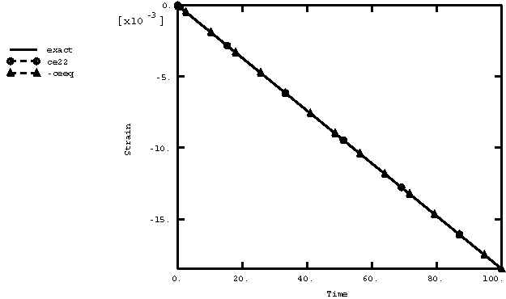

