# 3.2.8 Simple proportional and nonproportional cyclic tests

**Product: **Abaqus/Standard  

This example illustrates the process of calibrating the nonlinear isotropic/kinematic hardening model using test data from a uniaxial, symmetric strain-controlled, cyclic experiment. It also illustrates the limitations of the model under multiaxial loading conditions when the material properties are calibrated with uniaxial test data.

Three different simulations are performed in this example. The simulations include a uniaxial, symmetric strain-controlled experiment; a uniaxial, unsymmetric strain-controlled experiment; and a multiaxial tension-torsion experiment. The model predictions are compared with experimental test data for OFHC copper (Anand, 1996). The simulations show that the model captures the response of the material accurately when the experiment that is used to calibrate the model is simulated. However, it only approximates the behavior of the material when the loading does not correspond to the loading of the calibration experiment.

["Models for metals subjected to cyclic loading," Section 23.2.2 of the Abaqus Analysis User's Guide](../usb/usb-link.md#usb-mat-chardening), contains a description of the model and its use; and a mathematical description of the model is presented in ["Models for metals subjected to cyclic loading," Section 4.3.5 of the Abaqus Theory Guide](../stm/stm-link.md#stm-mat-combinedhardening).

### Problem description

The simple tests performed in this example are carried out using a tube (one PIPE31 element) of unit length and unit midsurface radius. This element is chosen so that the simulation of a tension-torsion cyclic experiment can be performed easily.

This example uses test data obtained from a well-annealed OFHC copper with a Young's modulus, *E*, of 104 GPa and a Poisson's ratio, , of 0.3.

### Calibration of the model

The model is calibrated using test data from a uniaxial experiment ([Figure 3.2.8--1](ch03s02ach181.md#sxmcyclic-symstrain)) obtained at a strain range  1.5%. Both the kinematic component and isotropic hardening component of the model are calibrated.

The shape of the first cycle differs from the shape of subsequent cycles, suggesting that the kinematic hardening component is a function of the cycle number. Since the model does not allow for such a dependency, a representative shape must be chosen. The objective in this example is to compare the model predictions with test data over many cycles. The stabilized cycle is, therefore, chosen for calibration. If the model were being used to simulate only one or two load cycles, it would be more appropriate to use the first loading cycle for calibration.

The second half of the saturated cycle used for calibrating the kinematic hardening material parameters *C* and  is shown in [Figure 3.2.8--2](ch03s02ach181.md#sxmcyclic-calibration). The data are entered as values of yield stress, , versus plastic strain, 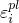, to define the stabilized cycle of the metal plasticity model, where 

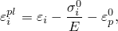

with 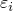 the total strain for data point *i*, and 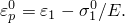 The onset of yield is taken as 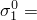 46.9 MPa. The calibration yields  33.55 GPa and  701.3; these quantities are reported in the results file.

The isotropic hardening component is calibrated next. Isotropic hardening defines the evolution of the elastic range as a function of equivalent plastic strain. The size of the elastic range can be determined easily at points where the loading is reversed as half the difference between the yield stress in tension and compression. For the stabilized cycle the size of the elastic range is 96.2 MPa. The corresponding values of equivalent plastic strain are obtained by assuming that the test is approximately performed as a symmetric plastic strain-controlled experiment, where 

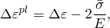

and  is an averaged yield stress over all the cycles.  is taken as 75.0 MPa for this material. With this assumption the equivalent plastic strain is obtained as 

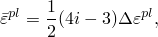

where *i* is the cycle number. This approximation yields a value of 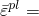 25.16% for the last cycle (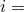 10). The resulting data are used to define the size of the elastic range. The change in elastic range during the first half-cycle is specified as zero to compensate for the difference in the shape of this cycle compared to subsequent cycles.

### Results and discussion

The predictions of the calibrated model for the three experiments are shown in [Figure 3.2.8--3](ch03s02ach181.md#sxmcyclic-symcompare) through [Figure 3.2.8--5](ch03s02ach181.md#sxmcyclic-tension-torsion).

[Figure 3.2.8--3](ch03s02ach181.md#sxmcyclic-symcompare) compares the predictions of the model with the test data obtained from the symmetric strain-controlled cyclic experiment. The figure shows a close match between the simulation and the test data except for the first cycle, which is to be expected since the calibration of the kinematic hardening component is based on stabilized test data. The equivalent plastic strain reported by Abaqus at the end of the analysis is equal to 23.67%; therefore, the assumption used to calibrate the isotropic hardening component that the test is approximately plastic strain-controlled is justified.

Next, the calibrated model is used to simulate the behavior of the material during an unsymmetric strain-controlled cyclic experiment with strain varying between 0.25% and 1.75%. [Figure 3.2.8--4](ch03s02ach181.md#sxmcyclic-unsymcompare) compares the simulation with the experimental test data. Again, a poor match is observed over the first cycle, since the model is calibrated using the stabilized stress-strain curve. The figure further shows that the model predicts less cyclic hardening (approximately 8%) than that obtained in the experiment.

[Figure 3.2.8--5](ch03s02ach181.md#sxmcyclic-tension-torsion) compares the predicitions of the model with test data for a tension-torsion cyclic experiment. The experiment is conducted as follows: first, the specimen is stretched to a strain of  1%; then it is cycled with an axial strain 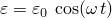 and a shear strain 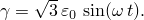 Since the material is assumed to be rate independent, it is convenient to choose 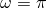 so that each strain cycle runs over two time units.

The model predicts a maximum normal stress of 143.1 MPa, which is also the saturated value that the model predicts during a uniaxial experiment. Saturation is reached after only four cycles. The experiment, on the other hand, shows that the maximum (saturated) normal stress of 218.0 MPa is reached after approximately 10 cycles. The large difference between the maximum values of the normal stress and the rate at which saturation is reached is the result of the different responses of the material under different loading conditions and different strain ranges. For example, the tension-torsion experiment is conducted over a strain range of 2.0%, whereas the isotropic hardening component is calibrated using test data from a uniaxial experiment conducted over a 1.5% strain range. 

These experiments show that the cyclic response of the material depends on the strain range over which the cycles occur and on the type of loading conditions. The experiments further show that the kinematic hardening component may change from cycle to cycle. Some materials also show different kinematic hardening behavior at different strain ranges, although this effect is negligible in this case. Typically, isotropic hardening properties are more sensitive to loading conditions than kinematic hardening properties. The model does not allow for such dependencies. Therefore, it is important to perform different types of cyclic experiments at different strain ranges to establish the sensitivity of the isotropic and kinematic hardening properties to strain range and loading conditions.

### Acknowledgment

SIMULIA would like to thank Professor L. Anand of the Massachusetts Institute of Technology for providing the experimental test data.

### Input files

[cyclictests_sym.inp](../eif/cyclictests_sym.inp)

Symmetric strain-controlled cyclic simulation.

[cyclictests_kinematic.inp](../eif/cyclictests_kinematic.inp)

Kinematic hardening data obtained from the symmetric strain-controlled cyclic experiment.

[cyclictests_unsym.inp](../eif/cyclictests_unsym.inp)

Unsymmetric strain-controlled cyclic simulation.

[cyclictests_tensiontorsion.inp](../eif/cyclictests_tensiontorsion.inp)

Tension-torsion cyclic simulation.

### Reference

Anand,  L., “Test Data for a Well-Annealed OFHC Copper Material,” Massachusetts Institute of Technology, Cambridge, MA, 1996.

### Figures

**Figure 3.2.8–1** Symmetric strain cyclic test data.

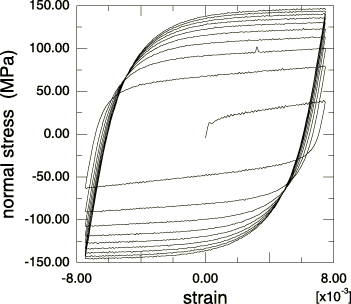

**Figure 3.2.8–2** The last half cycle of test data is used to calibrate the kinematic hardening component.

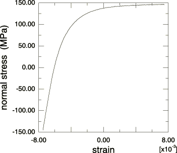

**Figure 3.2.8–3** Comparison of the calibrated model and the test data for the symmetric strain cycle experiment.

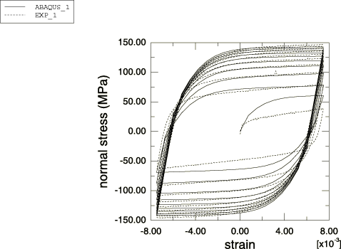

**Figure 3.2.8–4** Comparison of the calibrated model and the test data for the unsymmetric strain cycle experiment.

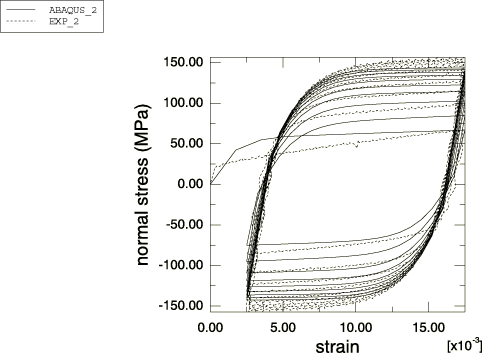

**Figure 3.2.8–5** Comparison of the calibrated model and the test data for the tension-torsion cycle experiment.

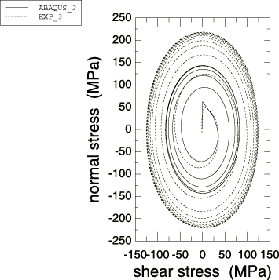

