# 3.2.9 Biaxial tests on gray cast iron

**Products: **Abaqus/Standard  Abaqus/Explicit  

This example illustrates the fundamental material behavior obtained with the cast iron plasticity material model in Abaqus. It also compares the model predictions under multiaxial loading conditions with the experimental test data given by Coffin (1950). The model is calibrated with uniaxial tension and uniaxial compression test data, and the predictions are compared with test data under different loading conditions. ["Cast iron plasticity," Section 23.2.10 of the Abaqus Analysis User's Guide](../usb/usb-link.md#usb-mat-ccastironplasticity), contains a summary of the model; and a complete description of the model is given in ["Cast iron plasticity," Section 4.3.7 of the Abaqus Theory Guide](../stm/stm-link.md#stm-mat-castironplasticity).

### Problem description

The tests performed in this example are carried out using a cube (one C3D8 element) of unit dimensions. Pressure loads are applied to appropriate faces of the element to model six different loading paths in stress space. These loading paths are uniaxial tension, uniaxial compression, equibiaxial tension, pure shear, biaxial tension (with the magnitude of the loading in the two directions being unequal), and biaxial tension/compression (with the magnitude of the loading in the two directions being unequal), respectively. The loading in all the test cases results in homogeneous deformation. Since the cast iron plasticity model assumes nonassociated flow, the unsymmetric matrix storage and solution scheme is used in the Abaqus/Standard analyses.

### Material parameters

In the cast iron plasticity model the elastic behavior is assumed to be linear and isotropic. The Young's modulus, *E*, and Poisson's ratio, , are assumed to be the same in tension and compression. For calibrating the plastic behavior, the model requires the value of the “plastic Poisson's ratio,” ; the hardening curve in uniaxial tension; and the hardening curve in uniaxial compression. The plastic Poisson's ratio is an average measure of the transverse to the longitudinal plastic strain under uniaxial tension. The material data used in this example were obtained from Coffin (1950). [Figure 3.2.9--1](ch03s02ach182.md#sxmcastiron-stressvstrain) shows the uniaxial tension and compression curves (the first data point in each case corresponds to the onset of plastic deformation) that are used to calibrate the hardening of the model. The plastic Poisson's ratio is taken to be 0.039, based on Coffin's data for permanent volumetric strain under uniaxial tension. The units for the stresses and Young's modulus are psi.

### Results and discussion

The results for each test are presented in two plots: one showing the stress/strain response and the other showing the variation of the permanent volumetric strain with the applied stress. For each plot two sets of data are presented: one corresponds to Coffin's experimental data, and the other corresponds to the Abaqus simulation.

[Figure 3.2.9--2](ch03s02ach182.md#sxmcastiron-tension), [Figure 3.2.9--3](ch03s02ach182.md#sxmcastiron-tensionp), and [Figure 3.2.9--4](ch03s02ach182.md#sxmcastiron-compression) compare the prediction of the model with the experimental test data in uniaxial tension and uniaxial compression, respectively. All the figures show good agreement between the test data and experimental results. This behavior is to be expected since the model is calibrated using uniaxial test data. [Figure 3.2.9--5](ch03s02ach182.md#sxmcastiron-compressionp) shows that small (compared to the strain in [Figure 3.2.9--4](ch03s02ach182.md#sxmcastiron-compression)) permanent volume changes were observed in the uniaxial compression experiment. The model in Abaqus predicts zero permanent volume change under uniaxial compression and higher confining stresses.

The results for equibiaxial tension are presented in [Figure 3.2.9--6](ch03s02ach182.md#sxmcastiron-equibiaxial) and [Figure 3.2.9--7](ch03s02ach182.md#sxmcastiron-equibiaxialp). At high stress values Abaqus predicts a stiffer response. The error in the stress/strain response is about 20% at 70% of the fracture stress and higher for higher stress values. The error in the stress/strain response at high stresses is probably because the Rankine yield criterion is only an approximation to the real material behavior under equibiaxial loading conditions.

The results for pure shear are shown in [Figure 3.2.9--8](ch03s02ach182.md#sxmcastiron-shear) and [Figure 3.2.9--9](ch03s02ach182.md#sxmcastiron-shearp). Again, Abaqus predicts a stiffer response at high stress values. The error in the stress/strain response is about 20% at 70% of the fracture stress and higher for higher stress values. The stress/strain response of the simulation indicates a change in the rate of hardening at very high stresses. This behavior is due to a change in the yielding mechanism from Rankine to Mises.

[Figure 3.2.9--10](ch03s02ach182.md#sxmcastiron-unequalbi) and [Figure 3.2.9--11](ch03s02ach182.md#sxmcastiron-unequalbip) show the results for unequal biaxial tension, where the applied loading in one direction is twice of that in the other. In both the figures the strains are plotted against the maximum principal stress. In [Figure 3.2.9--10](ch03s02ach182.md#sxmcastiron-unequalbi) the curves labeled “Abaqus–1” and “COFFIN-1” correspond to the maximum principal stress versus the maximum principal strain, and the curves labeled “Abaqus–2” and “COFFIN-2” correspond to the maximum principal stress versus the intermediate principal strain. The stress/strain response predicted by Abaqus is in good agreement with the experimental results. The difference between the numerical and experimental results for the permanent volume strain under high stresses suggests that the minimum principal strain has not been captured as accurately as the other principal strains in the numerical simulation. The reason for the better agreement in the stress/strain results for unequal biaxial tension as compared to those for equibiaxial tension and shear may be that the loading path is, in relative terms, closer to the uniaxial tension loading path and that the model is calibrated with uniaxial tension results.

Finally, the case of biaxial tension/compression is shown in [Figure 3.2.9--12](ch03s02ach182.md#sxmcastiron-biaxialtc) and [Figure 3.2.9--13](ch03s02ach182.md#sxmcastiron-biaxialtcp). The loading for this test consists of tension in one direction and compression, with twice the magnitude of the tensile load, in the other direction. The stress/strain response as predicted by Abaqus agrees well with the experimental results. The loading path for this case is close to the loading path for uniaxial compression, and the model is calibrated with uniaxial compression results. In [Figure 3.2.9--13](ch03s02ach182.md#sxmcastiron-biaxialtcp) the experimental results indicate a very high value for the maximum permanent volume change. Given that the loading is predominantly compressive, such a high value of the permanent volume change is somewhat surprising. It is possible that such a permanent volume change may be related to effects such as microbuckling of the graphite flakes; the Abaqus model does not capture this behavior.

### Conclusions

These simulations show that the Abaqus model generally matches the experiments reasonably well. As expected, the match is better for stress paths close to the ones that are used for calibration. However, the model is only a first approximation to the real material behavior, and it would need more features to match the experimental results well for all stress paths. For stress paths that represent equibiaxial tension and pure shear, respectively, the simulations indicate that about 20% error may be expected at 70% of the fracture stress (such high stresses are unlikely to be acceptable in a design).

### Input files

##### **Abaqus/Standard input files**

[castiron_unitension.inp](../eif/castiron_unitension.inp)

Uniaxial tension test.

[castiron_unicompress.inp](../eif/castiron_unicompress.inp)

Uniaxial compression test.

[castiron_equitension.inp](../eif/castiron_equitension.inp)

Equibiaxial tension test.

[castiron_shear.inp](../eif/castiron_shear.inp)

Shear test.

[castiron_bitension.inp](../eif/castiron_bitension.inp)

Biaxial tension case.

[castiron_tensioncompress.inp](../eif/castiron_tensioncompress.inp)

Biaxial tension/compression case.

##### **Abaqus/Explicit input files**

[castiron_unitension_xpl.inp](../eif/castiron_unitension_xpl.inp)

Uniaxial tension test.

[castiron_unicompress_xpl.inp](../eif/castiron_unicompress_xpl.inp)

Uniaxial compression test.

[castiron_equitension_xpl.inp](../eif/castiron_equitension_xpl.inp)

Equibiaxial tension test.

[castiron_shear_xpl.inp](../eif/castiron_shear_xpl.inp)

Shear test.

[castiron_bitension_xpl.inp](../eif/castiron_bitension_xpl.inp)

Biaxial tension case.

[castiron_tensioncompress_xpl.inp](../eif/castiron_tensioncompress_xpl.inp)

Biaxial tension/compression case.

### Reference

Coffin,  L. F., “The Flow and Fracture of a Brittle Material,” Journal of Applied Mechanics, vol. 72, pp. 233–248, 1950.

### Figures

**Figure 3.2.9–1** Uniaxial stress/strain curves for gray cast iron.

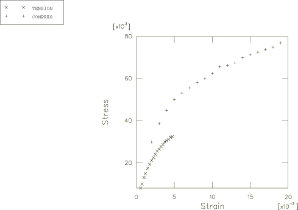

**Figure 3.2.9–2** Stress versus strain under uniaxial tension.

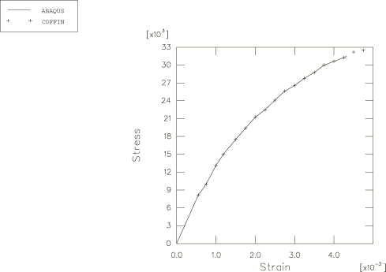

**Figure 3.2.9–3** Stress versus permanent volume strain under uniaxial tension.

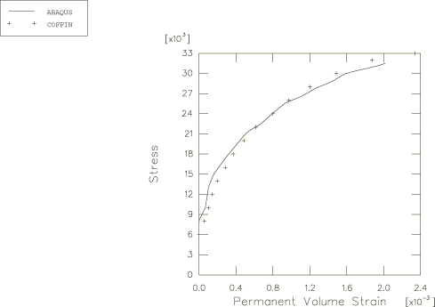

**Figure 3.2.9–4** Stress versus strain under uniaxial compression.

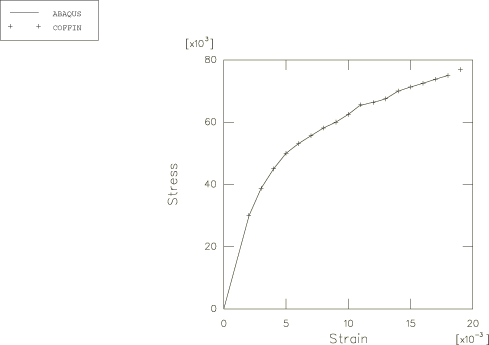

**Figure 3.2.9–5** Stress versus permanent volume strain under uniaxial compression.

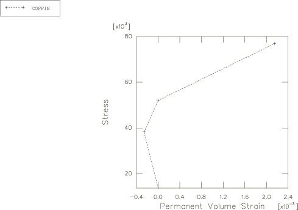

**Figure 3.2.9–6** Stress versus strain under equibiaxial tension.

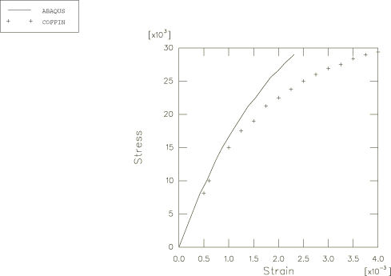

**Figure 3.2.9–7** Stress versus permanent volume strain under equibiaxial tension.

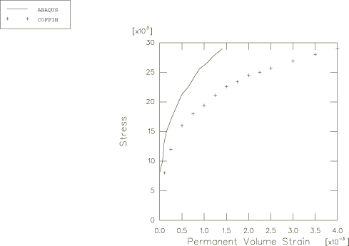

**Figure 3.2.9–8** Stress versus strain under pure shear.

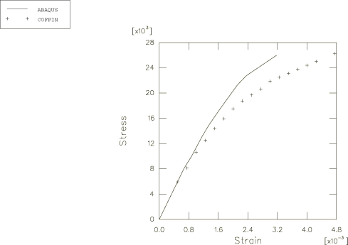

**Figure 3.2.9–9** Stress versus permanent volume strain under pure shear.

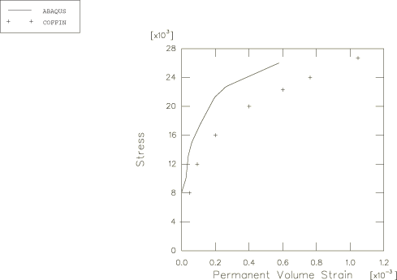

**Figure 3.2.9–10** Stress versus strain under unequal biaxial tension.

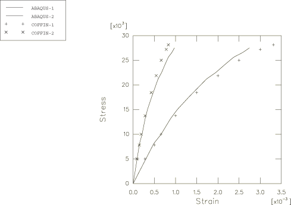

**Figure 3.2.9–11** Stress versus permanent volume strain under unequal biaxial tension.

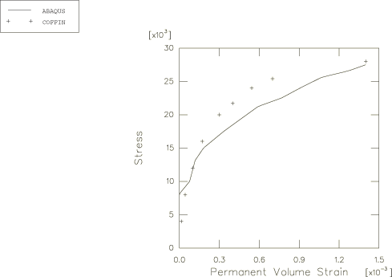

**Figure 3.2.9–12** Stress versus strain under biaxial tension/compression.

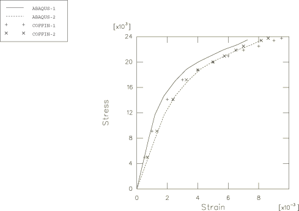

**Figure 3.2.9–13** Stress versus permanent volume strain under biaxial tension/compression.

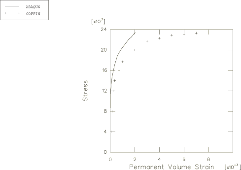

