# 3.2.10 Indentation of a crushable foam plate

**Products: **Abaqus/Standard  Abaqus/Explicit  

Two indentation problems are considered: a square plate of polyurethane foam indented by a rigid, cylindrical punch and a cylindrical plate of the same kind of foam indented by a rigid, hemispherical punch. The examples illustrate a typical application of crushable foam materials used as energy absorption devices. The effect of rate dependence of the foam is shown. Results are presented for both the isotropic and volumetric hardening foam models.

### Problem description

The model consists of a rigid impactor and a deformable plate made of polyurethane foam. The undeformed square plate is 30 mm thick and extends 180 mm on each side. The plate is assumed to deform in a symmetric manner, so only half of it is discretized, as shown in [Figure 3.2.10--1](ch03s02ach183.md#bmkfoamindent-model). The half plate is modeled with 10  30 CPE4 elements in Abaqus/Standard and 10  30 and 15  45 CPE4R elements in Abaqus/Explicit. 

The undeformed cylindrical plate has a radius of 90 mm and a thickness of 30 mm, as shown in [Figure 3.2.10--1](ch03s02ach183.md#bmkfoamindent-model). It is modeled with 10  30 CAX4 elements in Abaqus/Standard and 10  30 and 15  45 CAX4R elements in Abaqus/Explicit. In both cases the impactors are assumed to have a radius of 82.5 mm. The bottom nodes of the mesh are fixed, while the outer boundary is free to deform.

### Material

Uniaxial and hydrostatic compression tests have been conducted on a block of sample polyurethane foam material by Schluppkotten (1999). The yield stress in uniaxial compression is plotted against the axial plastic strain in [Figure 3.2.10--2](ch03s02ach183.md#bmkfoamindent-uniaxial). Insignificant lateral deformation is observed during uniaxial compression. The hydrostatic compression test results show that the initial yield stress in hydrostatic compression, , is almost the same as that in uniaxial compression, . The elastic response is approximated by the following constants:

|  7.5 MPa (Young's modulus), |
| --- |
|  0.0 (elastic Poisson's ratio). |

The material parameters for the isotropic hardening foam model are

| 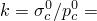 1.0 (yield strength ratio), |
| --- |
| 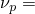 0.0 (plastic Poisson's ratio), |

and the material parameters for the volumetric hardening foam model are

|  1.0 (compression yield strength ratio), |
| --- |
| 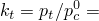 0.1 (tension yield strength ratio). |

The density for the polyurethane foam analyzed in this example is

|  60 kg/m3. |
| --- |

In addition, the experimental results provide the following material properties for the rate-dependent case: 

|  4638.0 per sec, |
| --- |
|  2.285. |

### Contact interaction

The contact between the top exterior surface of the foam plate and the rigid punch is modeled with a contact pair. Both the cylindrical and hemispherical rigid punches are modeled as analytical rigid surfaces using a surface definition in conjunction with a rigid body constraint. Coulomb friction is modeled between the punch and the plate with a friction coefficient of 0.2. The maximum shear traction due to friction is assumed to be 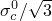, or 0.115 MPa.

### Loading and controls

The impactor is fully constrained except in the vertical direction, in which motion is prescribed such that the maximum indentation depth is about 90% of the thickness of the plate. In most of the tests, the load is applied in one analysis step. A few tests also verify the import capability. In these simulations the load is applied over two analysis step. Tests are included where the solution obtained by Abaqus/Standard at the end of the first load step is transferred and the rest of the simulation completed in Abaqus/Explicit, as well as tests where the solution starts in Abaqus/Explicit and is then transferred and completed in Abaqus/Standard. 

#### Abaqus/Standard

The impactor is displaced statically to indent the foam. To model the large deformations of the foam, geometric nonlinearities are taken into account in the step. For nonassociated flow cases the unsymmetric storage and solution scheme is activated. This is important to obtain an acceptable rate of convergence during the equilibrium iterations, since the nonassociated flow plasticity model used for the foam has a nonsymmetric stiffness matrix.

The accuracy of the equilibrium solution within a time increment is controlled by iterating until the out-of-balance forces reduce to a small fraction of an average force magnitude calculated internally by Abaqus. The rough punch causes an inhomogeneous stress state: stresses are higher in the region of the mesh near the punch. This tends to cause an underestimation of the average force magnitude since the reference force magnitude is averaged over the entire mesh. To avoid an excessive number of iterations, solution controls for field equations are used to relax the convergence tolerance.

#### Abaqus/Explicit

 The plate is indented quasi-statically when the foam is modeled without rate dependence. An amplitude curve with smoothing is used to specify the displacement of the punch and to promote a quasi-static solution. The plate is indented dynamically when the foam is modeled with rate effects. For this case a ramped velocity profile is prescribed such that the maximum velocity is 5.4 m/sec.

### Results and discussion

The same response is obtained in Abaqus/Explicit using the coarse mesh and the fine mesh. The overall load-deflection response of the foam plate is plotted in [Figure 3.2.10--3](ch03s02ach183.md#bmkfoamindent-cyl-force) for indentation with the cylindrical punch and in [Figure 3.2.10--4](ch03s02ach183.md#bmkfoamindent-sph-force) for indentation with the hemispherical punch. In both cases the simulated load-deflection responses are in good agreement with the experimental results by Schluppkotten (1999). The deformed configuration of the mesh at the end of the loading step (showing actual displacements) and the contour plots of the equivalent plastic strain (for the isotropic hardening foam model) or the volumetric compacting plastic strain (for the volumetric hardening foam model) are shown in [Figure 3.2.10--5](ch03s02ach183.md#bmkfoamindent-contour1) through [Figure 3.2.10--10](ch03s02ach183.md#bmkfoamindent-contour6). The figures show that the plastic strain magnitude in the vicinity of the punch approaches 180%.

The import analysis can be verified by comparing the results from the zero increment of the imported analysis to the last increment of the previous analysis. In all cases the response of the structure is continuous between the first analysis to the second analysis and compares very closely with solutions obtained using one simulation module. As an example, see [Figure 3.2.10--11](ch03s02ach183.md#bmkfoamindent-import) which compares load-deflection responses of the impactor using four different modeling approaches.

### Input files

##### **Abaqus/Standard input files**

[cyl_volstd_reg.inp](../eif/cyl_volstd_reg.inp)

Rate-independent case with cylindrical impactor, coarse mesh of the plate, and the volumetric hardening foam model.

[sph_volstd_reg.inp](../eif/sph_volstd_reg.inp)

Rate-independent case with hemispherical impactor, coarse mesh of the plate, and the volumetric hardening foam model.

[cyl_isostd_reg.inp](../eif/cyl_isostd_reg.inp)

Rate-independent case with cylindrical impactor, coarse mesh of the plate, and the isotropic hardening foam model. Base problem for carrying out import from Abaqus/Standard to Abaqus/Explicit.

[cyl_isostd_regimport.inp](../eif/cyl_isostd_regimport.inp)

Import into Abaqus/Standard from base problem cyl_isoexp_reg.inp.

[sph_isostd_regrate.inp](../eif/sph_isostd_regrate.inp)

Rate-dependent case with hemispherical impactor, coarse mesh of the plate, and the isotropic hardening foam model.

##### **Abaqus/Explicit input files**

[cyl_isoexp_reg.inp](../eif/cyl_isoexp_reg.inp)

Rate-independent case with cylindrical impactor, coarse mesh of the plate, and the isotropic hardening foam model. Base problem for carrying out import from Abaqus/Explicit to Abaqus/Standard. 

[cyl_isoexp_regimport.inp](../eif/cyl_isoexp_regimport.inp)

 Import into Abaqus/Explicit from base problem cyl_isostd_reg.inp.

[cyl_isoexp_fin.inp](../eif/cyl_isoexp_fin.inp)

Rate-independent case with cylindrical impactor, fine mesh of the plate, and the isotropic hardening foam model.

[cyl_isoexp_regrate.inp](../eif/cyl_isoexp_regrate.inp)

Rate-dependent case with cylindrical impactor, coarse mesh of the plate, and the isotropic hardening foam model.

[cyl_volexp_reg.inp](../eif/cyl_volexp_reg.inp)

Rate-independent case with cylindrical impactor, coarse mesh of the plate, and the volumetric hardening foam model.

[cyl_volexp_fin.inp](../eif/cyl_volexp_fin.inp)

Rate-independent case with cylindrical impactor, fine mesh of the plate, and the volumetric hardening foam model.

[cyl_volexp_regrate.inp](../eif/cyl_volexp_regrate.inp)

Rate-dependent case with cylindrical impactor, coarse mesh of the plate, and the volumetric hardening foam model.

[sph_isoexp_reg.inp](../eif/sph_isoexp_reg.inp)

Rate-independent case with hemispherical impactor, coarse mesh of the plate, and the isotropic hardening foam model.

[sph_isoexp_fin.inp](../eif/sph_isoexp_fin.inp)

Rate-independent case with hemispherical impactor, fine mesh of the plate, and the isotropic hardening foam model.

[sph_isoexp_regrate.inp](../eif/sph_isoexp_regrate.inp)

Rate-dependent case with hemispherical impactor, coarse mesh of the plate, and the isotropic hardening foam model.

[sph_volexp_reg.inp](../eif/sph_volexp_reg.inp)

Rate-independent case with hemispherical impactor, coarse mesh of the plate, and the volumetric hardening foam model.

[sph_volexp_fin.inp](../eif/sph_volexp_fin.inp)

Rate-independent case with hemispherical impactor, fine mesh of the plate, and the volumetric hardening foam model.

[sph_volexp_regrate.inp](../eif/sph_volexp_regrate.inp)

Rate-dependent case with hemispherical impactor, coarse mesh of the plate, and the volumetric hardening foam model.

### Reference

Schluppkotten,  J., *Investigation of the ABAQUS/Crushable Foam Plasticity Model, *Internal report of BMW AG, 1999.

### Figures

**Figure 3.2.10–1** Model for foam indentation by cylindrical or hemispherical punch.

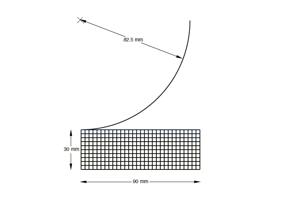

**Figure 3.2.10–2** Uniaxial compression test of a sample material.

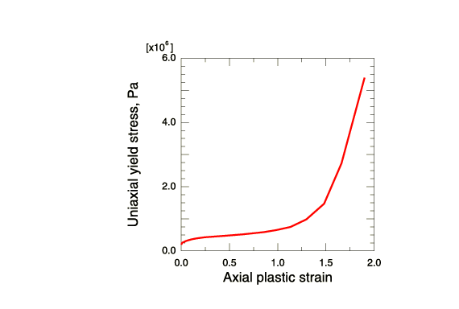

**Figure 3.2.10–3** Cylindrical punch force versus penetration response.

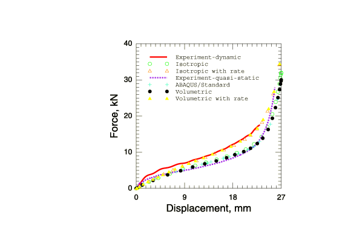

**Figure 3.2.10–4** Hemispherical punch force versus penetration response.

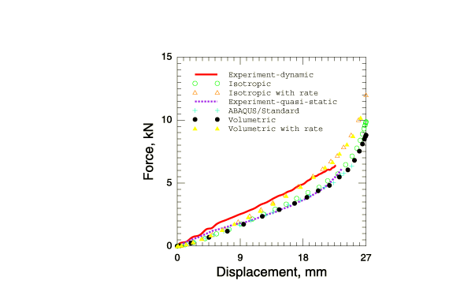

**Figure 3.2.10–5** Deformed configuration and contours of the equivalent plastic strain for indentation with cylindrical impactor and the isotropic hardening foam model in Abaqus/Explicit.

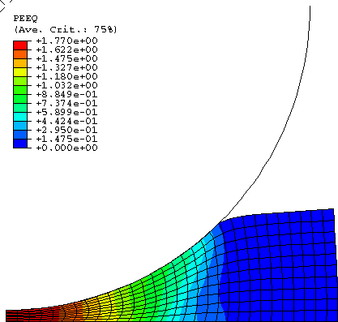

**Figure 3.2.10–6** Deformed configuration and contours of the volumetric compacting plastic strain for indentation with cylindrical impactor and the volumetric hardening foam model in Abaqus/Explicit.

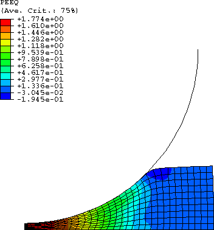

**Figure 3.2.10–7** Deformed configuration and contours of the equivalent plastic strain for indentation with hemispherical impactor and the isotropic hardening foam model in Abaqus/Explicit.

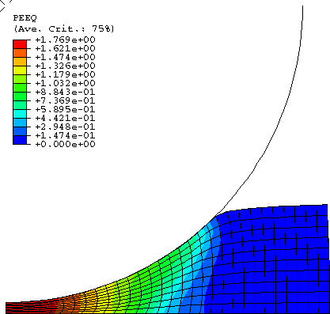

**Figure 3.2.10–8** Deformed configuration and contours of the volumetric compacting plastic strain for indentation with hemispherical impactor and the volumetric hardening foam model in Abaqus/Explicit.

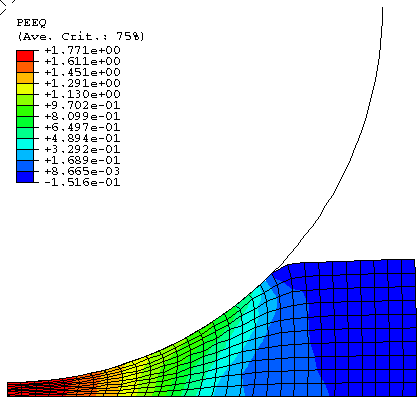

**Figure 3.2.10–9** Deformed configuration and contours of the volumetric compacting plastic strain for indentation with cylindrical impactor in Abaqus/Standard.

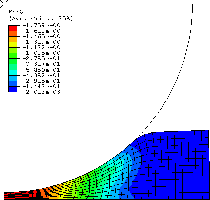

**Figure 3.2.10–10** Deformed configuration and contours of the volumetric compacting plastic strain for indentation with hemispherical impactor in Abaqus/Standard.

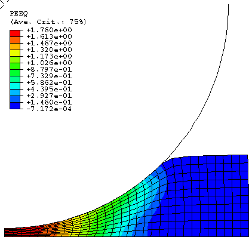

**Figure 3.2.10–11** Load-deflection response of the impactor using the import capability to transfer the solution between Abaqus/Standard and Abaqus/Explicit.

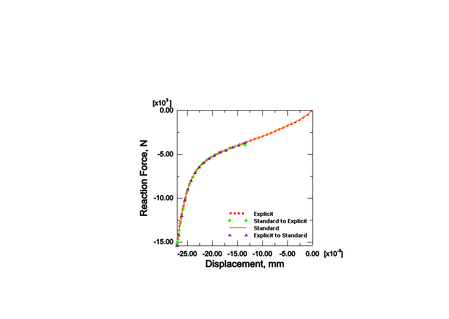

