# 3.2.13 Slider mechanism with slip-rate-dependent friction

**Product: **Abaqus/Standard  

This example is intended to provide basic verification of the slip-rate-dependent friction models in Abaqus for static and dynamic analysis. Two slip-rate-dependent friction models are implemented. One is an extended form of the classical Coulomb friction model in which the friction coefficient can be defined in terms of slip rate, contact pressure, surface temperature, and field variables. In the second model the user provides a static friction coefficient, a kinetic friction coefficient, and a decay parameter. The static friction coefficient decays exponentially to the kinetic friction coefficient. This model is referred to as the exponential decay friction model.

This problem also illustrates specifying an allowable contact interference and changing friction properties.

### Problem description

The model consists of a rod, a sliding cylinder, and a compound that is tightly fit between the rod and the cylinder. Both axisymmetric and three-dimensional models are created. [Figure 3.2.13--1](ch03s02ach186.md#sxmsliderslipfric-model) shows the axisymmetric model. A detail of the compound between the rod and the cylinder is shown in [Figure 3.2.13--2](ch03s02ach186.md#sxmsliderslipfric-detail). The inner radius of the rod is 19 mm (3/4 inch), and the outer radius is 25.4 mm (1 inch). The rod is 304.8 mm (12 inches) long and fixed at both ends. The inner radius of the sliding cylinder is 27 mm (1 1/16 inches), has a thickness of 12.7 mm (1/2 inch), and is 50.8 mm (2 inches) long. The initial thickness of the compound is larger than the 1.6 mm (1/16 inch) gap; the compound is confined between the rod and the cylinder.

### Material

All parts of the model are elastic. The Young's modulus, Poisson's ratio, and density for the rod and the cylinder are 207 GPa (30.0  106 psi), 0.3, and 7800 kg/m3 (0.73  103 lbf s2/ in4), respectively. The compound has a Young's modulus of 6.9 GPa (1.0  106 psi), a Poisson's ratio of 0.2, and a density of 1069 kg/m3 (0.1  103 lbf s2/ in4).

It is assumed that the interface between the slider and the compound is rough; i.e., no slip can occur when contact is established. The rough surface interface is modeled with the Lagrange friction model and a high friction coefficient. It is assumed that the interface between the rod and the compound is polished and has a static friction coefficient 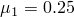. Experimental tests show that the dynamic friction coefficient, , is 0.1 for a slip rate equal to 2.5 inches per second. Furthermore, the static coefficient decays exponentially to the kinetic friction coefficient, , according to 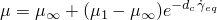, where  is the decay coefficient. The dynamic coefficient at higher slip rates is not known; hence, the default Abaqus assumption that the ratio 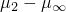 to 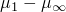 is 5% is used. The idealized friction model is illustrated in [Figure 3.2.13--3](ch03s02ach186.md#sxmsliderslipfric-expfric) and is specified using test data to fit the exponential model for frictional behavior. Abaqus calculates the kinetic friction coefficient and the decay parameter. For the cases that use the Coulomb friction model, the data for the friction coefficient and the corresponding slip rate have been provided in tabular form.

### Loading

The compound material is tightly fit between the rod and the slider in the first step of the analysis. The initial overclosure is resolved by specifying an allowable contact interference.

Friction is introduced in the second step by changing the friction properties. The contact interference allowance is removed. No loads are specified in this step to ensure that contact and equilibrium are established.

A harmonic sliding motion of the form 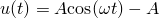 is applied to the cylinder. The amplitude, *A*, is equal to 101.6 mm (4.0 inches), and the frequency, , is equal to 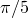 rad/second. This form of harmonic motion is selected since it produces a zero velocity and avoids an intantaneous acceleration jump at the beginning of the dynamic step. A dynamic analysis is performed for 10 seconds to complete one full cycle of harmonic load in Step 3. Another harmonic cycle is completed using a static analysis in Step 4.

### Results and discussion

The contact pressure distribution between the compound and the rod is nonuniform. This can be attributed to the deformation of the rod when the compound material is clamped between the rod and the cylinder. The Mises contour plot is shown in [Figure 3.2.13--4](ch03s02ach186.md#sxmsliderslipfric-mises).

[Figure 3.2.13--5](ch03s02ach186.md#sxmsliderslipfric-normal) shows the time history of the total normal force along the interface between the compound and the rod for the static step. The coarse master surface mesh is responsible for the oscillations in the curve. [Figure 3.2.13--6](ch03s02ach186.md#sxmsliderslipfric-shear) shows the time history of the frictional shear forces that develop along this interface. The exponential form of the friction model is apparent as the slider completes one cycle of the harmonic motion. During this cycle the slip rate varies according to 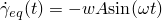. The slider starts at the top. At 5 seconds the slider reaches the bottom, the velocity of the slider is zero, and the slider goes from “slip” to “stick.” It reverses its direction and slips again. At 10 seconds the slider is back at the top. This motion is repeated for the static analysis.

### Input files

[sliderslipfric_cax4_expon.inp](../eif/sliderslipfric_cax4_expon.inp)

Axisymmetric model with the exponential decay friction model.

[sliderslipfric_cax4_coulomb.inp](../eif/sliderslipfric_cax4_coulomb.inp)

Axisymmetric model with the Coulomb friction model.

[sliderslipfric_c3d8_expon.inp](../eif/sliderslipfric_c3d8_expon.inp)

Three-dimensional model with the exponential decay friction model.

[sliderslipfric_c3d8_coulomb.inp](../eif/sliderslipfric_c3d8_coulomb.inp)

Three-dimensional model with the Coulomb friction model.

### Figures

**Figure 3.2.13–1** Axisymmetric model of the slider mechanism.

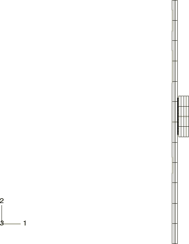

**Figure 3.2.13–2** Detail of the compound between the rod and the sliding cylinder.

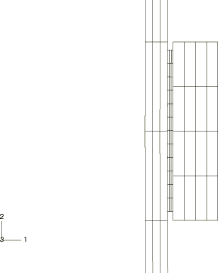

**Figure 3.2.13–3** Idealized friction model for the rod–compound surface interface.

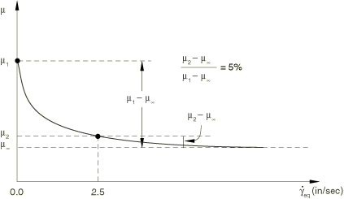

**Figure 3.2.13–4** Mises stresses.

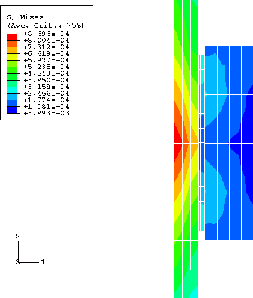

**Figure 3.2.13–5** Normal contact forces across the rod–compound surface interface.

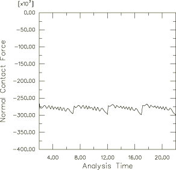

**Figure 3.2.13–6** Shear forces across the rod–compound surface interface.

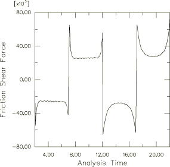

