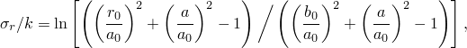
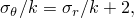
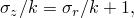
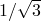
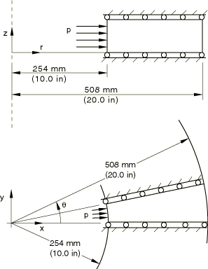
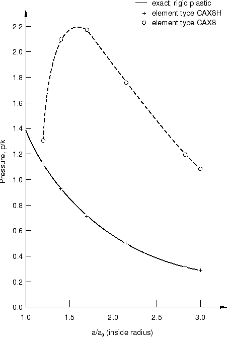
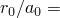
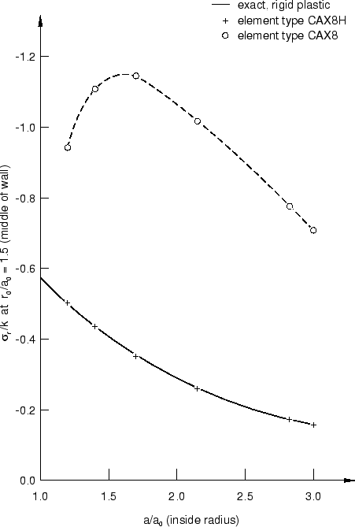
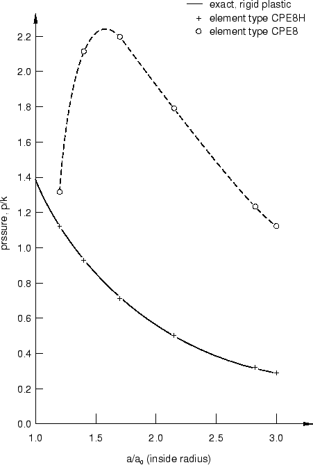

# 3.2.14 Cylinder under internal pressure

**Product: **Abaqus/Standard  

This problem is one of the best-known simple examples of elastic-plastic behavior and has been discussed extensively (see Prager and Hodge, 1951). It consists of a cylinder made of elastic-plastic material, subjected to internal pressure, under plane strain conditions. In this case the example is used as an elementary verification of the finite-strain, elastic-plastic capability in Abaqus. For this purpose a large change in the cylinder's inner radius (a factor of three) is prescribed. Both axisymmetric and plane strain models are used to verify both of these kinematic formulations.

### Problem description

The problem is illustrated in [Figure 3.2.14--1](ch03s02ach187.md#sxmintpresscyl-geom). The cylinder is assumed to be stress-free, with an inside radius of 254 mm (10 in) and an outside radius of 508 mm (20 in). It is modeled both as an axisymmetric structure and in plane strain, as shown in the figure. Boundary conditions are symmetry about the  = constant faces (axisymmetric case) or symmetry about the  = constant faces (plane strain case), the latter requiring the use of a local coordinate system to impose the appropriate conditions.

For each type of model, four meshes are used: ten regular 4-node elements (type CAX4, CPE4), ten hybrid 4-node elements (type CAX4H, CPE4H), five regular 8-node elements (type CAX8, CPE8), and five hybrid 8-node elements (type CAX8H, CPE8H). While no mesh convergence studies have been performed, the comparison of the numerical results with the analytic solution shows that, with an exception that is readily explained, all of these models give quite accurate results. The axisymmetric analysis with the corresponding CAXA elements are repeated for verification purposes.

The cylinder is assumed to be made of an elastic, perfectly plastic, Mises material, with the following properties: 

| Young's modulus | 207 GPa (30 106 lb/in2) |
| --- | --- |
| Poisson's ratio | 0.3 |
| Yield stress in pure tension | 207 MPa (30 103 lb/in2) |

### Loading

The cylinder is expanded by applying internal pressure. Following initial yielding, the cylinder reaches a limit state, after which the pressure decreases rapidly as the cylinder expands. This load-displacement behavior is unstable (softening) and, therefore, requires use of the modified Riks algorithm for solution under load control. Another approach, followed here, is to load the cylinder by prescribing the radial displacement at the innermost nodes. The pressure is then computed from the reaction forces conjugate to these prescribed radial displacements. (["Snap-through buckling analysis of circular arches," Section 1.2.1 of the Abaqus Example Problems Guide](../exa/exa-link.md#exa-sta-snapbuckling), and ["Snap-through of a shallow, cylindrical roof under a point load," Section 1.1.6](ch01s01ach06.md), among others, illustrate the use of the modified Riks algorithm.)

The cylinder is expanded to three times its initial radius in a small number of increments. This requires very large strain increments and would probably be too large for a more complicated problem that involves shear and rotation as well as direct straining. However, large strain increments are suitable for this simple case.

### Results and discussion

As the strains are so large, the results should compare very closely with the exact, rigid-plastic solution of Prager and Hodge (1951). That exact solution gives the stresses as follows:

where *k* is the yield stress in pure shear ( times the yield stress in pure tension); *a*0 is the initial inside radius; *b*0 is the initial outside radius; *r*0 is the radius, in the initial configuration, of the material point at which the stresses are being calculated; and  is the current value of the inside radius. The form of the solution shows that we need only compare the radial stress, since the other stresses are obtained directly from that component.

The results for the axisymmetric element models are summarized in [Figure 3.2.14--2](ch03s02ach187.md#sxmintpresscyl-asym-pvr) and [Figure 3.2.14--3](ch03s02ach187.md#sxmintpresscyl-asym-svr), while [Figure 3.2.14--4](ch03s02ach187.md#sxmintpresscyl-plane-pvr) and [Figure 3.2.14--5](ch03s02ach187.md#sxmintpresscyl-plane-svr) show the results for the plane strain models. [Figure 3.2.14--2](ch03s02ach187.md#sxmintpresscyl-asym-pvr) compares the pressure versus inside radius given by the CAX8H and CAX8 finite element models to that given by the exact, rigid-plastic solution. All of the axisymmetric models agree very closely with the exact solution with the exception of that using the fully integrated 8-node (CAX8) element. Recall that the solution is obtained by prescribing the motion of the inside surface of the cylinder, so the pressure is calculated for the finite element models from the reaction forces conjugate to these prescribed displacements.

[Figure 3.2.14--3](ch03s02ach187.md#sxmintpresscyl-asym-svr) compares the stress calculated by Abaqus at the point initially halfway through the cylinder wall ( 1.5) to the exact, rigid-plastic solution. Again, with the exception of the CAX8 element model, there is excellent agreement with the analytical solution.

[Figure 3.2.14--4](ch03s02ach187.md#sxmintpresscyl-plane-pvr) and [Figure 3.2.14--5](ch03s02ach187.md#sxmintpresscyl-plane-svr) show similar results to [Figure 3.2.14--2](ch03s02ach187.md#sxmintpresscyl-asym-pvr) and [Figure 3.2.14--3](ch03s02ach187.md#sxmintpresscyl-asym-svr) for the plane strain models. Again, with the exception of the fully integrated 8-node (CPE8) element model, all of the plane strain models show excellent agreement with the exact, rigid-plastic solution.

The pure displacement 8-node elements (CAX8 and CPE8) give poor results because the strains are calculated directly from the interpolation functions at each integration point, and the incompressibility requirement causes a severe oscillation in the mean pressure stress throughout each element. However, in the hybrid, 8-node elements the mean pressure stress is interpolated independently, so an accurate value is obtained for this variable. In addition, the 4-node elements in Abaqus are constant strain/stress elements for this case (because these elements are coded with a constant hoop strain value and use “selective reduced integration,” in which the volume strain is computed at the centroid only), and so also provide accurate pressure stress values.

Results for models using the fully integrated versions of axisymmetric and plane strain elements are shown here to caution the user. With rare exceptions the fully integrated 8-node quadrilaterals are not as effective as the reduced integration versions of the same elements; the reduced integration 8-node quadrilaterals are, hence, almost always recommended over their fully integrated counterparts. This particular problem gives a dramatic illustration of a difficulty encountered with full integration in a problem in which the bulk behavior of the material is very much stiffer than the shear behavior, a type of behavior commonly encountered.

### Input files

[cylinderunderpress_cax4.inp](../eif/cylinderunderpress_cax4.inp)

CAX4 element model.

[cylinderunderpress_cax4h.inp](../eif/cylinderunderpress_cax4h.inp)

CAX4H element model.

[cylinderunderpress_cax4i.inp](../eif/cylinderunderpress_cax4i.inp)

CAX4I element model.

[cylinderunderpress_cax4ih.inp](../eif/cylinderunderpress_cax4ih.inp)

CAX4IH element model.

[cylinderunderpress_cax8.inp](../eif/cylinderunderpress_cax8.inp)

CAX8 element model.

[cylinderunderpress_cax8h.inp](../eif/cylinderunderpress_cax8h.inp)

CAX8H element model.

[cylinderunderpress_caxa41.inp](../eif/cylinderunderpress_caxa41.inp)

CAXA41 element model.

[cylinderunderpress_caxa4h1.inp](../eif/cylinderunderpress_caxa4h1.inp)

CAXA4H1 element model.

[cylinderunderpress_caxa81.inp](../eif/cylinderunderpress_caxa81.inp)

CAXA81 element model.

[cylinderunderpress_caxa8h1.inp](../eif/cylinderunderpress_caxa8h1.inp)

CAXA8H1 element model.

[cylinderunderpress_cpe4.inp](../eif/cylinderunderpress_cpe4.inp)

CPE4 element model.

[cylinderunderpress_cpe4h.inp](../eif/cylinderunderpress_cpe4h.inp)

CPE4H element model.

[cylinderunderpress_cpe4i.inp](../eif/cylinderunderpress_cpe4i.inp)

CPE4I element model.

[cylinderunderpress_cpe4ih.inp](../eif/cylinderunderpress_cpe4ih.inp)

CPE4IH element model.

[cylinderunderpress_cpe8.inp](../eif/cylinderunderpress_cpe8.inp)

CPE8 element model.

[cylinderunderpress_cpe8h.inp](../eif/cylinderunderpress_cpe8h.inp)

CPE8H element model.

### Reference

Prager,  W., and P. G. Hodge, *Theory of Perfectly Plastic Solids, *John Wiley and Sons, New York, 1951.

### Figures

**Figure 3.2.14–1** Thick cylinder under internal pressure.

**Figure 3.2.14–2** Internal pressure versus inside radius, axisymmetric models.

**Figure 3.2.14–3** Stress at  1.5 versus inside radius, axisymmetric models.

**Figure 3.2.14–4** Internal pressure versus inside radius, plane strain models.

**Figure 3.2.14–5** Stress at 1.5 versus inside radius, plane strain models.

