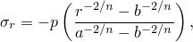
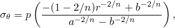
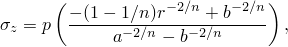
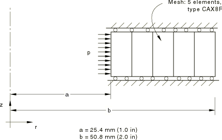
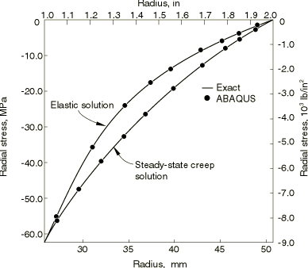
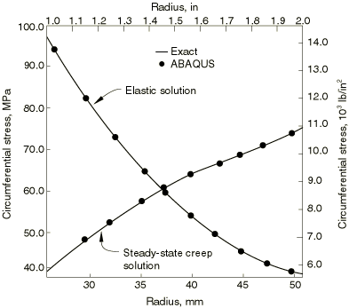
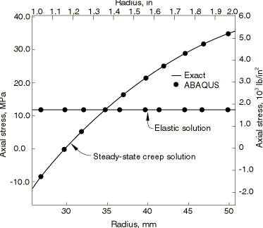
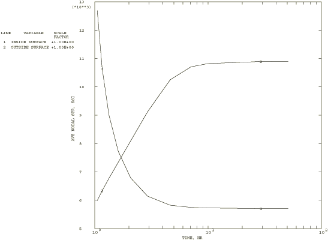

# 3.2.15 Creep of a thick cylinder under internal pressure

**Product: **Abaqus/Standard  

This problem is an example of high-temperature creep analysis. An exact solution is available for the steady-state part of the response; thus, this case provides some verification of the Abaqus capability for this type of creep analysis.

### Problem description

The problem is shown in [Figure 3.2.15--1](ch03s02ach188.md#sxmcreepcyl-geom). The structure is a cylinder, with an inside radius of 25.4 mm (1 in) and an outside radius of 50.8 mm (2 in). The cylinder is assumed to be under plane strain conditions (the axial strain is zero), and the solution is one-dimensional (independent of axial position) and axisymmetric. Therefore, a single row of axisymmetric elements is sufficient. Five equal-sized CAX8R elements are used. No mesh convergence studies have been done, but a comparison with the exact elasticity and steady-state solutions shows that this discretization provides accurate stress predictions.

The material is assumed to be isotropic elastic, with Young's modulus of 138 GPa (20  106 lb/in2) and Poisson's ratio of 0.3, with a Mises creep potential and uniaxial creep behavior defined by

where  is 1.7828  1017 per sec (stress in MPa) (1024 per hour with stress in lb/in2) and  5. These values are typical of structural steel at a fairly high temperature.

### Loading and control

The cylinder is subjected to a rapidly applied internal pressure of 60 MPa (8700 lb/in2) that is held constant for a long period of time, so that the steady-state creep conditions are reached.

The initial application of the pressure is assumed to occur so quickly that it involves purely elastic response, which is obtained by using the static procedure. The creep response is then developed in a second step, using the quasi-static procedure. A response of 180,000 seconds (50 hours) is requested, which is sufficient to reach steady-state conditions. During the quasi-static step a tolerance is required to control the time increment choice and, hence, the accuracy of the transient creep solution. In this case we assume that moderate accuracy is required. Errors in stress of about 0.7 MPa (100 lb/in2) will make a small difference to the creep strain added within an increment. Converting this stress error to a strain error by dividing it by the elastic modulus gives a tolerance of 5  106. Higher accuracy in the integration of the creep constitutive model can be obtained by reducing this tolerance, at the expense of using more time increments. Alternately, using a large tolerance value will allow Abaqus to use the largest possible time increments, so that low accuracy will result during the transient, but the steady-state solution will be reached at minimum cost. Thus, if the steady-state solution is the only part of the solution of interest, it is effective to set the tolerance to a large number.

With the tolerance specified in the quasi-static procedure, Abaqus uses automatic time incrementation. The scheme is rather simple and aims at increasing the time increments gradually as the solution progresses toward steady state. In a small-displacement case such as this, explicit integration of the creep constitutive model is usually efficient because the method is inexpensive per time increment (since no new stiffness matrix needs to be formed and solved), and its stability limit is usually quite large compared to times of interest in the solution. The automatic time stepping scheme includes an internal calculation of the stability limit, and the time increment is controlled to remain within this limit. If this is too restrictive—if it results in a sequence of time increments that are all much smaller than the remaining part of the time period requested on the data line associated with the quasi-static procedure (10 successive increments where the time increment is less than 2% of the remaining time period)—Abaqus automatically switches to an implicit time integration scheme that is unconditionally stable. The only limit at all on the time increment selection is then accuracy as specified by the tolerance. This switch to implicit integration can be suppressed by the user in the quasi-static procedure. In this example the switch to implicit integration occurs at increment 44, after 27,108 seconds (7.53 hours) of creep. This allows Abaqus to choose large time increments (up to 39,600 seconds, or 11 hours) toward the end of the solution.

### Results and discussion

The steady-state solution to this problem is given by Odquist and Hult (1962). The steady-state stresses are the radial stress

the circumferential stress

and the axial stress

where *p* is the pressure, *r* is the radial position of the point at which the stresses are given, *a* is the inside radius of the cylinder, *b* is the outside radius, and *n* is the exponent in the uniaxial creep law.

[Figure 3.2.15--2](ch03s02ach188.md#sxmcreepcyl-radialstress) to [Figure 3.2.15--4](ch03s02ach188.md#sxmcreepcyl-axialstress) show the computed results compared to this exact solution, as well as to the initial elastic solution (which is available in standard textbooks, such as Timoshenko and Goodier, 1951). The plots show that the computed stresses agree closely with these solutions.

[Figure 3.2.15--5](ch03s02ach188.md#sxmcreepcyl-hoopstress) shows a time history plot of the hoop stress at the inside and outside radius (obtained as nodal stress values) and illustrates the way the solution evolves from the initial elastic response to the steady-state creep response.

### Input files

[creepthickcylinder_cax8r.inp](../eif/creepthickcylinder_cax8r.inp)

Example using CAX8R elements.

[creepthickcylinder_cax4i.inp](../eif/creepthickcylinder_cax4i.inp)

Example using CAX4I elements.

### References

Odquist,  F. K. G., and J. Hult, *Kriechfestigkeit Metalischer Werkstoffe, *Springer-Verlag, Berlin, 1962.

Timoshenko,  S., and J. N. Goodier, *Theory of Elasticity, *McGraw-Hill, New York, 1951.

### Figures

**Figure 3.2.15–1** Thick cylinder creep example.

**Figure 3.2.15–2** Radial stress versus radial position.

**Figure 3.2.15–3** Circumferential stress versus radial position.

**Figure 3.2.15–4** Axial stress versus radial position.

**Figure 3.2.15–5** Hoop stress histories at inside and outside surfaces.

