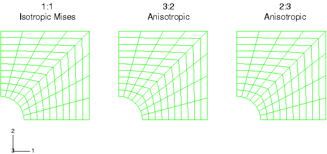
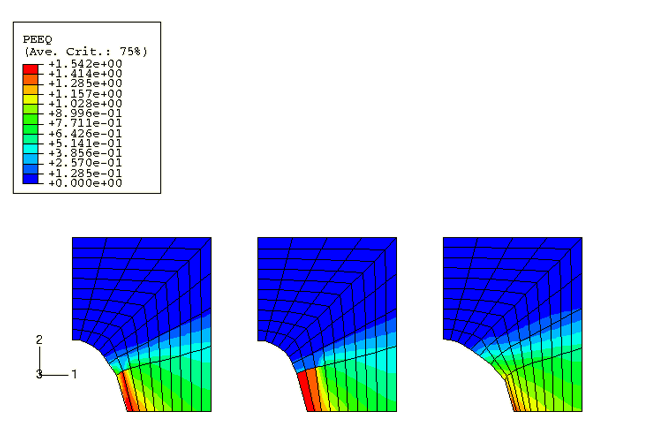
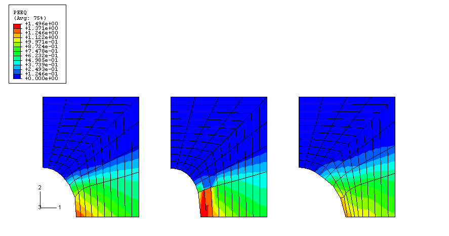
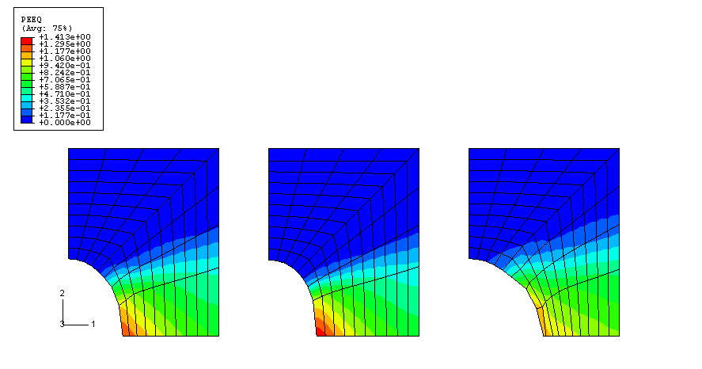

# 3.2.17 Stretching of a plate with a hole

**Products: **Abaqus/Standard  Abaqus/Explicit  

### Problem description

This problem is used to verify the anisotropic plasticity model in Abaqus/Explicit and also to verify the transfer of material properties into Abaqus/Standard using the results transfer capability. In the first case the entire process is analyzed in Abaqus/Explicit as a quasi-static analysis for a total time period of  1.0. In the second case part of the analysis is conducted in Abaqus/Explicit and the remainder of the analysis is conducted in Abaqus/Standard.

A square 30  30 plate containing a hole of radius 4 is stretched in the *y*-direction, while displacements in the *x*-direction are restrained along its outer perimeter. [Figure 3.2.17--1](ch03s02ach190.md#exxhole-meshes) shows the initial quarter symmetry CPS4R meshes with enhanced hourglass control used in this analysis. There are three identical meshes shown with three plasticity cases: isotropic Mises plasticity, anisotropic plasticity with a ratio of yield stresses of 3:2, and anisotropic plasticity with a ratio of yield stresses of 2:3. The material orthotropic axes are taken as the coordinate basis. Only yield stresses in the *x*-direction are altered. Other components of the yield stress are taken to be the same as the reference yield stress that is specified for the isotropic Mises plasticity model.

The elastic material properties of the plate are a Young's modulus of 1  109 and a Poisson's ratio of 0.3. The density is 2500.

The isotropic Mises plasticity specification uses constant isotropic hardening with an initial yield of 1  106 and a hardening modulus of 4  105. Anisotropic plasticity is used with two of the meshes to define a ratio of yield stress in each of the two in-plane directions. For the anisotropic cases the reference yield and hardening is defined to be the same as for the isotropic Mises case. It can be verified that the choice of the ratios does not violate the requirement that Hill's yield surface be convex in the deviatoric plane.

In the analysis that is performed entirely in Abaqus/Explicit, the plate is stretched by ramping the velocity at the top nodes to 5 for the first half of the step time and then keeping a constant velocity of 5 at these nodes for the rest of the analysis. The results of the explicit analysis obtained for the first half of the step time are also imported into Abaqus/Standard using the import capability. The stretching of the plate is continued in Abaqus/Standard by prescribing a displacement of 2.5 at the top nodes; this displacement corresponds to the velocity boundary conditions in Abaqus/Explicit.

The import capability allows for the analysis to be continued with or without updating the reference configuration to be the imported configuration. When the reference configuration is updated, the deformed model with its material state at the end of the Abaqus/Explicit analysis is imported into Abaqus/Standard. The deformed configuration is used as the reference configuration in the import analysis. When the reference configuration is not updated, the deformed model with its material state, displacements, and strains at the end of the Abaqus/Explicit analysis is imported into Abaqus/Standard. The original configuration is used as the reference configuration for the import analysis. In the import analyses both cases are used. To ensure the final deformed configurations are similar in both cases, a displacement of 3.75 is prescribed at the top nodes for the case when the reference configuration is not updated, as opposed to a displacement of 2.5 for the case when the reference configuration is updated.

### Results and discussion

The contours of the equivalent plastic strain in each of the plates, obtained from the analysis performed exclusively in Abaqus/Explicit, are shown in [Figure 3.2.17--2](ch03s02ach190.md#exxhole-contours). Inspection of the deformed shapes and regions of high plastic strain show that the anisotropic plasticity has a large effect on the manner in which the hole enlarges, or rather, the necking of the ligament. In the case of a 3:2 ratio the high flow stress in the *x*-direction inhibits the straining in the direction across the ligament. There is not much difference in the deformed shape and the plastic strain distribution between the first and second cases. When the yield stress ratio is changed to 2:3 (yield stress in the *x*-direction is two-thirds of that in the *y*-direction), it is easier for the material in the ligament to flow in the *x*-direction. Therefore, the plate necks faster than in the other cases. The smaller neck in the ligament would subsequently render less resistance to material elongation in the *y*-direction. Inclined plastic shear bands start to develop in all three cases, with the last case being the most severe.

Contours of equivalent plastic strain at the end of the import analysis are shown in [Figure 3.2.17--3](ch03s02ach190.md#exxhole-contours-updateno) (no configuration update) and [Figure 3.2.17--4](ch03s02ach190.md#exxhole-contours-updateyes) (updated configuration). The equivalent plastic strains obtained when the analysis is performed exclusively in Abaqus/Explicit and those obtained in the import analyses show differences in the region near the hole where maximum straining occurs. The differences in the results are due to the differences in the computation of thickness in plane stress conditions in the two analyses. In Abaqus/Standard the thickness is computed based on the assumption that the volume of the element remains the same during the analysis, whereas in Abaqus/Explicit thickness is computed by considering the strains in the out-of-plane direction. If the Poisson's ratio is allowed to approach 0.5, the results from the two analyses agree well.

This problem tests the features listed but does not provide independent verification of them.

### Input files

[hole.inp](../eif/hole.inp)

Input data used in this analysis.

[xs_s_hole.inp](../eif/xs_s_hole.inp)

Input data for the import analysis when UPDATE=NO.

[xs_s_hole1.inp](../eif/xs_s_hole1.inp)

Input data for the import analysis when UPDATE=YES.

### Figures

**Figure 3.2.17–1** Original meshes for stretching of perforated plates.

**Figure 3.2.17–2** Contours of equivalent plastic strain.

**Figure 3.2.17–3** Contours of equivalent plastic strain (reference configuration not updated).

**Figure 3.2.17–4** Contours of equivalent plastic strain (reference configuration updated).

