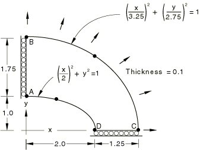

# 4.2.1 LE1: Plane stress elements—elliptic membrane

### 4.2.1 LE1: Plane stress elements---elliptic membrane

**Products: **Abaqus/Standard  Abaqus/Explicit  

### Elements tested

CPS3    CPS4    CPS4I    CPS4R    CPS6    CPS6M    CPS8    CPS8R    

### Problem description

**Model: **

Plane stress problem with shape defined by ABCD. Functions defining the curves BC and AD are given above.

**Mesh: **

A coarse and a fine mesh are tested for each element. In addition, a very fine mesh is tested for each element in the explicit dynamic analysis.

**Material: **

Linear elastic, Young's modulus = 210 GPa, Poisson's ratio = 0.3, density = 7800 kg/m3.

**Boundary conditions: **

 along edge AB,  along edge CD.

**Loading: **

Uniform outward pressure of 10 MPa at outer edge BC. In the explicit dynamic analysis the loading is applied such that a quasi-static solution is obtained.

### Reference solution

This is a test recommended by the National Agency for Finite Element Methods and Standards (U.K.): Test LE1 from NAFEMS publication TNSB, Rev. 3, “The Standard NAFEMS Benchmarks,” October 1990.

Target solution: Tangential edge stress () at D is 92.7 MPa.

### Results and discussion

The results are shown in [Table 4.2.1--1](ch04s02anf01.md#table-le1-std) and [Table 4.2.1--2](ch04s02anf01.md#table-le1-exp). The values enclosed in parentheses are percentage differences with respect to the reference solution.

**Table 4.2.1–1** Abaqus/Standard analysis.
| Element | Coarse Mesh | Fine Mesh |
| --- | --- | --- |
| CPS3 | 51.04 MPa (45%) | 71.26 MPa (23%) |
| CPS4 | 66.73 MPa (28%) | 84.54 MPa (9%) |
| CPS4I | 58.82 MPa (37%) | 78.21 MPa (16%) |
| CPS4R* | 40.48 MPa (56%) | 56.18 MPa (39%) |
| CPS6 | 89.10 MPa (4%) | 94.01 MPa (1%) |
| CPS6M | 85.88 MPa (7%) | 93.71 MPa (1%) |
| CPS8 | 84.54 MPa (9%) | 92.81 MPa (0.12%) |
| CPS8R | 85.80 MPa (7%) | 90.07 MPa (3%) |

*A comparison of the results for reduced-integration and full-integration lower-order elements indicates that the full-integration elements perform significantly better for problems with stress concentrations of this type.

**Table 4.2.1–2** Abaqus/Explicit analysis.
| Element | Coarse Mesh | Fine Mesh | Very Fine Mesh |
| --- | --- | --- | --- |
| CPS3 | 51.2 MPa (45%) | 71.5 MPa (23%) | 85.7 MPa (8%) |
| CPS4R | 39.6 MPa (57%) | 55.7 MPa (40%) | 87.3 MPa (6%) |
| CPS6M | 86.12 MPa (7%) | 92.93 MPa (0.2%) | --- |

### Input files

##### **Abaqus/Standard input files**

#### Coarse mesh tests:

[nle1xf3c.inp](../eif/nle1xf3c.inp)

CPS3 elements.

[nle1xf4c.inp](../eif/nle1xf4c.inp)

CPS4 elements.

[nle1xi4c.inp](../eif/nle1xi4c.inp)

CPS4I elements.

[nle1xr4c.inp](../eif/nle1xr4c.inp)

CPS4R elements.

[nle1xf6c.inp](../eif/nle1xf6c.inp)

CPS6 elements.

[nle1xm6c.inp](../eif/nle1xm6c.inp)

CPS6M elements.

[nle1xf8c.inp](../eif/nle1xf8c.inp)

CPS8 elements.

[nle1xr8c.inp](../eif/nle1xr8c.inp)

CPS8R elements.

#### Fine mesh tests:

[nle1xf3f.inp](../eif/nle1xf3f.inp)

CPS3 elements.

[nle1xf4f.inp](../eif/nle1xf4f.inp)

CPS4 elements.

[nle1xi4f.inp](../eif/nle1xi4f.inp)

CPS4I elements.

[nle1xr4f.inp](../eif/nle1xr4f.inp)

CPS4R elements.

[nle1xf6f.inp](../eif/nle1xf6f.inp)

CPS6 elements.

[nle1xm6f.inp](../eif/nle1xm6f.inp)

CPS6M elements.

[nle1xf8f.inp](../eif/nle1xf8f.inp)

CPS8 elements.

[nle1xr8f.inp](../eif/nle1xr8f.inp)

CPS8R elements.

##### **Abaqus/Explicit input files**

#### Coarse mesh tests:

[le1_cps3_c.inp](../eif/le1_cps3_c.inp)

CPS3 elements.

[le1_cps4r_c.inp](../eif/le1_cps4r_c.inp)

CPS4R elements.

[le1_cps6m_c.inp](../eif/le1_cps6m_c.inp)

CPS6M elements.

#### Fine mesh tests:

[le1_cps3_f.inp](../eif/le1_cps3_f.inp)

CPS3 elements.

[le1_cps4r_f.inp](../eif/le1_cps4r_f.inp)

CPS4R elements.

[le1_cps6m_f.inp](../eif/le1_cps6m_f.inp)

CPS6M elements.

#### Very fine mesh tests:

[le1_cps3_vf.inp](../eif/le1_cps3_vf.inp)

CPS3 elements.

[le1_cps4r_vf.inp](../eif/le1_cps4r_vf.inp)

CPS4R elements.

