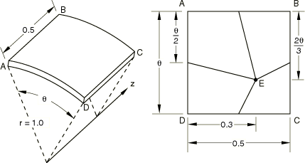

# 4.2.2 LE2: Cylindrical shell bending patch test

**Products: **Abaqus/Standard  Abaqus/Explicit  

### Elements tested

S3    S3R    S3RS    S4    S4R    S4R5    S4RS    S4RSW    S8R    S8R5    S9R5    

STRI3    STRI65    SC6R    SC8R    

### Problem description

**Model: **

Sector of cylindrical shell with a thickness *t*= 0.01 m.

**Material: **

Linear elastic, Young's modulus = 210 GPa, Poisson's ratio = 0.3, density = 7800 kg/m3.

**Boundary conditions: **

Edge AB is clamped. Axial displacements are constrained along edges AD and BC.

**Loading: **

Uniform normal edge moment of 1000/unit length along edge DC. In the explicit dynamic analysis the loading is applied such that a quasi-static solution is obtained.

### Reference solution

This is a test recommended by the National Agency for Finite Element Methods and Standards (U.K.): Test LE2 from NAFEMS publication TNSB, Rev. 3, “The Standard NAFEMS Benchmarks,” October 1990.

Stress: Outer surface tangential stress at point E is 60 MPa.

### Results and discussion

The results shown in [Table 4.2.2--1](ch04s02anf02.md#table-le2-std-30) through [Table 4.2.2--4](ch04s02anf02.md#table-le2-exp-10) are interpolated from the integration points to the required nodal location. The values enclosed in parentheses are percentage differences with respect to the reference solution.

**Table 4.2.2–1** Abaqus/Standard analysis,  30.
| Element | Bottom Surface (MPa) | Top Surface (MPa) |
| --- | --- | --- |
| S3/S3R | 44.3 (--26%) | 40.6 (--32%) |
| S4 | 63.2 (5%) | 54.0 (--10%) |
| S4R | 58.0 (--3%) | 58.0 (--3%) |
| S4R* | --55.0 (--8%) | 55.2 (--8%) |
| S4R5 | 58.6 (--2%) | 58.6 (2%) |
| S8R | 50.7 (16%) | 50.4 (16%) |
| S8R5 | 57.8 (4%) | 58.2 (3%) |
| S9R5 | 57.9 (4%) | 58.3 (3%) |
| STRI3 | 37.9 (37%) | 36.0 (40%) |
| STRI65 | 53.6 (11%) | 53.9 (10%) |
| SC6R | --43.9 (27%) | 43.9 (27%) |
| SC8R | 59.7 (1%) | 59.7 (1%) |
| SC8R* | --54.8 (--9%) | --54.8 (--9%) |
| *Abaqus/Standard results with enhanced hourglass control. |

**Table 4.2.2–2** Abaqus/Explicit analysis,  30.
| Element | Bottom Surface (MPa) | Top Surface (MPa) |
| --- | --- | --- |
| S3R | 43.2 MPa (28%) | 39.7 MPa (34%) |
| S3RS | 44.7 MPa (26%) | 42.2 MPa (30%) |
| S4R | 58.2 MPa (3%) | 58.3 MPa (2.8%) |
| S4RS | 57.0 MPa (5%) | 56.9 MPa (5.2%) |
| S4RSW | 57.3 MPa (4.5%) | 57.4 MPa (4.3%) |

These results vary significantly from the target value since the mesh is too coarse to capture a curvature of  30. The mesh can be refined easily by reducing the arc angle to  10. The following results show that such mesh refinement greatly improves the accuracy of the results.

**Table 4.2.2–3** Abaqus/Standard analysis,  10.
| Element | Bottom Surface (MPa) | Top Surface (MPa) |
| --- | --- | --- |
| S3/S3R | 60.1 (0.2%) | 59.9 (0.2%) |
| S4 | 60.5 (0.8%) | 59.5 (0.8%) |
| S4R | 60.0 (0%) | 60.0 (0%) |
| S4R* | --60.0 (0%) | 60.0 (0%) |
| S4R5 | 60.0 (0%) | 60.0 (0%) |
| S8R | 59.6 (0.7%) | 59.7 (0.5%) |
| S8R5 | 59.9 (0.2%) | 60.0 (0%) |
| S9R5 | 59.7 (--0.5%) | 60.0 (0%) |
| STRI3 | 60.8 (1.3%) | 60.8 (1.3%) |
| STRI65 | 59.6 (0.7%) | 59.7 (0.5%) |
| SC6R | --60.2 (0.3%) | 60.2 (0.3%) |
| SC8R | --60.2 (0.3%) | 60.2 (0.3%) |
| SC8R* | --60.2 (0.3%) | 60.2 (0.3%) |
| *Abaqus/Standard results with enhanced hourglass control. |

**Table 4.2.2–4** Abaqus/Explicit analysis,  10.
| Element | Bottom Surface (MPa) | Top Surface (MPa) |
| --- | --- | --- |
| S3R | 60.2 MPa (0.3%) | 59.9 MPa (0.1%) |
| S3RS | 60.0 MPa (0%) | 59.8 MPa (0.3%) |
| S4R | 60.0 MPa (0%) | 60.0 MPa (0%) |
| S4RS | 60.1 MPa (0.1%) | 60.1 MPa (0.1%) |
| S4RSW | 60.0 MPa (0%) | 59.9 MPa (0.2%) |

### Input files

##### **Abaqus/Standard input files**

#### *θ* = 30:

[nle2xf3c.inp](../eif/nle2xf3c.inp)

S3/S3R elements.

[nle2xe4c.inp](../eif/nle2xe4c.inp)

S4 elements.

[nle2xf4c.inp](../eif/nle2xf4c.inp)

S4R elements.

[nle2xf4c_eh.inp](../eif/nle2xf4c_eh.inp)

S4R elements with enhanced hourglass control.

[nle2x54c.inp](../eif/nle2x54c.inp)

S4R5 elements.

[nle2x68c.inp](../eif/nle2x68c.inp)

S8R elements.

[nle2x58c.inp](../eif/nle2x58c.inp)

S8R5 elements.

[nle2x59c.inp](../eif/nle2x59c.inp)

S9R5 elements.

[nle2x63c.inp](../eif/nle2x63c.inp)

STRI3 elements.

[nle2x56c.inp](../eif/nle2x56c.inp)

STRI65 elements.

[nle2_std_sc6r_30.inp](../eif/nle2_std_sc6r_30.inp)

SC6R elements.

[nle2_std_sc8r_30.inp](../eif/nle2_std_sc8r_30.inp)

SC8R elements.

[nle2_std_sc8r_30_eh.inp](../eif/nle2_std_sc8r_30_eh.inp)

SC8R elements with enhanced hourglass control.

#### *θ* = 10:

[nle2xf3f.inp](../eif/nle2xf3f.inp)

S3/S3R elements.

[nle2xe4f.inp](../eif/nle2xe4f.inp)

S4 elements.

[nle2xf4f.inp](../eif/nle2xf4f.inp)

S4R elements.

[nle2xf4f_eh.inp](../eif/nle2xf4f_eh.inp)

S4R elements with enhanced hourglass control.

[nle2x54f.inp](../eif/nle2x54f.inp)

S4R5 elements.

[nle2x68f.inp](../eif/nle2x68f.inp)

S8R elements.

[nle2x58f.inp](../eif/nle2x58f.inp)

S8R5 elements.

[nle2x59f.inp](../eif/nle2x59f.inp)

S9R5 elements.

[nle2x63f.inp](../eif/nle2x63f.inp)

STRI3 elements.

[nle2x56f.inp](../eif/nle2x56f.inp)

STRI65 elements.

[nle2_std_sc6r_10.inp](../eif/nle2_std_sc6r_10.inp)

SC6R elements.

[nle2_std_sc8r_10.inp](../eif/nle2_std_sc8r_10.inp)

SC8R elements.

[nle2_std_sc8r_10_eh.inp](../eif/nle2_std_sc8r_10_eh.inp)

SC8R elements with enhanced hourglass control.

##### **Abaqus/Explicit input files**

#### *θ* = 30:

[le2_s3r_c.inp](../eif/le2_s3r_c.inp)

S3R elements.

[le2_s3rs_c.inp](../eif/le2_s3rs_c.inp)

S3RS elements.

[le2_s4r_c.inp](../eif/le2_s4r_c.inp)

S4R elements.

[le2_s4rs_c.inp](../eif/le2_s4rs_c.inp)

S4RS elements.

[le2_s4rsw_c.inp](../eif/le2_s4rsw_c.inp)

S4RSW elements.

#### *θ* = 10:

[le2_s3r_f.inp](../eif/le2_s3r_f.inp)

S3R elements.

[le2_s3rs_f.inp](../eif/le2_s3rs_f.inp)

S3RS elements.

[le2_s4r_f.inp](../eif/le2_s4r_f.inp)

S4R elements.

[le2_s4rs_f.inp](../eif/le2_s4rs_f.inp)

S4RS elements.

[le2_s4rsw_f.inp](../eif/le2_s4rsw_f.inp)

S4RSW elements.

