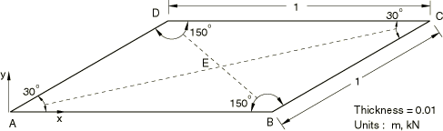

# 4.2.6 LE6: Skew plate under normal pressure

**Products: **Abaqus/Standard  Abaqus/Explicit  

### Elements tested

S4R    S4RS    S4RSW    S8R5    S9R5    

### Problem description

**Model: **

Skew plate under normal pressure.

**Mesh: **

A coarse (2  2) and a fine (4  4) are tested for each element. In addition, a very fine (8  8) mesh is tested for each element in the explicit dynamic analysis.

**Material: **

Linear elastic, Young's modulus = 210 GPa, Poisson's ratio = 0.3, density = 7800 kg/m3.

**Boundary conditions: **

 along edges AB, BC, CD, and AD.  0 at point A and  at point B to prevent rigid body motion.

**Loading: **

Uniform pressure of 7.0 kPa in the vertical *z*-direction. In the explicit dynamic analysis the loading is applied such that a quasi-static solution is obtained.

### Reference solution

This is a test recommended by the National Agency for Finite Element Methods and Standards (U.K.): Test LE6 from NAFEMS Publication TNSB, Rev. 3, “The Standard NAFEMS Benchmarks,” October 1990.

Target solution: Maximum principal stress = 0.802 MPa on the lower surface at point E.

### Results and discussion

The results are shown in [Table 4.2.6--1](ch04s02anf06.md#table-le6-std) and [Table 4.2.6--2](ch04s02anf06.md#table-le6-exp). The values enclosed in parentheses are percentage differences with respect to the reference solution.

**Table 4.2.6–1** Abaqus/Standard analysis.
| Element | Coarse Mesh | Fine Mesh |
| --- | --- | --- |
| S8R5 | 1.156 MPa (+44.1%) | 0.862 MPa (+7.5%) |
| S9R5 | 1.156 MPa (+44.1%) | 0.862 MPa (+7.5%) |

**Table 4.2.6–2** Abaqus/Explicit analysis.
| Element | Coarse Mesh | Fine Mesh | Very Fine Mesh |
| --- | --- | --- | --- |
| S4R | 0.338 MPa (58%) | 0.703 MPa (12.3%) | 0.765 MPa (4.61%) |
| S4RS | 0.343 MPa (57%) | 0.745 MPa (7.11%) | 0.8021 MPa (+0.01%) |
| S4RSW | 0.341 MPa (57%) | 0.674 MPa (16.0%) | 0.8034 MPa (+0.17%) |

### Remarks

The skew sensitivity of shell elements is discussed in ["Skew sensitivity of shell elements," Section 2.3.4](ch02s03ach150.md).

### Input files

##### **Abaqus/Standard input files**

#### Coarse mesh tests:

[nle6x58c.inp](../eif/nle6x58c.inp)

S8R5 elements.

[nle6x59c.inp](../eif/nle6x59c.inp)

S9R5 elements.

#### Fine mesh tests:

[nle6x58f.inp](../eif/nle6x58f.inp)

S8R5 elements.

[nle6x59f.inp](../eif/nle6x59f.inp)

S9R5 elements.

##### **Abaqus/Explicit input files**

#### Coarse mesh tests:

[le6_c.inp](../eif/le6_c.inp)

S4R elements.

[le6_c_s4rs.inp](../eif/le6_c_s4rs.inp)

S4RS elements.

[le6_c_s4rsw.inp](../eif/le6_c_s4rsw.inp)

S4RSW elements.

#### Refined mesh tests:

[le6_f.inp](../eif/le6_f.inp)

S4R elements.

[le6_f_s4rs.inp](../eif/le6_f_s4rs.inp)

S4RS elements.

[le6_f_s4rsw.inp](../eif/le6_f_s4rsw.inp)

S4RSW elements.

#### Very refined mesh tests:

[le6_vf.inp](../eif/le6_vf.inp)

S4R elements.

[le6_vf_s4rs.inp](../eif/le6_vf_s4rs.inp)

S4RS elements.

[le6_vf_s4rsw.inp](../eif/le6_vf_s4rsw.inp)

S4RSW elements.

