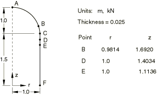
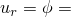

# 4.2.7 LE7: Axisymmetric cylinder/sphere under pressure

**Products: **Abaqus/Standard  Abaqus/Explicit  

### Elements tested

SAX1    SAX2    

### Problem description

**Model: **

Thin-walled pressure vessel.

**Mesh: **

A coarse and a fine mesh are tested.

**Material: **

Linear elastic, Young's modulus = 210 GPa, Poisson's ratio = 0.3, density = 7800 kg/m3.

**Boundary conditions: **

 0 at point A.  0 at point F.

**Loading: **

Uniform internal pressure of 1.0 MPa. In the explicit dynamic analysis the loading is applied such that a quasi-static solution is obtained.

### Reference solution

This is a test recommended by the National Agency for Finite Element Methods and Standards (U.K.): Test LE7 from NAFEMS Publication TNSB, Rev. 3, “The Standard NAFEMS Benchmarks,” October 1990.

Target solution: Axial stress,  25.9 MPa on the outer surface at point D.

### Results and discussion

The results are shown in the following table. The values enclosed in parentheses are percentage differences from the target solution.

| Element | , Coarse Mesh | , Fine Mesh |
| --- | --- | --- |
| SAX1 (Abaqus/Explicit) | 25.6 MPa (1%) | 25.7 MPa (0.5%) |
| SAX2 (Abaqus/Standard) | 26.034 MPa (+0.67%) | 25.878 MPa (+0.07%) |

### Input files

#### Coarse mesh tests:

[le7_c.inp](../eif/le7_c.inp)

SAX1 elements.

[nle7xa3c.inp](../eif/nle7xa3c.inp)

SAX2 elements.

#### Fine mesh tests:

[le7_f.inp](../eif/le7_f.inp)

SAX1 elements.

[nle7xa3f.inp](../eif/nle7xa3f.inp)

SAX2 elements.

