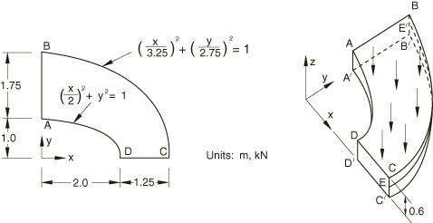
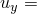
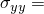

# 4.2.10 LE10: Thick plate under pressure

**Products: **Abaqus/Standard  Abaqus/Explicit  

### Elements tested

C3D20    C3D20R    C3D10    C3D10I    C3D10M    

### Problem description

**Model: **

Thick plate under uniform pressure.

**Mesh: **

A coarse and a fine mesh are tested.

**Material: **

Linear elastic, Young's modulus = 210 GPa, Poisson's ratio = 0.3, density = 7800 kg/m3.

**Boundary conditions: **

 0 on face DCD′C′.  0 on face ABA′B′.  0 on face BCB′C′.  0 on line EE′ (E is the midpoint of edge CC′; E′ is the midpoint of edge BB′).

**Loading: **

Uniform normal pressure of 1.0 MPa on the upper surface of the plate.

### Reference solution

This is a test recommended by the National Agency for Finite Element Methods and Standards (U.K.): Test LE10 from NAFEMS Publication TNSB, Rev. 3, “The Standard NAFEMS Benchmarks,” October 1990.

Target solution: Direct stress,  5.38 MPa at point D.

### Results and discussion

The Abaqus/Standard results are shown in [Table 4.2.10--1](ch04s02anf10.md#table-le10-std). The values enclosed in parentheses are percentage differences with respect to the reference solution.

**Table 4.2.10–1** Abaqus/Standard analysis.
| Element | , Coarse Mesh | , Fine Mesh |
| --- | --- | --- |
| C3D20 | 6.72 MPa (+25.00%) | 5.64 MPa (+4.83%) |
| C3D20R | 7.93 MPa (+47.39%) | 5.53 MPa (+2.78%) |
| C3D10 | 5.44 MPa (+1.15%) | 5.77 MPa (+7.24%) |
| C3D10I | --5.08 MPa (3.72%) | --5.51 MPa (+2.42%) |
| C3D10M | 5.57 MPa (+3.53%) | 5.89 MPa (+9.48%) |

The C3D10 and C3D10M elements are more accurate with the coarse mesh than with the fine mesh: in the coarse meshes four elements come together at the point of interest, giving a more accurate result after averaging to the nodes. In the more refined mesh, only one element contains the point of interest; therefore, the extrapolation to the nodes is less accurate.

Unlike Abaqus/Standard, Abaqus/Explicit does not have the option for extrapolating integration point outputs (such as stresses) to the nodes. Consequently, the desired stress component at point D cannot be extracted except by rough interpretation of color contour plots. As an alternative, the value of  at an integration point near point D is compared between an Abaqus/Standard simulation and an Abaqus/Explicit simulation.

In the Abaqus/Explicit analyses the pressure is ramped up smoothly from zero to its final value of 1.0 MPa over a time period of 0.4 seconds, which is slow enough to be considered quasi-static (inertial effects play a minimal role).

| Analysis Type | , Coarse Mesh | , Fine Mesh |
| --- | --- | --- |
| Abaqus/Standard | 3.70 MPa | 4.61 MPa |
| Abaqus/Explicit | 3.79 MPa | 4.55 MPa |

For the coarse mesh the point of comparison is at element 18, integration point 3. For the fine mesh the point of comparison is at element 199, integration point 1. Both are close neighbors of the physical corner point D.

### Input files

##### **Abaqus/Standard input files**

#### Coarse mesh tests:

[nle10fkc.inp](../eif/nle10fkc.inp)

C3D20 elements.

[nle10rkc.inp](../eif/nle10rkc.inp)

C3D20R elements.

[nle10c_c3d10.inp](../eif/nle10c_c3d10.inp)

C3D10 elements.

[nle10c_c3d10i.inp](../eif/nle10c_c3d10i.inp)

C3D10I elements.

[nle10c_c3d10m.inp](../eif/nle10c_c3d10m.inp)

C3D10M elements.

#### Fine mesh tests:

[nle10fkf.inp](../eif/nle10fkf.inp)

C3D20 elements.

[nle10rkf.inp](../eif/nle10rkf.inp)

C3D20R elements.

[nle10f_c3d10.inp](../eif/nle10f_c3d10.inp)

C3D10 elements.

[nle10f_c3d10i.inp](../eif/nle10f_c3d10i.inp)

C3D10I elements.

[nle10f_c3d10m.inp](../eif/nle10f_c3d10m.inp)

C3D10M elements.

##### **Abaqus/Explicit input files**

[exxle10_c.inp](../eif/exxle10_c.inp)

C3D10M elements, coarse mesh.

[exxle10_f.inp](../eif/exxle10_f.inp)

C3D10M elements, fine mesh.

