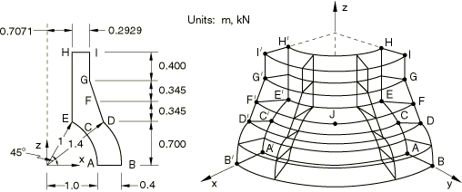
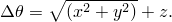

# 4.2.11 LE11: Solid cylinder/taper/sphere—temperature loading

### 4.2.11 LE11: Solid cylinder/taper/sphere---temperature loading

**Product: **Abaqus/Standard  

### Elements tested

C3D20    C3D20R    

### Problem description

**Mesh: **

A coarse and a fine mesh are tested.

**Material: **

Linear elastic, Young's modulus = 210 GPa, Poisson's ratio = 0.3, coefficient of thermal expansion = 2.3E4/C.

**Boundary conditions: **

 0 on the plane  0.  0 on the plane  0.  0 on the plane  0 and the face HIH′I′.

**Loading: **

Linear temperature gradient in the radial and axial directions is given by 

This is applied using user subroutine [`UTEMP`](../sub/sub-link.md#sub-xsl-utemp).

### Reference solution

This is a test recommended by the National Agency for Finite Element Methods and Standards (U.K.): Test LE11 from NAFEMS Publication TNSB, Rev. 3, “The Standard NAFEMS Benchmarks,” October 1990.

Target solution: Direct stress,  = 105 MPa at point A.

### Results and discussion

The results are shown in the following table. The values enclosed in parentheses are percentage differences with respect to the reference solution.

| Element | , Coarse Mesh | , Fine Mesh |
| --- | --- | --- |
| C3D20 | 96.71 MPa (7.9%) | 103.26 MPa (1.7%) |
| C3D20R | 93.04 MPa (11.4%) | 99.60 MPa (5.1%) |

### Input files

#### Coarse mesh tests:

[nle11fkc.inp](../eif/nle11fkc.inp)

C3D20 elements.

[nle11fkc.f](../eif/nle11fkc.f)

User subroutine used in nle11fkc.inp.

[nle11rkc.inp](../eif/nle11rkc.inp)

C3D20R elements.

[nle11rkc.f](../eif/nle11rkc.f)

User subroutine used in nle11rkc.inp.

#### Fine mesh tests:

[nle11fkf.inp](../eif/nle11fkf.inp)

C3D20 elements.

[nle11fkf.f](../eif/nle11fkf.f)

User subroutine used in nle11fkf.inp.

[nle11rkf.inp](../eif/nle11rkf.inp)

C3D20R elements.

[nle11rkf.f](../eif/nle11rkf.f)

User subroutine used in nle11rkf.inp.

