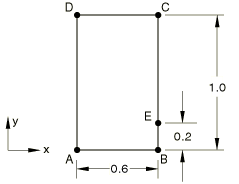

# 4.3.4 T4: Two-dimensional heat transfer with convection

**Products: **Abaqus/Standard  Abaqus/Explicit  

### Elements tested

DC2D3    DC2D4    DC2D6    DC2D8    

DC3D4    DC3D6    DC3D8    DC3D10    DC3D15    DC3D20    

CPE3T    CPE4RHT    CPE4RT    CPE6MHT    CPE6MT    CPS3T    CPS4RT    CPS6MT    C3D4T    C3D6T    C3D8RHT    C3D8RT    C3D8T    C3D10MHT    C3D10MT    

EC3D8RT    

SC6RT    SC8RT    

### Problem description

**Model: **

The two-dimensional geometry is shown above. Three-dimensional elements are tested with a thickness of 1.0 in the *z*-direction. In Abaqus/Standard a steady-state simulation is performed, while in Abaqus/Explicit a transient simulation is performed. The total simulation time in the latter case is 20000 seconds, which provides enough time for the transient solution to reach steady-state conditions in this problem.

**Material: **

Conductivity = 52 W/mC, surface convective coefficient = 750 W/m2/C.

For coupled temperature-displacement elements dummy mechanical properties are used to complete the material definition.

**Boundary conditions: **

Temperature = 100C along edge AB. Zero heat flux along edge DA. Convection to ambient temperature of 0C along edges BC and CD.

**Loading: **

Zero internal heat generation.

### Reference solution

This is a test recommended by the National Agency for Finite Element Methods and Standards (U.K.): Test T4 from NAFEMS publication TNSB, Rev. 3, “The Standard NAFEMS Benchmarks,” October 1990.

Target solution: Temperature of 18.3C at point E.

### Results and discussion

The results for the Abaqus/Standard analysis are shown in the following table. The values enclosed in parentheses are percentage differences with respect to the reference solution.

| Element | T, Coarse Mesh | T, Fine Mesh |
| --- | --- | --- |
| DC2D3 | 22.40C (22.4%) | 19.22C (5.0%) |
| DC2D4 | 19.34C (5.7%) | 18.91C (3.3%) |
| DC2D6 | 17.99C (1.7%) |  |
| DC2D8 | 17.90C (2.2%) |  |
| DC3D4 | 18.81C (2.8%) |  |
| DC3D8 | 19.34C (5.7%) | 18.91C (3.3%) |
| DC3D6 | 22.40C (22.4%) | 18.94C (3.5%) |
| DC3D10 | 19.00C (3.8%) |  |
| DC3D15 | 17.99C (1.7%) |  |
| DC3D20 | 17.89C (2.2%) |  |
| CPE3T | 22.40C (22.4%) | 18.94C (3.5%) |
| CPE4RT | 19.34C (5.7%) | 18.91C (3.3%) |
| CPE4RHT | 19.34C (5.7%) | 18.91C (3.3%) |
| CPE6MT | 17.22C (5.8%) |  |
| CPE6MHT | 17.22C (5.8%) |  |
| CPS3T | 22.40C (22.4%) | 18.94C (3.5%) |
| CPS4RT | 19.34C (5.7%) | 18.91C (3.3%) |
| CPS6MT | 17.22C (5.8%) |  |
| C3D4T | 19.26C (5.2%) |  |
| C3D6T | 22.40C (22.4%) | 18.94C (3.5%) |
| C3D8T | 19.34C (5.7%) | 18.91C (3.3%) |
| C3D8RT | 19.34C (5.7%) | 18.91C (3.3%) |
| C3D8RHT | 19.34C (5.7%) | 18.91C (3.3%) |
| C3D10MT | 19.79C (8.1%) |  |
| C3D10MHT | 19.79C (8.1%) |  |

The results for the Abaqus/Explicit analysis are shown in the following table. The values enclosed in parentheses are percentage differences with respect to the reference solution.

| Element | T, Coarse Mesh | T, Fine Mesh |
| --- | --- | --- |
| CPE3T | 22.26C (21.6%) | 18.90C (3.3%) |
| CPE4RT | 19.29C (5.4%) | 18.87C (3.1%) |
| CPS3T | 22.36C (22.2%) | 18.90C (3.3%) |
| CPS4RT | 19.29C (5.4%) | 18.87C (3.1%) |
| C3D4T | 19.21C (5.0%) |  |
| C3D6T | 22.36C (22.2%) | 18.90C (3.3%) |
| C3D8RT | 19.29C (5.4%) | 18.87C (3.1%) |
| C3D8T | 19.29C (5.4%) | 18.87C (3.1%) |
| SC6RT | 22.36C (22.2%) | 18.90C (3.3%) |
| SC8RT | 19.29C (5.4%) | 18.87C (3.1%) |
| EC3D8RT | 19.29C (5.4%) | 18.87C (3.1%) |

### Input files

##### **Abaqus/Standard input files**

#### Coarse mesh tests:

[nt4xx23c.inp](../eif/nt4xx23c.inp)

DC2D3 elements.

[nt4xx24c.inp](../eif/nt4xx24c.inp)

DC2D4 elements.

[nt4xx26c.inp](../eif/nt4xx26c.inp)

DC2D6 elements.

[nt4xx28c.inp](../eif/nt4xx28c.inp)

DC2D8 elements.

[nt4xx34c.inp](../eif/nt4xx34c.inp)

DC3D4 elements.

[nt4xx36c.inp](../eif/nt4xx36c.inp)

DC3D6 elements.

[nt4xx38c.inp](../eif/nt4xx38c.inp)

DC3D8 elements.

[nt4xx3ac.inp](../eif/nt4xx3ac.inp)

DC3D10 elements.

[nt4xx3fc.inp](../eif/nt4xx3fc.inp)

DC3D15 elements.

[nt4xx3kc.inp](../eif/nt4xx3kc.inp)

DC3D20 elements.

[twodheattrconvecc_std_cpe3t.inp](../eif/twodheattrconvecc_std_cpe3t.inp)

CPE3T elements.

[twodheattrconvecc_std_cpe4rt.inp](../eif/twodheattrconvecc_std_cpe4rt.inp)

CPE4RT elements.

[twodheattrconvecc_std_cpe4rht.inp](../eif/twodheattrconvecc_std_cpe4rht.inp)

CPE4RHT elements.

[twodheattrconvecc_std_cpe6mt.inp](../eif/twodheattrconvecc_std_cpe6mt.inp)

CPE6MT elements.

[twodheattrconvecc_std_cpe6mht.inp](../eif/twodheattrconvecc_std_cpe6mht.inp)

CPE6MHT elements.

[twodheattrconvecc_std_cps3t.inp](../eif/twodheattrconvecc_std_cps3t.inp)

CPS3T elements.

[twodheattrconvecc_std_cps4rt.inp](../eif/twodheattrconvecc_std_cps4rt.inp)

CPS4RT elements.

[twodheattrconvecc_std_cps6mt.inp](../eif/twodheattrconvecc_std_cps6mt.inp)

CPS6MT elements.

[twodheattrconvecc_std_c3d4t.inp](../eif/twodheattrconvecc_std_c3d4t.inp)

C3D4T elements.

[twodheattrconvecc_std_c3d6t.inp](../eif/twodheattrconvecc_std_c3d6t.inp)

C3D6T elements.

[twodheattrconvecc_std_c3d8t.inp](../eif/twodheattrconvecc_std_c3d8t.inp)

C3D8T elements.

[twodheattrconvecc_std_c3d8rt.inp](../eif/twodheattrconvecc_std_c3d8rt.inp)

C3D8RT elements.

[twodheattrconvecc_std_c3d8rht.inp](../eif/twodheattrconvecc_std_c3d8rht.inp)

C3D8RHT elements.

[twodheattrconvecc_std_c3d10mt.inp](../eif/twodheattrconvecc_std_c3d10mt.inp)

C3D10MT elements.

[twodheattrconvecc_std_c3d10mht.inp](../eif/twodheattrconvecc_std_c3d10mht.inp)

C3D10MHT elements.

#### Fine mesh tests:

[nt4xx23f.inp](../eif/nt4xx23f.inp)

DC2D3 elements.

[nt4xx24f.inp](../eif/nt4xx24f.inp)

DC2D4 elements.

[nt4xx36f.inp](../eif/nt4xx36f.inp)

DC3D6 elements.

[nt4xx38f.inp](../eif/nt4xx38f.inp)

DC3D8 elements.

[twodheattrconvecf_std_cpe3t.inp](../eif/twodheattrconvecf_std_cpe3t.inp)

CPE3T elements.

[twodheattrconvecf_std_cpe4rt.inp](../eif/twodheattrconvecf_std_cpe4rt.inp)

CPE4RT elements.

[twodheattrconvecf_std_cpe4rht.inp](../eif/twodheattrconvecf_std_cpe4rht.inp)

CPE4RHT elements.

[twodheattrconvecf_std_cps3t.inp](../eif/twodheattrconvecf_std_cps3t.inp)

CPS3T elements.

[twodheattrconvecf_std_cps4rt.inp](../eif/twodheattrconvecf_std_cps4rt.inp)

CPS4RT elements.

[twodheattrconvecf_std_c3d6t.inp](../eif/twodheattrconvecf_std_c3d6t.inp)

C3D6T elements.

[twodheattrconvecf_std_c3d8t.inp](../eif/twodheattrconvecf_std_c3d8t.inp)

C3D8T elements.

[twodheattrconvecf_std_c3d8rt.inp](../eif/twodheattrconvecf_std_c3d8rt.inp)

C3D8RT elements.

[twodheattrconvecf_std_c3d8rht.inp](../eif/twodheattrconvecf_std_c3d8rht.inp)

C3D8RHT elements.

##### **Abaqus/Explicit input files**

#### Coarse mesh tests:

[twodheattrconvecc_xpl_cpe3t.inp](../eif/twodheattrconvecc_xpl_cpe3t.inp)

CPE3T elements.

[twodheattrconvecc_xpl_cpe4rt.inp](../eif/twodheattrconvecc_xpl_cpe4rt.inp)

CPE4RT elements.

[twodheattrconvecc_xpl_cps3t.inp](../eif/twodheattrconvecc_xpl_cps3t.inp)

CPS3T elements.

[twodheattrconvecc_xpl_cps4rt.inp](../eif/twodheattrconvecc_xpl_cps4rt.inp)

CPS4RT elements.

[twodheattrconvecc_xpl_c3d4t.inp](../eif/twodheattrconvecc_xpl_c3d4t.inp)

C3D4T elements.

[twodheattrconvecc_xpl_c3d6t.inp](../eif/twodheattrconvecc_xpl_c3d6t.inp)

C3D6T elements.

[twodheattrconvecc_xpl_c3d8rt.inp](../eif/twodheattrconvecc_xpl_c3d8rt.inp)

C3D8RT elements.

[twodheattrconvecc_xpl_ec3d8rt.inp](../eif/twodheattrconvecc_xpl_ec3d8rt.inp)

EC3D8RT elements.

[twodheattrconvecc_xpl_c3d8t.inp](../eif/twodheattrconvecc_xpl_c3d8t.inp)

C3D8T elements.

[twodheattrconvecc_xpl_sc6rt.inp](../eif/twodheattrconvecc_xpl_sc6rt.inp)

SC6RT elements.

[twodheattrconvecc_xpl_sc8rt.inp](../eif/twodheattrconvecc_xpl_sc8rt.inp)

SC8RT elements.

#### Fine mesh tests:

[twodheattrconvecf_xpl_cpe3t.inp](../eif/twodheattrconvecf_xpl_cpe3t.inp)

CPE3T elements.

[twodheattrconvecf_xpl_cpe4rt.inp](../eif/twodheattrconvecf_xpl_cpe4rt.inp)

CPE4RT elements.

[twodheattrconvecf_xpl_cps3t.inp](../eif/twodheattrconvecf_xpl_cps3t.inp)

CPS3T elements.

[twodheattrconvecf_xpl_cps4rt.inp](../eif/twodheattrconvecf_xpl_cps4rt.inp)

CPS4RT elements.

[twodheattrconvecf_xpl_c3d6t.inp](../eif/twodheattrconvecf_xpl_c3d6t.inp)

C3D6T elements.

[twodheattrconvecf_xpl_c3d8rt.inp](../eif/twodheattrconvecf_xpl_c3d8rt.inp)

C3D8RT elements.

[twodheattrconvecf_xpl_c3d8t.inp](../eif/twodheattrconvecf_xpl_c3d8t.inp)

C3D8T elements.

[twodheattrconvecf_xpl_ec3d8rt.inp](../eif/twodheattrconvecf_xpl_ec3d8rt.inp)

EC3D8RT elements.

[twodheattrconvecf_xpl_sc6rt.inp](../eif/twodheattrconvecf_xpl_sc6rt.inp)

SC6RT elements.

[twodheattrconvecf_xpl_sc8rt.inp](../eif/twodheattrconvecf_xpl_sc8rt.inp)

SC8RT elements.

