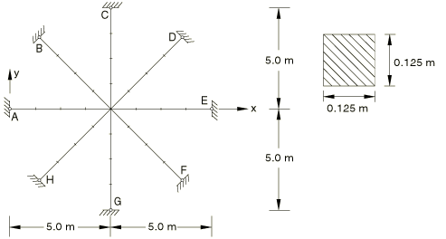
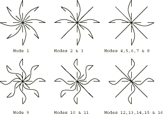

# 4.4.1 FV2: Pin-ended double cross: in-plane vibration

**Product: **Abaqus/Standard  

### Elements tested

B22    B23    

### Problem description

**Material: **

Young's modulus = 200 GPa, Poisson's ratio = 0.3, density = 8000 kg/m3.

**Boundary conditions: **

Beams are pinned at A, B, C, D, E, F, G, H. 

### Reference solution

This is a test recommended by the National Agency for Finite Element Methods and Standards (U.K.): Test FV2 from NAFEMS publication TNSB, Rev. 3, “The Standard NAFEMS Benchmarks,” October 1990.

### Mode shapes predicted by Abaqus

Modes 2 through 8 are vibration modes with the same eigenvalues. Because the eigenvalues are identical, any linear combination of modes 2 through 8 is still a valid mode. Hence, the shapes of these modes are arbitrary linear combinations of the mode shapes shown in the figure, and in particular will vary from computer to computer. The same behavior is observed for modes 10 through 16.

### Results and discussion

The results are shown in [Table 4.4.1--1](ch04s04anf16.md#table-fv2-1-8) and [Table 4.4.1--2](ch04s04anf16.md#table-fv2-9-16). The values enclosed in parentheses are percentage differences with respect to the reference solution.

**Table 4.4.1–1** B22 and B23 Modes 1–8 element results.
|  | Mode |
| --- | --- |
| 1 | 2 | 3 | 4 | 5 | 6 | 7 | 8 |
| NAFEMS | 11.336 | 17.709 | 17.709 | 17.709 | 17.709 | 17.709 | 17.709 | 17.709 |
| B22 | 11.337 (0.01) | 17.676 (0.19) | 17.676 (0.19) | 17.699 (0.06) | 17.706 (0.02) | 17.707 (0.01) | 17.707 (0.01) | 17.712 (0.02) |
| B23 | 11.343 (0.06) | 17.697 (0.07) | 17.697 (0.07) | 17.721 (0.07) | 17.721 (0.07) | 17.728 (0.11) | 17.728 (0.11) | 17.733 (0.14) |

**Table 4.4.1–2** B22 and B23 Modes 9–16 element results.
|  | Mode |
| --- | --- |
| 9 | 10 | 11 | 12 | 13 | 14 | 15 | 16 |
| NAFEMS | 45.345 | 57.390 | 57.390 | 57.390 | 57.390 | 57.390 | 57.390 | 57.390 |
| B22 | 45.686 (0.75) | 57.745 (0.62) | 57.745 (0.62) | 58.059 (1.17) | 58.080 (1.20) | 58.081 (1.20) | 58.081 (1.20) | 58.101 (1.24) |
| B23 | 45.544 (0.44) | 57.457 (0.12) | 57.457 (0.12) | 57.759 (0.64) | 58.780 (2.42) | 58.781 (2.42) | 58.781 (2.42) | 58.801 (2.46) |

### Input files

[nfv2x22x.inp](../eif/nfv2x22x.inp)

B22 elements.

[nfv2x23x.inp](../eif/nfv2x23x.inp)

B23 elements.

