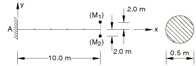
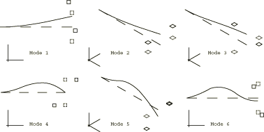

# 4.4.2 FV4: Cantilever with off-center point masses

**Product: **Abaqus/Standard  

### Elements tested

B32    B33    

### Problem description

**Material: **

Young's modulus = 200 GPa, Poisson's ratio = 0.3, density = 8000 kg/m3.

**Boundary conditions: **

All displacements are zero at A.

### Reference solution

This is a test recommended by the National Agency for Finite Element Methods and Standards (U.K.): Test FV4 from NAFEMS publication TNSB, Rev. 3, “The Standard NAFEMS Benchmarks,” October 1990.

### Mode shapes predicted by Abaqus

(Dashed lines represent the undeformed configuration.)

### Results and discussion

The results are shown in the following table. The values enclosed in parentheses are percentage differences with respect to the reference solution.

|  | Mode |
| --- | --- |
| 1 | 2 | 3 | 4 | 5 | 6 |
| NAFEMS | 1.723 | 1.727 | 7.413 | 9.972 | 18.155 | 26.957 |
| B32 | 1.722 (0.06) | 1.726 (0.06) | 7.412 (0.01) | 9.955 (0.17) | 18.174 (0.10) | 27.053 (0.36) |
| B33 | 1.723 (0.00) | 1.727 (0.00) | 7.414 (0.01) | 9.975 (0.03) | 18.187 (0.18) | 27.001 (0.16) |

### Input files

[nfv4x32x.inp](../eif/nfv4x32x.inp)

B32 elements.

[nfv4x33x.inp](../eif/nfv4x33x.inp)

B33 elements.

