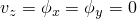
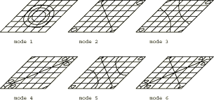

# 4.4.4 FV15: Clamped thin rhombic plate

**Product: **Abaqus/Standard  

### Elements tested

S8R5    STRI65    

### Problem description

**Material: **

Young's modulus = 200 GPa, Poisson's ratio = 0.3, density = 8000 kg/m3.

**Boundary conditions: **

 at all nodes.  along all edges.

Gauss integration is used for the shell cross-section for element STRI65.

### Reference solution

This is a test recommended by the National Agency for Finite Element Methods and Standards (U.K.): Test FV15 from NAFEMS publication TNSB, Rev. 3, “The Standard NAFEMS Benchmarks,” October 1990.

### Mode shapes predicted by Abaqus

The contour plots were generated by setting the maximum and minimum contour levels close to zero. Where contour levels coincided with the element boundaries, the maximum contour level was increased and the minimum contour level was decreased appropriately.

### Results and discussion

The results are shown in the following table. The values enclosed in parentheses are percentage differences with respect to the reference solution.

|  | Mode |
| --- | --- |
| 1 | 2 | 3 | 4 | 5 | 6 |
| NAFEMS | 7.938 | 12.835 | 17.941 | 19.133 | 24.009 | 27.922 |
| S8R5 | 7.902 (0.45) | 12.884 (0.38) | 18.027 (0.48) | 18.989 (0.75) | 24.119 (0.46) | 28.234 (1.12) |
| STR165 | 7.935 (0.04) | 12.804 (0.24) | 18.095 (0.86) | 19.267 (0.70) | 24.428 (1.75) | 27.945 (0.08) |

### Input files

[nfv1558x.inp](../eif/nfv1558x.inp)

S8R5 elements.

[nfv1556x.inp](../eif/nfv1556x.inp)

STRI65 elements.

