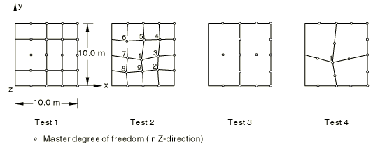
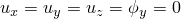

# 4.4.5 FV16: Cantilevered thin square plate

**Product: **Abaqus/Standard  

### Elements tested

S8R    S8R5    STRI65    

### Problem description

| Node | Coordinates |
| --- | --- |
| Numbers | x | y |
| 1 | 4.00 | 4.00 |
| 2 | 2.25 | 2.25 |
| 3 | 4.75 | 2.50 |
| 4 | 7.25 | 2.75 |
| 5 | 7.50 | 4.75 |
| 6 | 7.75 | 7.25 |
| 7 | 5.25 | 7.25 |
| 8 | 2.25 | 7.25 |
| 9 | 2.50 | 4.75 |

**Model: **

Plate thickness = 0.05 m.

**Material: **

Young's modulus = 200 GPa, Poisson's ratio = 0.3, density = 8000 kg/m3.

**Boundary conditions: **

 along the *y*-axis.

### Reference solution

This is a test recommended by the National Agency for Finite Element Methods and Standards (U.K.): Test FV16 from NAFEMS publication TNSB, Rev. 3, “The Standard NAFEMS Benchmarks,” October 1990.

### Results and discussion

The results are shown in the following table. The values enclosed in parentheses are percentage differences with respect to the reference solution.

|  | Mode |
| --- | --- |
| 1 | 2 | 3 | 4 | 5 | 6 |
| NAFEMS | 0.421 | 1.029 | 2.582 | 3.306 | 3.753 | 6.555 |
| STRI65 (Test 1) | 0.418 (0.71) | 1.035 (0.58) | 2.565 (0.66) | 3.325 (0.57) | 3.870 (3.12) | 6.966 (6.27) |
| STRI65 (Test 2) | 0.420 (0.24) | 1.034 (0.49) | 2.570 (0.46) | 3.326 (0.60) | 3.850 (2.58) | 6.843 (4.39) |
| S8R | 0.491 | 1.025 | 2.583 | 3.330 | 3.742 | 7.278 |
| (Test 1) | (0.48) | (0.39) | (0.04) | (0.73) | (0.29) | (11.03) |
| S8R | 0.423 | 1.044 | 2.634 | 3.345 | 4.105 | 7.048 |
| (Test 2) | (0.48) | (1.46) | (2.01) | (1.18) | (9.38) | (7.52) |
| S8R | 0.419 | 1.028 | 2.702 | 3.429 | 3.941 | 6.696 |
| (Test 3) | (0.48) | (0.10) | (4.65) | (3.72) | (5.01) | (2.15) |
| S8R | 0.420 | 1.049 | 2.707 | 3.723 | 4.128 | 7.008 |
| (Test 4) | (0.24) | (1.94) | (4.84) | (12.58) | (9.99) | (6.91) |
| S8R5 (Test 1) | 0.418 (0.71) | 1.023 (0.58) | 2.569 (0.50) | 3.282 (0.73) | 3.721 (0.85) | 5.988 (8.65) |
| S8R5 (Test 2) | 0.418 (0.71) | 1.024 (0.49) | 2.569 (0.50) | 3.283 (0.70) | 3.722 (0.83) | 6.077 (7.29) |
| S8R5 (Test 3) | 0.418 (0.71) | 1.021 (0.78) | 2.661 (3.06) | 3.382 (2.30) | 3.946 (5.14) | 6.814 (3.95) |
| S8R5 (Test 4) | 0.419 (0.24) | 1.022 (0.68) | 2.630 (1.86) | 3.560 (1.63) | 3.920 (4.45) | 6.602 (0.72) |

### Input files

[nfv16561.inp](../eif/nfv16561.inp)

STRI65 elements, Test 1.

[nfv16562.inp](../eif/nfv16562.inp)

STRI65 elements, Test 2.

[nfv16681.inp](../eif/nfv16681.inp)

S8R elements, Test 1.

[nfv16682.inp](../eif/nfv16682.inp)

S8R elements, Test 2.

[nfv16683.inp](../eif/nfv16683.inp)

S8R elements, Test 3.

[nfv16684.inp](../eif/nfv16684.inp)

S8R elements, Test 4.

[nfv16581.inp](../eif/nfv16581.inp)

S8R5 elements, Test 1.

[nfv16582.inp](../eif/nfv16582.inp)

S8R5 elements, Test 2.

[nfv16583.inp](../eif/nfv16583.inp)

S8R5 elements, Test 3.

[nfv16584.inp](../eif/nfv16584.inp)

S8R5 elements, Test 4.

