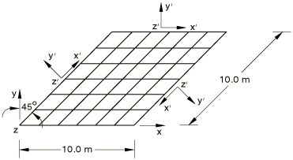
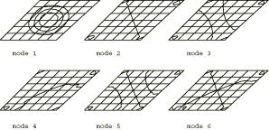

# 4.4.6 FV22: Clamped thick rhombic plate

**Product: **Abaqus/Standard  

### Elements tested

S3R    S4    S4R    S8R    SC6R    SC8R    

### Problem description

**Model: **

Plate thickness = 1.0 m.

**Material: **

Young's modulus = 200 GPa, Poisson's ration = 0.3, density = 8000 kg/m3.

**Boundary conditions: **

 at all nodes.  along all edges. The continuum shell meshes use equation constraints to provide equivalent midsurface kinematic constraints.

### Reference solution

This is a test recommended by the National Agency for Finite Element Methods and Standards (U.K.): Test FV22 from NAFEMS publication TNSB, Rev. 3, “The Standard NAFEMS Benchmarks,” October 1990.

### Mode shapes predicted by Abaqus

The contour plots were generated by setting the maximum and minimum contour levels close to zero. Where contour levels coincided with the element boundaries, the maximum contour level was increased and the minimum contour level was decreased appropriately.

### Results and discussion

The results are shown in the following table. The values enclosed in parentheses are percentage differences with respect to the reference solution.

|  | Mode |
| --- | --- |
| 1 | 2 | 3 | 4 | 5 | 6 |
| NAFEMS | 133.95 | 201.41 | 265.81 | 282.74 | 334.45 | N.A. |
| S3R | 143.11 (6.8) | 232.33 (15.4) | 307.61 (15.7) | 333.37 (17.9) | 446.63 (33.6) | 456.72 |
| S4 | 136.50 (1.9) | 215.60 (7.04) | 292.01 (9.86) | 295.96 (4.68) | 380.96 (13.91) | 423.86 |
| S4R | 135.50 (1.16) | 213.61 (6.06) | 287.25 (8.07) | 293.99 (3.98) | 372.50 (11.38) | 421.20 |
| S8R | 132.28 (1.25) | 199.67 (0.86) | 265.78 (0.01) | 281.67 (0.38) | 338.72 (1.28) | 382.09 |
| SC6R | 144.18 (7.6) | 235.09 (16.7) | 312.44 (17.5) | 338.54 (19.7) | 455.64 (36.2) | 465.54 |
| SC8R | 136.44 (1.9) | 216.00 (7.2) | 291.27 (9.58) | 298.43 (5.5) | 378.66 (13.2) | 429.43 |

### Input files

[nfv22_std_s3r.inp](../eif/nfv22_std_s3r.inp)

S3R elements.

[nfv22e4f.inp](../eif/nfv22e4f.inp)

S4 elements.

[nfv22f4f.inp](../eif/nfv22f4f.inp)

S4R elements.

[nfv2268c.inp](../eif/nfv2268c.inp)

S8R elements.

[nfv22_std_sc6r.inp](../eif/nfv22_std_sc6r.inp)

SC6R elements.

[nfv22_std_sc8r.inp](../eif/nfv22_std_sc8r.inp)

SC8R elements.

