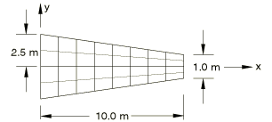
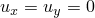
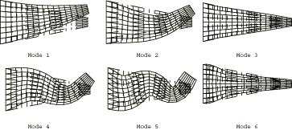

# 4.4.7 FV32: Cantilevered tapered membrane

**Product: **Abaqus/Standard  

### Elements tested

CPS4    CPS4I    CPS8    CPS8R    CPS6    CPS6M    

### Problem description

**Model: **

Plate thickness = 0.05 m.

**Material: **

Young's modulus = 200 GPa, Poisson's ratio = 0.3, density = 8000 kg/m3.

**Boundary conditions: **

 along the *y*-axis.  at all nodes.

### Reference solution

This is a test recommended by the National Agency for Finite Element Methods and Standards (U.K.): Test FV32 from NAFEMS publication TNSB, Rev. 3, “The Standard NAFEMS Benchmarks,” October 1990.

### Mode shapes predicted by Abaqus (for element type CPS4)

### Results and discussion

The results are shown in the following table. The values enclosed in parentheses are percentage differences with respect to the reference solution.

|  | Mode |
| --- | --- |
| 1 | 2 | 3 | 4 | 5 | 6 |
| NAFEMS | 44.623 | 130.03 | 162.70 | 246.05 | 379.90 | 391.44 |
| CPS4 | 44.782 (0.36) | 130.63 (0.46) | 162.59 (0.07) | 246.79 (0.30) | 379.14 (0.20) | 389.83 (0.41) |
| CPS4I | 44.524 (0.23) | 129.55 (0.09) | 162.55 (0.09) | 244.13 (0.78) | 374.46 (1.43) | 389.60 (0.47) |
| CPS8 | 44.636 (0.04) | 130.14 (0.08) | 162.72 (0.01) | 246.63 (0.24) | 382.02 (0.56) | 391.55 (0.03) |
| CPS8R | 44.629 (0.02) | 130.11 (0.06) | 162.70 (0.00) | 246.42 (0.15) | 381.32 (0.37) | 391.51 (0.02) |
| CPS6 | 44.624 (0.00) | 130.04 (0.00) | 162.70 (0.00) | 246.09 (0.02) | 379.99 (0.02) | 391.45 (0.02) |
| CPS6M | 44.637 (0.03) | 129.88 (0.12) | 162.67 (0.02) | 245.29 (0.31) | 377.64 (0.59) | 390.98 (0.12) |

### Input files

[nfv32f4f.inp](../eif/nfv32f4f.inp)

CPS4 elements.

[nfv32i4f.inp](../eif/nfv32i4f.inp)

CPS4I elements.

[nfv32f8c.inp](../eif/nfv32f8c.inp)

CPS8 elements.

[nfv32r8c.inp](../eif/nfv32r8c.inp)

CPS8R elements.

[nfv32f6c.inp](../eif/nfv32f6c.inp)

CPS6 elements.

[nfv32m6c.inp](../eif/nfv32m6c.inp)

CPS6M elements.

