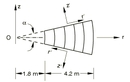
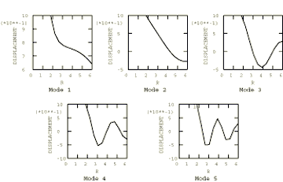

# 4.4.9 FV42: Thick hollow sphere: uniform radial vibration

**Product: **Abaqus/Standard  

### Elements tested

CAX4    CAX8    CAX6    CAX6M    

### Problem description

**Model: **

Shell thickness = 4.2 m.

**Material: **

Young's modulus = 200 GPa, Poisson's ratio = 0.3, density = 8000 kg/m3.

**Boundary conditions: **

Unsupported.

### Reference solution

This is a test recommended by the National Agency for Finite Element Methods and Standards (U.K.): Test FV42 from NAFEMS publication TNSB, Rev. 3, “The Standard NAFEMS Benchmarks,” October 1990.

### Radial displacement; Mode shapes predicted by Abaqus (for element type CAX8)

### Results and discussion

The results are shown in the following table. The values enclosed in parentheses are percentage differences with respect to the reference solution.

|  | Mode |
| --- | --- |
| 1 | 2 | 3 | 4 | 5 |
| NAFEMS | 369.91 | 838.03 | 1451.2 | 2111.7 | 2795.8 |
| CAX4 | 367.79 (0.03) | 829.11 (1.06) | 1417.6 (2.32) | 2025.8 (4.07) | 2598.4 (7.60) |
| CAX8 | 370.97 (0.29) | 840.49 (0.29) | 1457.3 (0.42) | 2137.9 (0.99) | 2861.1 (2.33) |
| CAX6 | 369.95 (0.01) | 838.04 (0.00) | 1451.3 (0.00) | 2118.0 (0.30) | 2800.2 (0.16) |
| CAX6M | 370.06 (0.04) | 836.50 (0.18) | 1443.0 (0.57) | 2092.1 (0.93) | 2738.8 (2.04) |

### Input files

[nfv4264f.inp](../eif/nfv4264f.inp)

CAX4 elements.

[nfv4268c.inp](../eif/nfv4268c.inp)

CAX8 elements.

[nfv4266c.inp](../eif/nfv4266c.inp)

CAX6 elements.

[nfv4266m.inp](../eif/nfv4266m.inp)

CAX6M elements.

