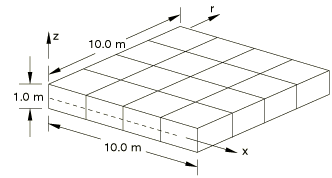
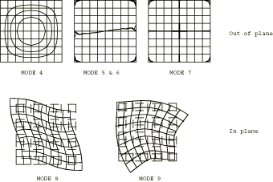

# 4.4.10 FV52: Simply supported “solid” square plate

### 4.4.10 FV52: Simply supported "solid" square plate

**Product: **Abaqus/Standard  

### Elements tested

C3D8I    C3D10    C3D10I    C3D10M    C3D20    

### Problem description

**Model: **

Plate thickness = 1.0 m.

**Material: **

Young's modulus = 200 GPa, Poisson's ratio = 0.3, density = 8000 kg/m3.

**Boundary conditions: **

 along all four edges on the plane *z* =0.5.

### Reference solution

This is a test recommended by the National Agency for Finite Element Methods and Standards (U.K.): Test FV52 from NAFEMS publication TNSB, Rev. 3, “The Standard NAFEMS Benchmarks,” October 1990.

### Mode shapes predicted by Abaqus (for element type C3D8I)

The following contour plots were generated by setting the maximum and minimum contour levels close to zero. Where contour levels coincided with the element boundaries, the maximum contour level was increased and the minimum contour level was decreased appropriately.

### Results and discussion

The results are shown in the following table. The values enclosed in parentheses are percentage differences with respect to the reference solution.

|  | Mode |
| --- | --- |
| 1, 2, 3 | 4 | 5 | 6 | 7 | 8 | 9 | 10 |
| NAFEMS | RBM | 44.092 | 106.66 | 106.66 | 156.23 | 193.58 | 200.13 | 200.13 |
| C3D8I | RBM | 44.092 (0.0) | 106.66 (0.0) | 106.66 (0.0) | 156.23 (0.0) | 193.58 (0.0) | 200.13 (0.0) | 200.13 (0.0) |
| C3D10 | RBM | 44.348 (0.58) | 107.73 (1.00) | 107.73 (1.00) | 163.58 (4.70) | 193.63 (0.02) | 204.74 (2.30) | 205.10 (2.48) |
| C3D10I | RBM | 44.348 (0.58) | 107.73 (1.00) | 107.73 (1.00) | 163.58 (4.70) | 193.63 (0.02) | 204.74 (2.30) | 205.10 (2.48) |
| C3D10M | RBM | 42.687 (3.19) | 101.57 (4.77) | 101.57 (4.77) | 151.22 (3.21) | 192.89 (0.35) (Mode 10) | 203.76 (1.81) (Mode 11) | 203.76 (1.81) (Mode 12) |
| C3D20 | RBM | 44.796 (1.60) | 110.54 (3.64) | 110.54 (3.64) | 169.10 (8.24) | 193.92 (0.18) | 206.64 (3.25) | 206.64 (3.25) |

### Remarks

Element types C3D10, C3D10M, and C3D20 capture the same eigenmodes, but the order of eigenmodes 8 through 12 is different. For example, the same mode is captured as mode 12 by C3D10, as mode 11 by C3D10M, and as mode 9 by C3D20. Element type C3D8I captures the eigenmodes in the same order as C3D20.

### Input files

[nfv52i8f.inp](../eif/nfv52i8f.inp)

C3D8I elements.

[nfv52f10.inp](../eif/nfv52f10.inp)

C3D10 elements.

[nfv52i10.inp](../eif/nfv52i10.inp)

C3D10I elements.

[nfv52m10.inp](../eif/nfv52m10.inp)

C3D10M elements.

[nfv52fkc.inp](../eif/nfv52fkc.inp)

C3D20 elements.

