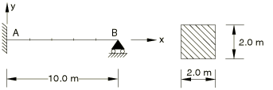
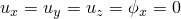
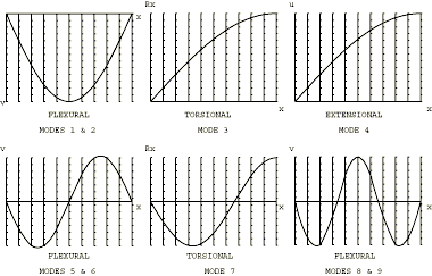

# 4.5.1 Test 5: Deep simply supported beam: frequency extraction

**Product: **Abaqus/Standard  

### Element tested

B32

### Problem description

**Material: **

Young's modulus = 200 GPa, Poisson's ratio = 0.3, density = 8000 kg/m3.

**Boundary conditions: **

 at A,  at B.

Frequency extraction is performed in Step 1.

### Reference solution

This is a test recommended by the National Agency for Finite Element Methods and Standards (U.K.): Test 5 from NAFEMS “Selected Benchmarks for Forced Vibration,” R0016, March 1993.

### Mode shapes predicted by Abaqus

### Results and discussion

The results are shown in the following table.

| Mode | Abaqus result | NAFEMS | % Difference |
| --- | --- | --- | --- |
|  | reference result |  |
| 1 | 42.658 | 42.650 | 0.02 |
| 2 | 42.658 | 42.650 | 0.02 |
| 3 | 71.261 | 71.200 | 0.09 |
| 4 | 125.00 | 125.00 | 0.00 |
| 5 | 148.72 | 148.15 | 0.38 |
| 6 | 148.72 | 148.15 | 0.38 |
| 7 | 213.89 | 213.61 | 0.13 |
| 8 | 287.84 | 283.47 | 1.52 |
| 9 | 287.84 | 283.47 | 1.52 |

### Input file

[nfm5x32x.inp](../eif/nfm5x32x.inp)

B32 elements.

