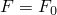
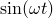
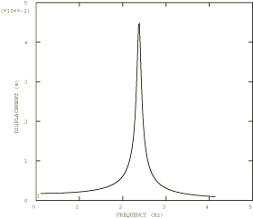

# 4.5.6 Test 13H: Simply supported thin square plate: harmonic forced vibration

**Product: **Abaqus/Standard  

### Elements tested

S3    S3R    S4    S4R    S4R5    S8R    S8R5    S9R5    STRI3    STRI65    SC6R    SC8R    

### Problem description

Material and geometry specifications are as given in ["Test 13: Simply supported thin square plate: frequency extraction," Section 4.5.5](ch04s05anf30.md).

**Forcing function: **

Steady-state harmonic.

 

 100 N/m2 over whole plate.

 0 to 4.16 Hz

**Damping: **

 2%

**Response: **

 and  at center of plate.

Gauss integration is used for the shell cross-section in input file [nfh1368x.inp](../eif/nfh1368x.inp).

### Reference solution

This is a test recommended by the National Agency for Finite Element Methods and Standards (U.K.): Test 13H from NAFEMS “Selected Benchmarks for Forced Vibration,” R0016, March 1993.

### Response predicted by Abaqus

### Results and discussion

The results are given in [Table 4.5.6--1](ch04s05anf31.md#table-test13h-modal) and [Table 4.5.6--2](ch04s05anf31.md#table-test13h-direct). The values enclosed in parentheses are percentage differences with respect to the reference solution. The modal solutions are obtained from Step 2 in files whose names begin with nfm13.

**Table 4.5.6–1** Modal solution.
|  | Peak displacement (mm) | Peak stress (N/mm2) | Frequency (Hz) |
| --- | --- | --- | --- |
| Reference solution | 45.42 | 30.03 | 2.377 |
| S4 | 45.03 (0.85%) | 31.33 (4.3%) | 2.418 (1.72%) |
| S4R | 45.33 (0.20%) | 30.34 (1.03%) | 2.410 (1.39%) |
| S4R5 | 45.42 (0.00%) | 30.41 (1.27%) | 2.407 (1.26%) |
| S8R | 43.12 (5.06%) | 33.73 (12.32%) | 2.441 (2.69%) |
| S8R5 | 45.50 (0.18%) | 35.12 (16.95%) | 2.377 (0.00%) |

**Table 4.5.6–2** Direct solution.
|  | Peak displacement (mm) | Peak stress (N/mm2) | Frequency (Hz) |
| --- | --- | --- | --- |
| Reference solution | 45.42 | 30.03 | 2.377 |
| S3/S3R | 41.56 (8.50%) | 27.82 (7.36%) | 2.49 (4.75%) |
| S4 | 44.93 (1.08%) | 31.26 (4.10%) | 2.420 (1.81%) |
| S4 (collapsed) | 41.56 (8.50%) | 27.82 (7.36%) | 2.49 (4.75%) |
| S4R | 45.38 (0.09%) | 30.37 (1.13%) | 2.405 (1.18%) |
| S4R (collapsed) | 41.56 (8.50%) | 27.82 (7.36%) | 2.49 (4.75%) |
| S4R5 | 45.41 (0.02%) | 30.39 (1.20%) | 2.405 (1.18%) |
| S8R | 43.86 (3.43%) | 34.31 (14.25%) | 2.446 (2.90%) |
| S8R5 | 44.66 (1.34%) | 34.49 (14.85%) | 2.385 (0.34%) |
| S9R5 | 44.59 (1.83%) | 32.24 (7.36%) | 2.39 (0.55%) |
| STRI3 | 44.74 (1.49%) | 32.81 (9.26%) | 2.36 (0.71%) |
| STRI65 | 44.96 (1.01%) | 33.19 (10.5%) | 2.36 (0.71%) |
| SC6R | 41.56 (8.5%) | 27.82 (7.36) | 2.49 (4.75%) |
| SC8R | 45.38 (0.09%) | 30.37 (1.13%) | 2.405 (1.18%) |

### Input files

[nfh13f3x.inp](../eif/nfh13f3x.inp)

S3/S3R elements.

[nfh13e4x.inp](../eif/nfh13e4x.inp)

S4 elements.

[nfh13e41.inp](../eif/nfh13e41.inp)

Collapsed S4 elements.

[nfh13f4x.inp](../eif/nfh13f4x.inp)

S4R elements.

[nfh13641.inp](../eif/nfh13641.inp)

Collapsed S4R elements.

[nfh1354x.inp](../eif/nfh1354x.inp)

S4R5 elements.

[nfh1368x.inp](../eif/nfh1368x.inp)

S8R elements.

[nfh1358x.inp](../eif/nfh1358x.inp)

S8R5 elements.

[nfh1359x.inp](../eif/nfh1359x.inp)

S9R5 elements.

[nfh1363x.inp](../eif/nfh1363x.inp)

STRI3 elements.

[nfh1356x.inp](../eif/nfh1356x.inp)

STRI65 elements.

[nfh13_std_sc6r.inp](../eif/nfh13_std_sc6r.inp)

SC6R elements.

[nfh13_std_sc8r.inp](../eif/nfh13_std_sc8r.inp)

SC8R elements.

