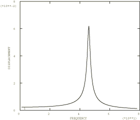

# 4.5.10 Test 21H: Simply supported thick square plate: harmonic forced vibration

**Product: **Abaqus/Standard  

### Elements tested

S3    S3R    S4    S4R    S4R5    S8R    S8R5    S9R5    STRI3    STRI65    

### Problem description

Material and geometry specifications are as given in ["Test 21: Simply supported thick square plate: frequency extraction," Section 4.5.9](ch04s05anf34.md).

**Forcing function: **

Steady-state harmonic.

 

 1 MN/m2 over whole plate.

 0 to 78.17 Hz

**Damping: **

 2%

**Response: **

 and  at center of plate.

The modal solution is obtained from Step 2 in files whose names begin with nfm21. 

### Reference solution

This is a test recommended by the National Agency for Finite Element Methods and Standards (U.K.): Test 21H from NAFEMS “Selected Benchmarks for Forced Vibration,” R0016, March 1993.

### Response predicted by Abaqus

### Results and discussion

The results are given in [Table 4.5.10--1](ch04s05anf35.md#table-test21h-modal) and [Table 4.5.10--2](ch04s05anf35.md#table-test21h-direct). The values enclosed in parentheses are percentage differences with respect to the reference solution.

**Table 4.5.10–1** Modal solution.
|  | Peak displacement (mm) | Peak stress (N/mm2) | Frequency (Hz) |
| --- | --- | --- | --- |
| Reference solution | 58.33 | 800.8 | 45.90 |
| S4 | 59.54 (2.03%) | 784.01 (2.09%) | 46.67(1.68%) |
| S4R | 60.01 (2.88%) | 760.4 (5.04%) | 46.52 (1.35%) |
| S4R5 | 59.93 (2.74%) | 760.8 (5.00%) | 46.51 (1.33%) |
| S8R | 59.94 (2.76%) | 880.1 (9.90%) | 45.94 (0.09%) |

**Table 4.5.10–2** Direct solution.
|  | Peak displacement (mm) | Peak stress (N/mm2) | Frequency (Hz) |
| --- | --- | --- | --- |
| Reference solution | 58.33 | 800.8 | 45.90 |
| S3/S3R | 57.52 (1.39%) | 745.7 (6.88%) | 47.92 (4.40%) |
| S4R (collapsed) | 57.52 (1.39%) | 745.7 (6.88%) | 47.92 (4.40%) |
| S4 (collapsed) | 57.52 (1.39%) | 745.7 (6.88%) | 47.92 (4.40%) |
| S4 | 60.77 (4.18%) | 800.3 (0.06%) | 46.76(1.87%) |
| S4R | 61.33 (5.14%) | 776.9 (2.98%) | 46.39 (1.07%) |
| S4R5 | 61.09 (4.73%) | 775.7 (3.13%) | 45.98 (0.17%) |
| S8R | 61.87 (6.07%) | 908.4 (13.44%) | 45.98 (0.17%) |
| S8R5 | 60.81 (4.25%) | 887.8 (10.8%) | 46.0 (0.22%) |
| S9R5 | 60.73 (4.11%) | 830.3 (3.68%) | 46.0 (0.22%) |
| STRI3 | 55.88 (4.20%) | 818.4 (2.19%) | 46.8 (1.96%) |
| STRI65 | 62.47 (7.09%) | 860.7 (7.48%) | 46.0 (0.22%) |

### Input files

[nfh21f3x.inp](../eif/nfh21f3x.inp)

S3/S3R elements.

[nfh21641.inp](../eif/nfh21641.inp)

Collapsed S4R elements.

[nfh21e41.inp](../eif/nfh21e41.inp)

Collapsed S4 elements.

[nfh21e4x.inp](../eif/nfh21e4x.inp)

S4 elements.

[nfh21f4x.inp](../eif/nfh21f4x.inp)

S4R elements.

[nfh2154x.inp](../eif/nfh2154x.inp)

S4R5 elements.

[nfh2168x.inp](../eif/nfh2168x.inp)

S8R elements.

[nfh2158x.inp](../eif/nfh2158x.inp)

S8R5 elements.

[nfh2159x.inp](../eif/nfh2159x.inp)

S9R5 elements.

[nfh2163x.inp](../eif/nfh2163x.inp)

STRI3 elements.

[nfh2156x.inp](../eif/nfh2156x.inp)

STRI65 elements.

