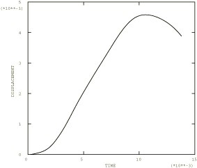
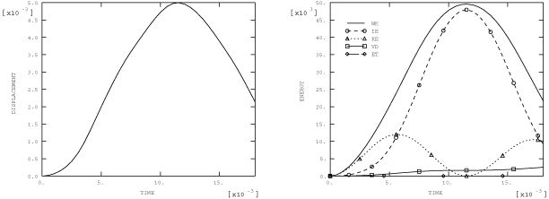

# 4.5.11 Test 21T: Simply supported thick square plate: transient forced vibration

**Products: **Abaqus/Standard  Abaqus/Explicit  

### Elements tested

S3R    S3RS    S4    S4R    S4RS    S4RSW    S4R5    S8R    SC8R    

### Problem description

Material and geometry specifications are as given in ["Test 21: Simply supported thick square plate: frequency extraction," Section 4.5.9](ch04s05anf34.md). The plate thickness for the Abaqus/Explicit analyses is 1.0 in.

**Mesh: **

A coarse mesh, a fine mesh, and a very fine mesh of a quarter of the plate are tested for elements S3R, S3RS, S4R, S4RS, and S4RSW in Abaqus/Explicit. For the quadrilateral element types the mesh densities of the coarse, fine, and very fine meshes are 2  2, 3  3, and 4  4, respectively; for the triangular element types the meshes are 2  2  4, 3  3  4, and 4  4  4, respectively.

**Forcing function: **

Suddenly applied pressure.

 1 MN/m2 over whole plate.

**Damping: **

 2% [2% of critical damping in the dominant first mode with analytical frequency value  45.897 (Hz) or  288.379 (sec1)].

The damping factors are chosen as  5.772 (sec1) and  6.929  105 (sec) so that

**Response location: **

 and  at center of plate.

### Reference solution

This is a test recommended by the National Agency for Finite Element Methods and Standards (U.K.): Test 21T from NAFEMS “Selected Benchmarks for Forced Vibration,” R0016, March 1993.

### Response predicted by Abaqus/Standard

### Response predicted by Abaqus/Explicit

### Results and discussion

The results are given in [Table 4.5.11--1](ch04s05anf36.md#table-test21t-s4) through [Table 4.5.11--10](ch04s05anf36.md#table-test21t-s4rsw). The values enclosed in parentheses are percentage differences with respect to the reference solution. The static displacement was obtained by creating a second step with a time period of about 2 seconds.

**Table 4.5.11–1** Element type: S4, Abaqus/Standard analysis.
|  | Peak displacement | Peak stress | Static disp. |
| --- | --- | --- | --- |
|  |  (mm) |  (sec) |  (N/mm2) |  (mm) |
| Reference solution | 4.524 | 0.0108 | 62.11 | 2.333 |
| Direct solution | 4.569 (0.99%) | 0.0108 (0.00%) | 58.61 (5.63%) | 2.338 (0.21%) |
| Modal solution | 4.564 (0.88%) | 0.0107 (0.93%) | 58.57 (5.69%) | 2.334 (0.04%) |

**Table 4.5.11–2** Element type: S4R, Abaqus/Standard analysis.
|  | Peak displacement | Peak stress | Static disp. |
| --- | --- | --- | --- |
|  |  (mm) |  (sec) |  (N/mm2) |  (mm) |
| Reference solution | 4.524 | 0.0108 | 62.11 | 2.333 |
| Direct solution | 4.603 (1.75%) | 0.0108 (0.00%) | 56.91 (8.37%) | 2.338 (0.21%) |
| Modal solution | 4.534 (0.22%) | 0.0107 (0.93%) | 53.82 (13.35%) | 2.334 (0.04%) |

**Table 4.5.11–3** Element type: S4R5, Abaqus/Standard analysis.
|  | Peak displacement | Peak stress | Static disp. |
| --- | --- | --- | --- |
|  |  (mm) |  (sec) |  (N/mm2) |  (mm) |
| Reference solution | 4.524 | 0.0108 | 62.11 | 2.333 |
| Direct solution | 4.599 (1.66%) | 0.0108 | 56.90 (8.68%) | 2.339 (0.26%) |
| Modal solution | 4.536 (0.27%) | 0.0109 (0.93%) | 54.04 (12.99%) | 2.335 (0.09%) |

**Table 4.5.11–4** Element type: S8R, Abaqus/Standard analysis.
|  | Peak displacement | Peak stress | Static disp. |
| --- | --- | --- | --- |
|  |  (mm) |  (sec) |  (N/mm2) |  (mm) |
| Reference solution | 4.524 | 0.0108 | 62.11 | 2.333 |
| Direct solution | 4.571 (1.04%) | 0.0104 (3.70%) | 64.03 (3.09%) | 2.331 (0.09%) |
| Modal solution | 4.578 (1.19%) | 0.0106 (1.85%) | 63.88 (2.85%) | 2.331 (0.09%) |

**Table 4.5.11–5** Element type: SC8R, Abaqus/Standard analysis.
|  | Peak displacement | Peak stress | Static disp. |
| --- | --- | --- | --- |
|  |  (mm) |  (sec) |  (N/mm2) |  (mm) |
| Reference solution | 4.524 | 0.0108 | 62.11 | 2.333 |
| Direct solution | 4.627 (2.27%) | 0.0110 (1.85%) | 57.9 (6.77%) | 2.337 (0.17%) |
| Modal solution | 4.544 (0.33%) | 0.0107 (0.93%) | 54.0 (13.1%) | 2.339 (0.26%) |

**Table 4.5.11–6** Element type: S3R, Abaqus/Explicit analysis.
|  | Peak displacement | Peak stress | Static disp. |
| --- | --- | --- | --- |
|  (mm) |  (sec) |  (N/mm2) |  (mm) |
| Reference solution | 4.524 | 0.0108 | 62.11 | 2.333 |
| Coarse mesh | 4.223 | 0.0110 | 52.78 | 2.170 |
| (6.65%) | (1.85%) | (15.02%) | (7.00%) |
| Fine mesh | 4.441 | 0.0107 | 57.02 | 2.265 |
| (1.83%) | (0.92%) | (8.20%) | (2.91%) |
| Very fine mesh | 4.517 | 0.0107 | 58.67 | 2.296 |
| (0.15%) | (0.92%) | (5.54%) | (1.58%) |

**Table 4.5.11–7** Element type: S3RS, Abaqus/Explicit analysis.
|  | Peak displacement | Peak stress | Static disp. |
| --- | --- | --- | --- |
|  (mm) |  (sec) |  (N/mm2) |  (mm) |
| Reference solution | 4.524 | 0.0108 | 62.11 | 2.333 |
| Coarse mesh | 4.208 | 0.0109 | 53.00 | 2.148 |
| (6.98%) | (0.93%) | (19.50%) | (7.93%) |
| Fine mesh | 4.425 | 0.0106 | 56.99 | 2.252 |
| (2.19%) | (1.85%) | (8.24%) | (3.47%) |
| Very fine mesh | 4.507 | 0.0107 | 58.67 | 2.288 |
| (0.38%) | (0.93%) | (5.54%) | (1.93%) |

**Table 4.5.11–8** Element type: S4R, Abaqus/Explicit analysis.
|  | Peak displacement | Peak stress | Static disp. |
| --- | --- | --- | --- |
|  (mm) |  (sec) |  (N/mm2) |  (mm) |
| Reference solution | 4.524 | 0.0108 | 62.11 | 2.333 |
| Coarse mesh | 4.466 | 0.0122 | 48.21 | 2.368 |
| (1.28%) | (12.96%) | (22.38%) | (1.50%) |
| Fine mesh | 4.556 | 0.0114 | 55.02 | 2.348 |
| (0.71%) | (5.56%) | (11.42%) | (0.64%) |
| Very fine mesh | 4.577 | 0.0110 | 57.33 | 2.351 |
| (1.17%) | (1.85%) | (7.70%) | (0.77%) |

**Table 4.5.11–9** Element type: S4RS, Abaqus/Explicit analysis.
|  | Peak displacement | Peak stress | Static disp. |
| --- | --- | --- | --- |
|  (mm) |  (sec) |  (N/mm2) |  (mm) |
| Reference solution | 4.524 | 0.0108 | 62.11 | 2.333 |
| Coarse mesh | 4.624 | 0.0125 | 49.84 | 2.381 |
| (2.21%) | (15.74%) | (19.75%) | (2.06%) |
| Fine mesh | 4.625 | 0.0114 | 55.75 | 2.353 |
| (2.23%) | (5.56%) | (10.24%) | (0.86%) |
| Very fine mesh | 4.612 | 0.0110 | 57.67 | 2.344 |
| (1.95%) | (1.85%) | (7.15%) | (0.47%) |

**Table 4.5.11–10** Element type: S4RSW, Abaqus/Explicit analysis.
|  | Peak displacement | Peak stress | Static disp. |
| --- | --- | --- | --- |
|  (mm) |  (sec) |  (N/mm2) |  (mm) |
| Reference solution | 4.524 | 0.0108 | 62.11 | 2.333 |
| Coarse mesh | 4.618 | 0.0121 | 49.77 | 2.381 |
| (2.08%) | (12.04%) | (19.87%) | (2.06%) |
| Fine mesh | 4.623 | 0.0114 | 55.74 | 2.353 |
| (2.19%) | (5.56%) | (10.26%) | (0.86%) |
| Very fine mesh | 4.612 | 0.0109 | 57.67 | 2.344 |
| (1.95%) | (0.93%) | (7.15%) | (0.47%) |

### Input files

##### **Abaqus/Standard input files**

[nft21e4x.inp](../eif/nft21e4x.inp)

S4 elements.

[nft21f4x.inp](../eif/nft21f4x.inp)

S4R elements.

[nft2154x.inp](../eif/nft2154x.inp)

S4R5 elements.

[nft2168x.inp](../eif/nft2168x.inp)

S8R elements.

[nft21_std_sc8r.inp](../eif/nft21_std_sc8r.inp)

SC8R elements.

The modal solution in Abaqus/Standard is obtained from Steps 3 and 4 in files whose names begin with nfm21.

##### **Abaqus/Explicit input files**

[fv21t_s3r_c.inp](../eif/fv21t_s3r_c.inp)

S3R elements, coarse mesh.

[fv21t_s3r_f.inp](../eif/fv21t_s3r_f.inp)

S3R elements, fine mesh.

[fv21t_s3r_vf.inp](../eif/fv21t_s3r_vf.inp)

S3R elements, very fine mesh.

[fv21t_s3rs_c.inp](../eif/fv21t_s3rs_c.inp)

S3RS elements, coarse mesh.

[fv21t_s3rs_f.inp](../eif/fv21t_s3rs_f.inp)

S3RS elements, fine mesh.

[fv21t_s3rs_vf.inp](../eif/fv21t_s3rs_vf.inp)

S3RS elements, very fine mesh.

[fv21t_s4r_c.inp](../eif/fv21t_s4r_c.inp)

S4R elements, coarse mesh.

[fv21t_s4r_f.inp](../eif/fv21t_s4r_f.inp)

S4R elements, fine mesh.

[fv21t_s4r_vf.inp](../eif/fv21t_s4r_vf.inp)

S4R elements, very fine mesh.

[fv21t_s4rs_c.inp](../eif/fv21t_s4rs_c.inp)

S4RS elements, coarse mesh.

[fv21t_s4rs_f.inp](../eif/fv21t_s4rs_f.inp)

S4RS elements, fine mesh.

[fv21t_s4rs_vf.inp](../eif/fv21t_s4rs_vf.inp)

S4RS elements, very fine mesh.

[fv21t_s4rsw_c.inp](../eif/fv21t_s4rsw_c.inp)

S4RSW elements, coarse mesh.

[fv21t_s4rsw_f.inp](../eif/fv21t_s4rsw_f.inp)

S4RSW elements, fine mesh.

[fv21t_s4rsw_vf.inp](../eif/fv21t_s4rsw_vf.inp)

S4RSW elements, very fine mesh.

