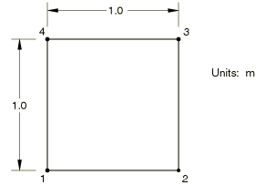
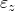

# 4.6.1 NL1: Prescribed biaxial strain history, plane strain

**Product: **Abaqus/Standard  

### Element tested

CPE4R

### Problem description

**Material: **

Linear elastic, Young's modulus = 250 GPa, Poisson's ratio = 0.25, yield stress = 5 MPa, strain at first yield = 0.25  104, hardening modulus = 0 or 62.5 GPa.

**Boundary conditions: **

| Step 1:  = 0.25 104 at nodes 2 and 3 |
| --- |
| Step 2:  = 0.50 104 at nodes 2 and 3 |
| Step 3:  = 0.50 104 at nodes 2 and 3,  = 0.25 104 at nodes 3 and 4 |
| Step 4:  = 0.50 104 at nodes 2 and 3,  = 0.50 104 at nodes 3 and 4 |
| Step 5:  = 0.25 104 at nodes 2 and 3,  = 0.50 104 at nodes 3 and 4 |
| Step 6:  = 0.50 104 at nodes 3 and 4 |
| Step 7:  = 0.25 104 at nodes 2 and 3 |
| Step 8: all degrees of freedom constrained with zero displacement |

All degrees of freedom are constrained with zero displacement unless stated otherwise.

### Reference solution

This is a test recommended by the National Agency for Finite Element Methods and Standards (U.K.): Test NL1 from NAFEMS Publication NNB, Rev. 1, “NAFEMS Non-Linear Benchmarks,” October 1989.

| Strain ( 104) | Target effective stress (MPa) |
| --- | --- |
|  |  |  | Perfect plasticity | Isotropic hardening |
|  |  |  | (H = 0 GPa) | (H = 62.5 GPa) |
| 0.25 | 0.0 | 0.0 | 5.000 | 5.000 |
| 0.50 | 0.0 | 0.0 | 5.000 | 5.862 |
| 0.50 | 0.25 | 0.0 | 5.000 | 5.482 |
| 0.50 | 0.50 | 0.0 | 5.000 | 6.362 |
| 0.25 | 0.50 | 0.0 | 5.000 | 6.640 |
| 0.0 | 0.50 | 0.0 | 5.000 | 7.322 |
| 0.0 | 0.25 | 0.0 | 3.917 | 4.230 |
| 0.0 | 0.0 | 0.0 | 5.000 | 5.673 |

### Results and discussion

The results are shown in the following table. The values enclosed in parentheses are percentage differences with respect to the reference solution.

| Strain ( 104) | Target effective stress (MPa) |
| --- | --- |
|  |  |  | Perfect plasticity | Isotropic hardening |
|  |  |  | (H = 0 GPa) | (H = 62.5 GPa) |
| 0.25 | 0.0 | 0.0 | 5.000 (0%) | 5.000 (0%) |
| 0.50 | 0.0 | 0.0 | 5.000 (0%) | 5.862 (0%) |
| 0.50 | 0.25 | 0.0 | 5.000 (0%) | 5.482 (0%) |
| 0.50 | 0.50 | 0.0 | 5.000 (0%) | 6.359 (0.05%) |
| 0.25 | 0.50 | 0.0 | 5.000 (0%) | 6.626 (0.21%) |
| 0.0 | 0.50 | 0.0 | 5.000 (0%) | 7.297 (0.34%) |
| 0.0 | 0.25 | 0.0 | 3.824 (2.4%) | 4.114 (2.70%) |
| 0.0 | 0.0 | 0.0 | 5.000 (0%) | 5.532 (2.50%) |

### Remarks

The loading and constraints on the model ensure that the force residuals at the nodes are always zero, regardless of the state of stress in the element. Abaqus, therefore, does not iterate. The results tabulated above are obtained using integration with 10 constant increments, as recommended in the test description. More accurate results are obtained if a larger number of increments is specified.

### Input file

[nnl1xr4x.inp](../eif/nnl1xr4x.inp)

CPE4R elements.

