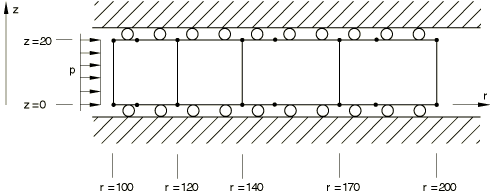

# 4.6.2 NL2: Axisymmetric thick cylinder

**Product: **Abaqus/Standard  

### Elements tested

CAX8R    CCL24R    

### Problem description

**Material: **

Linear elastic, Young's modulus = 207 GPa, Poisson's ratio = 0.3, yield stress = 207.9 MPa.

**Boundary conditions: **

 = 0 for all nodes.

**Loading: **

An initial internal pressure of 80 MPa is increased in steps of 20 MPa to 160 MPa.

### Reference solution

This is a test recommended by the National Agency for Finite Element Methods and Standards (U.K.): Test NL2 from NAFEMS Publication NNB, Rev. 1, “NAFEMS Non-Linear Benchmarks,” October 1989.

The target radial stress and the target circumferential (hoop) stress are given by  and , respectively.

| *r* (mm) | Internal pressure (MPa) |
| --- | --- |
| 80 | 100 | 120 | 140 | 160 |
|  |  |  |  |  |  |  |  |  |  |
| 104.2 | 71.55 | 124.9 | 89.74 | 149.9 | 110.1 | 130.0 | 130.1 | 110.0 | 150.1 | 89.92 |
| 115.8 | 52.89 | 106.2 | 66.65 | 133.7 | 84.87 | 154.7 | 104.9 | 135.2 | 124.9 | 115.2 |
| 124.2 | 42.46 | 98.50 | 53.47 | 120.6 | 68.32 | 154.1 | 87.92 | 151.9 | 107.9 | 132.1 |
| 135.8 | 31.19 | 84.52 | 39.27 | 106.4 | 50.17 | 136.0 | 66.66 | 172.3 | 86.61 | 153.3 |
| 146.3 | 23.16 | 76.49 | 29.16 | 96.32 | 37.26 | 123.1 | 49.51 | 163.5 | 68.61 | 170.9 |
| 163.7 | 13.14 | 66.48 | 16.55 | 83.71 | 21.15 | 107.0 | 28.10 | 142.1 | 41.94 | 195.9 |
| 176.3 | 7.643 | 60.98 | 9.624 | 76.78 | 12.30 | 98.10 | 16.34 | 130.4 | 24.55 | 195.9 |
| 193.7 | 1.769 | 55.10 | 2.227 | 69.38 | 2.846 | 88.65 | 3.781 | 117.8 | 5.682 | 177.0 |

### Results and discussion

All results agree exactly with the reference solution, except for the result of  at a load of 80 MPa and a distance of 124.2 mm. The value obtained here for both element types is 95.8 MPa, a difference of 2.74%.

### Input files

[nnl2xr8x.inp](../eif/nnl2xr8x.inp)

CAX8R elements.

[nnl2xrccl24.inp](../eif/nnl2xrccl24.inp)

CCL24R elements.

