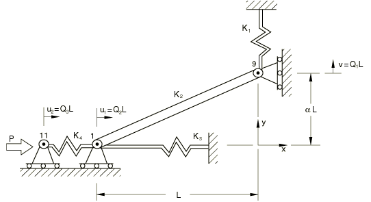
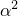
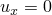

# 4.6.4 NL4: Snap-back under displacement control

**Product: **Abaqus/Standard  

### Element tested

T2D2

### Problem description

**Model: **

AE = 5.0  107, L = 2500, L = 25, K1 = 1.5, K2 = AE/L(1 + )1/2 = 19999.0, K3 = 0.25, K4 = 1.0

**Boundary conditions: **

 0 at node 1 and node 11,  at node 9.

**Loading: **

A load is applied to node 11 in the *x*-direction.

### Reference solution

This is a test recommended by the National Agency for Finite Element Methods and Standards (U.K.): Test NL4 from NAFEMS Publication NNB, Rev. 1, “NAFEMS Non-Linear Benchmarks,” October 1989.

| P | u | u | v |
| --- | --- | --- | --- |
| 649.9 | 0.0904 | 650 | 5.241 |
| 1300 | 0.2328 | 1300 | 13.26 |
| 1949 | 0.5149 | 1950 | 27.08 |
| 2599 | 1.334 | 2600 | 56.50 |
| 3243 | 7.089 | 3250 | 162.6 |
| 1099 | 4999 | 3900 | 41.95 |

### Results and discussion

The RIKS algorithm was used for this problem. In this case it is not possible to obtain the solution at particular force values. The results below were obtained from the Abaqus results by linear interpolation between the two nearest increments. Therefore, there is some error associated with this interpolation procedure. The values enclosed in parentheses are percentage differences with respect to the reference solution.

| P | u | u | v |
| --- | --- | --- | --- |
| 649.9 | 0.0906 (+0.22%) | 650 (0.0%) | 5.254 (+0.25%) |
| 1300 | 0.2333 (+0.21%) | 1300 (0.0%) | 13.29 (+0.23%) |
| 1949 | 0.5152 (+0.06%) | 1949 (0.05%) | 27.08 (0.0%) |
| 2599 | 1.337 (+0.22%) | 2600 (0.0%) | 56.57 (+0.12%) |
| 3243 | 7.241 (+2.14%) | 3250 (0.0%) | 163.9 (+0.08%) |
| 1099 | 4999 (0.0%) | 3900 (0.0%) | 43.49 (+3.67%) |

### Input file

[nnl4xf2x.inp](../eif/nnl4xf2x.inp)

T2D2 elements.

